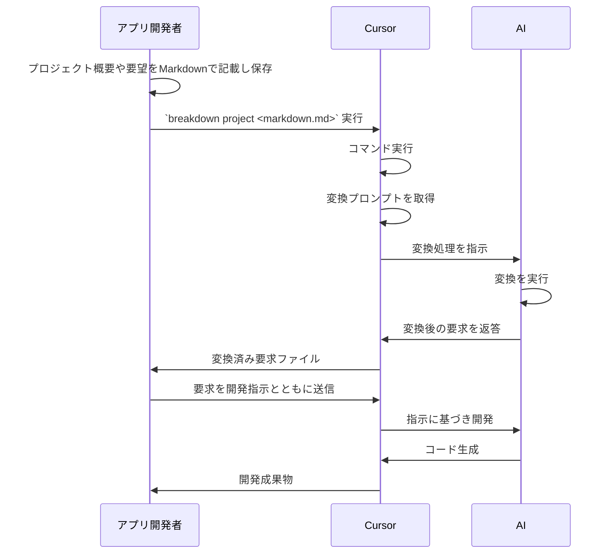

# ブレークダウン

TypeScriptとJSONスキーマを使ったAI自動開発のための開発指示作成ツール。

## 概要

BreakDownは、TypeScriptとDeno with AI
composerを使って、Markdownドキュメントを変換し、AIシステムが解釈しやすいようにするツール＆スキーマのセットです。

実行すると、Markdownで書かれた開発要件が、変換するためのプロンプトとして示されます。示されたプロンプトには事前に定義されたJSONスキーマが示されています。JSONスキーマは変換のために構造化された定義です。
結果、示されたプロンプトによって、要件を構造化された情報へと変換します。
出力形式はプロンプトで指示できるため、Markdonw/JSON/YAMLなど様々な形式にできます。

BreakdownSchema構文を資料として読むことで、AIシステムはJSON構造を解釈し、開発要件や仕様を適切に理解することが期待できます。
結果、指示する内容の簡素化が図られ、簡潔に指示を出すことができるよう期待しています。

このライブラリは、CursorのようなAI開発エージェントで動作するように設計されています。この設計は、特にCursorに最適化されています。作者が主に使用しているツールであるためです。基礎となるAIモデルはClaude-3.7-sonnetを想定しています。構文と構造は、他のAIモデルでも容易に解釈できるように設計されています。

## 主な想定機能

- 最適化されたMarkdownの変換プロンプト
- AIシステムのためのJSONスキーマ構文

## 目的

開発要件を表現するための標準化された方法を提供することによって、人間が書いた仕様とAIが解釈可能な命令の間のギャップを埋めることです。

## 処理の概要

このツールがルールに基づいてドキュメントを生成するわけではありません。AIが解釈しやすく、作業しやすい構造化されたフォーマットをプロンプトとともに提供することで、AIによるドキュメント生成を支援します。



## 将来の展望

このツール自体は何も開発成果を生成しません。ただ解釈を最適化するだけです。
今後AI開発が進むにつれて、IDEの進化によって解釈が洗練されたり、プログラミング言語がAI開発に最適化されていくでしょう。

一方で、要件整理の段階がシステム構築やアプリケーション構築の効率を左右することも予想されます。
自然言語で一貫した指示を行うために、引き続き Breakdown するニーズは残るだろうと考え得ています。

# Usage

Breakdownツールには以下の主要コマンドがあります：

| コマンド | 説明                                                                 | Project                              | Issue                      | Task                       |
| -------- | -------------------------------------------------------------------- | ------------------------------------ | -------------------------- | -------------------------- |
| to       | 入力されたMarkdownを次のレイヤー形式に変換するコマンド               | プロジェクトへ分解                   | プロジェクトから課題へ分解 | 課題からタスクへ分解       |
| summary  | 新規のMarkdownを生成、または指定レイヤーのMarkdownを生成するコマンド | プロジェクト概要を生成               | 課題概要を生成             | タスク概要を生成           |
| defect   | エラーログや不具合情報から修正を生成するコマンド                     | 不具合情報からプロジェクト情報を生成 | 不具合情報から課題を生成   | 不具合情報からタスクを生成 |

## プロジェクトへの分解

```bash
breakdown to project <written_project_summary.md> -o <project_dir>
```

## 課題への分解

```bash
breakdown to issue <project_summary.md|written_issue.md> -o <issue_dir>
```

## タスクへの分解

```bash
breakdown to task <issue.md|written_task.md> -o <tasks_dir>
```

## Markdownサマリーの生成

**プロジェクトサマリー** 未整理の情報からプロジェクト概要を生成：

```bash
echo "<messy_something>" | breakdown summary project -o <project_summary.md>
```

**課題サマリー** タスク群から課題を生成：

```bash
breakdown summary issue --from <aggregated_tasks.md> --input task -o <issue_markdown_dir>
```

**タスクサマリー** 未整理のタスク情報から整理されたタスクを生成：

```bash
breakdown summary task --from <unorganized_tasks.md> -o <task_markdown_dir>
```

## 不具合情報からの修正生成

**プロジェクトレベルの不具合分析**

```bash
tail -100 "<error_log_file>" | breakdown defect project -o <project_defect.md>
```

**課題レベルの不具合分析**

```bash
breakdown defect issue --from <bug_report.md> -o <issue_defect_dir>
```

**タスクレベルの不具合分析**

```bash
breakdown defect task --from <improvement_request.md> -o <task_defect_dir>
```

# ユースケースパターン

## 1. 未整理の情報からプロジェクト実装までの流れ

未整理の情報からプロジェクトを構築し、課題とタスクに分解：

```bash
# 未整理の情報からプロジェクトサマリーを生成
echo "<messy_something>" | breakdown summary project -o <project_summary.md>

# プロジェクトへ分解
breakdown to project <project_summary.md> -o <project_dir>

# 課題へ分解
breakdown to issue <project_summary.md> -o <issue_dir>

# タスクへ分解
breakdown to task <issue.md> -o <tasks_dir>
```

## 2. タスク群から課題の作成

複数の未整理タスクから課題を生成し、再度タスクに分解：

```bash
# タスク群から課題を生成
breakdown summary issue --from <aggregated_tasks.md> --input task -o <issue_markdown_dir>

# 生成された課題を編集（必要に応じて）

# 課題からタスクを生成
breakdown to task <issue.md> -o <tasks_dir>
```

## 3. 不具合情報からの修正タスク生成

エラーログや不具合レポートから修正タスクを生成：

```bash
# エラーログから不具合情報を生成
tail -100 "<error_log_file>" | breakdown defect project -o <project_defect.md>

# 不具合情報から課題を生成
breakdown defect issue --from <project_defect.md> -o <issue_defect_dir>

# 課題から修正タスクを生成
breakdown defect task --from <issue_defect.md> -o <task_defect_dir>
```

## 4. 改善要望からの修正提案作成

改善要望から直接タスクレベルの修正を生成：

```bash
# 改善要望から修正タスクを生成
breakdown defect task --from <improvement_request.md> -o <task_defect_dir>
```

# セットアップ

## インストール

### 推奨: CLIとしてインストール

BreakdownはCLIツールとしての利用が主目的です。  
**Deno公式/JSR標準の方法**で、以下のコマンドでインストールできます。

```bash
deno install -A -f --global breakdown jsr:@tettuan/breakdown/cli
```
- `-A` : すべての権限を許可（推奨）
- `-f` : 既存のコマンドを上書き
- `--global` : グローバルインストール
- `breakdown` : コマンド名

> **Note:**  
> Breakdown CLIのメインモジュールは `jsr:@tettuan/breakdown/cli` です。  
> 必ず `/cli` サブパスを指定してください。

---

### アップデート

新しいバージョンが公開された場合も、同じコマンドで上書きインストールできます。

```bash
deno install -A -f --global breakdown jsr:@tettuan/breakdown/cli
```

---

### アンインストール

#### グローバルインストールの場合

```bash
deno uninstall breakdown
```

#### プロジェクト配下（ローカルインストール）の場合

```bash
deno uninstall --root .deno breakdown
```

- `--root .deno` で、プロジェクト内の `.deno/bin` からアンインストールされます。

---

### ライブラリとして使う場合

TypeScript/JavaScriptから直接importして使う場合は、  
`deno add` で依存に追加できます。

```bash
deno add @tettuan/breakdown
```

---

### 注意事項

- breakdownコマンドは、`deno.json`の`bin`設定により自動的に`cli/breakdown.ts`をエントリーポイントとして動作します。
- Deno 1.40以降を推奨します。
- 詳細な使い方は下記「Usage」セクションを参照してください。

### プロジェクト配下にローカルインストールしたい場合

特定のプロジェクト内だけでbreakdownコマンドを使いたい場合は、`--root` オプションで `.deno/bin` 配下にインストールできます。

```bash
deno install -A -f --root .deno -n breakdown jsr:@tettuan/breakdown
```
- `.deno/bin/breakdown` で実行できます。
- 必要に応じて `.deno/bin` を `PATH` に追加してください。
- この方法でインストールしたCLIは、そのプロジェクト内でのみ有効です。

# ドキュメント

https://jsr.io/@tettuan/breakdown

## 初期化後のディレクトリ構成例

`breakdown init` コマンドを実行すると、プロジェクト配下に以下のようなディレクトリ・ファイルが生成されます（デフォルト設定の場合）:

```
.agent/
└── breakdown/
    ├── config/
    │   └── app.yml         # アプリケーション設定ファイル
    ├── prompts/            # プロンプトファイル格納ディレクトリ
    └── schema/             # JSONスキーマ格納ディレクトリ
```

- 設定ファイルやプロンプト、スキーマの配置ルールは [app_config.ja.md](docs/breakdown/app_config.ja.md) を参照してください。
- パスやファイル名の詳細な仕様は [path.ja.md](docs/breakdown/path.ja.md) を参照してください。

## 仕様・詳細ドキュメントへのリンク

- [Breakdown 仕様書インデックス](docs/breakdown/index.ja.md)
- [CLIインターフェース仕様](docs/breakdown/cli.ja.md)
- [アプリケーション設定・作業ディレクトリ仕様](docs/breakdown/app_config.ja.md)
- [パス・ファイル名仕様](docs/breakdown/path.ja.md)
- [モジュール構成・ディレクトリ構成](docs/breakdown/module.ja.md)
