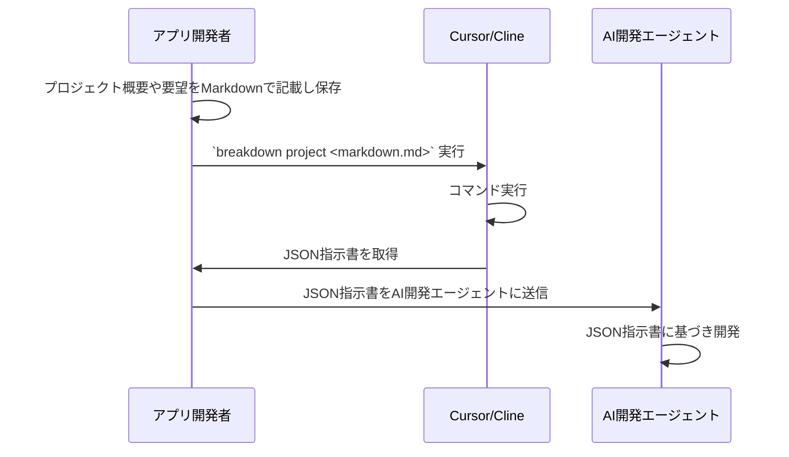

# ブレークダウン
TypeScriptとJSONを使ったAI自動開発のための開発指示言語ツール。

> 注***： このプロジェクトは実験的なもので、まだ完全に機能する状態ではありません。


## 概要

BreakDownは、TypeScriptとDeno with AI composerを使って、MarkdownドキュメントをJSON形式に変換し、AIシステムが解釈しやすいようにするツール＆スキーマのセットです。

実行すると、Markdownで書かれた開発要件が、AIの開発指示書として機能する構造化されたJSONに変換されます。

BreakDown構文を学習することで、AIシステムはこれらのJSON構造を解釈し、開発要件や仕様を事前に理解することを期待できます。
結果、指示する内容の簡素化が図られ、簡潔に指示を出すことができるよう期待しています。

このライブラリは、CursorやVSCodeのClineのようなAI開発エージェントで動作するように設計されています。この設計は、特にCursorとClineに最適化されています。作者が主に使用しているツールであるためです。基礎となるAIモデルはClaude-3.5-sonnetを想定しています。構文と構造は、他のAIモデルでも容易に解釈できるように設計されています。

## 主な想定機能

- AI解釈用に最適化されたMarkdownからJSONへの変換
- DenoランタイムによるTypeScript実装
- AI自動開発のための構造化フォーマット
- AIシステムのための学習しやすい構文
- CursorとClineのAI開発エージェントに最適化
- Claude-3.5-sonnetおよび他のAIモデルとの互換性

## 目的

目的は、人間とAIの両方が効果的に作業できる開発要件を表現するための標準化された方法を提供することによって、人間が書いた仕様とAIが解釈可能な命令の間のギャップを埋めることです。

## 処理の概要

本ライブラリは、それ自体がルールに基づいてドキュメントを生成するわけではありません。AIが解釈しやすく、作業しやすい構造化されたフォーマットを提供することで、AIによるドキュメント生成を支援します。




## 将来の展望

このツール自体は何も開発成果を生成しません。ただ解釈を最適化するだけです。
こうした解釈の領域も、今後AI開発が進むにつれて、IDEの進化によって解釈が洗練されたり、プログラミング言語がAI開発に最適化されていくでしょう。

こうした展望の中でも、私は、システム構築やアプリケーションのリリースを、一貫して自然言語のみで行うことを目指しています。

# Usage

- to : MarkdownファイルをもとにJSON化します
- summary : 概略からMarkdownファイルを作成します

## to JSON
**プロジェクトの概要を作る**

```
breakdown to project <written_project_summary.md>  -o <project-dir>
```

**Issueを作る**

```
breakdown to issue <project_summary.json|written_issue.md>  -o <issue-dir>
```

**Taskを作る**

```
breakdown to task <issue.json|written_task.md>  -o <tasks-dir>
```

出力先には、いずれもディレクトリを指定します。
GitHubのProjectとIssueの番号が必要です。 
例えば `breakdown to project create_edinet_api.md -o agent/cursor/projects` と -o へ指定すると、 `agent/cursor/projects/18-edinet-api.json` のように、ファイルが生成されます。

## summary Markdown

**プロジェクト**
プロジェクトの概要を書き起こします。`<summary>` はAIから得たものを貼り付けたり、自分で書き起こした文章を用います。

GitHubへの登録を行います。

```
echo "<summary>" | breakdown summary project -o <project_summary.md>
```

**Issue**
Issueを書き起こします。

```
echo "<issue summary>" | breakdown summary issue -o <issue_summary.md>
```

Projectのサマリーから書き起こすこともできます。この場合は、複数ファイルになる可能性があるため、出力先をディレクトリで指定します。

```
breakdown summary <project_summary.md> -o <issue_markdown_dir>
```


**タスク**
タスクを書き起こします。

```
echo "<task summary>" | breakdown summary task -o <task_summary.md>
```
Issueのサマリーから書き起こすこともできます。この場合は、複数ファイルになる可能性があるため、出力先をディレクトリで指定します。

```
breakdown summary <issue_summary.md> -o <task_markdown_dir>
```

# ユースケースパターン

## 1. プロジェクトを概要で書き、あとはお任せ
生成したMDからIssue化。IssueからTask化。

```
echo "<summary>" | breakdown summary project -o <project_summary.md>
breakdown to project <written_project_summary.md>  -o <project-dir>
breakdown to issue <project_summary.json>  -o <issue-dir>
breakdown to task <issue.json>  -o <tasks-dir>
```

## 2. プロジェクト概要からIssueの細分化作成まで実施
IssueからTask化。

```
echo "<summary>" | breakdown summary project -o <project_summary.md>
breakdown summary <project_summary.md> -o <issue_markdown_dir>
（複数のIssue Markdownを編集）
breakdown to issue <written_issue_1.md>  -o <issue-dir>
breakdown to task <issue_1.json>  -o <tasks-dir>
breakdown to issue <written_issue_2.md>  -o <issue-dir>
breakdown to task <issue_2.json>  -o <tasks-dir>
```

## 3. 細かい課題をタスク処理
IssueからTask化。

```
echo "<issue summary>" | breakdown summary issue -o <issue_summary.md>
breakdown to issue <issue_summary.md>  -o <issue-dir>
breakdown to task <issue.json>  -o <tasks-dir>
```

# セットアップ
以下の手順によって、使えるように準備します。

1. 最初にDenoをセットアップします
2. 次に CLI で使えるよう Deno installation を行います（推奨）
   1. システムへインストールする
   2. AI開発用のレポジトリにのみインストールする

## CLI

**まだ準備中**

### 2-1. システムへインストールする

```
deno install --name=breakdown https://deno.land/x/breakdown.ts
```

### 2-2. AI開発用のレポジトリにのみインストールする

```
deno install --root ./tools --name=breakdown https://deno.land/x/breakdown.ts
```

もしインストールせずに使いたい場合は、以下のように実行できます。
AI開発エージェントが利用する場合には冗長なので、PATHの通った場所へインストールすることをお勧めします。

```
deno run --allow-read --allow-net https://deno.land/x/breakdown.ts
```


# Documents
https://tettuan.github.io/breakdown/
