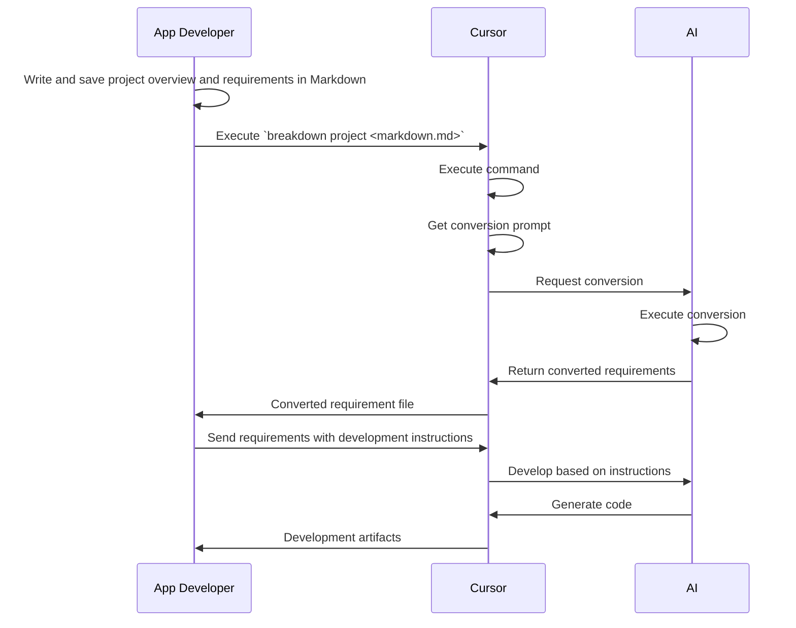

# Breakdown

A development instruction language tool for AI-assisted development using TypeScript and JSON.

> Note: This project is experimental and not yet fully functional.

## Overview

Breakdown is a tool & schema set that uses TypeScript and Deno with AI composer to convert Markdown documents and make them easier for AI systems to interpret.

When executed, development requirements written in Markdown are presented as prompts for conversion. These prompts include predefined JSON schemas that serve as structured definitions for the conversion.
As a result, the prompts convert requirements into structured information.
The output format can be specified in the prompt, allowing for various formats such as Markdown/JSON/YAML.

By reading the BreakdownSchema syntax as documentation, AI systems are expected to interpret these JSON structures and appropriately understand development requirements and specifications. As a result, we expect to simplify the content of instructions and enable concise direction.

This library is designed to work with AI development agents like Cursor. This design is specifically optimized for Cursor, as it is the primary tool used by the author. The underlying AI model is assumed to be Claude-3.7-sonnet. The syntax and structure are designed to be easily interpreted by other AI models as well.

## Main Expected Features

- Optimized Markdown conversion prompts
- JSON schema syntax for AI systems

## Purpose

To bridge the gap between human-written specifications and AI-interpretable instructions by providing a standardized way to express development requirements.

## Process Overview

This tool itself doesn't generate documents based on rules. It supports AI document generation by providing structured formats along with prompts that are easy for AI to interpret and work with.



## Future Prospects

This tool itself doesn't generate any development output. It only optimizes interpretation. As AI development progresses, the interpretation domain will also evolve through IDE improvements and programming languages becoming optimized for AI development.

With this in mind, we aim to consistently perform system building and application releases using natural language alone.

# Usage

Breakdown tool has the following main commands:

| Command | Description | Project | Issue | Task |
|---------|-------------|---------|--------|------|
| to | Command to convert input Markdown to next layer format | Breakdown to project | Breakdown from project to issues | Breakdown from issues to tasks |
| summary | Command to generate new Markdown or generate Markdown for specified layer | Generate project overview | Generate issue overview | Generate task overview |
| defect | Command to generate fixes from error logs and defect information | Generate project information from defect info | Generate issues from defect info | Generate tasks from defect info |

## Project Breakdown

```bash
breakdown to project <written_project_summary.md> -o <project_dir>
```

## Issue Breakdown

```bash
breakdown to issue <project_summary.md|written_issue.md> -o <issue_dir>
```

## Task Breakdown

```bash
breakdown to task <issue.md|written_task.md> -o <tasks_dir>
```

## Markdown Summary Generation

**Project Summary**
Generate project overview from unorganized information:
```bash
echo "<messy_something>" | breakdown summary project -o <project_summary.md>
```

**Issue Summary**
Generate issues from task groups:
```bash
breakdown summary issue --from <aggregated_tasks.md> --input task -o <issue_markdown_dir>
```

**Task Summary**
Generate organized tasks from unorganized task information:
```bash
breakdown summary task --from <unorganized_tasks.md> -o <task_markdown_dir>
```

## Fix Generation from Defect Information

**Project Level Defect Analysis**
```bash
tail -100 "<error_log_file>" | breakdown defect project -o <project_defect.md>
```

**Issue Level Defect Analysis**
```bash
breakdown defect issue --from <bug_report.md> -o <issue_defect_dir>
```

**Task Level Defect Analysis**
```bash
breakdown defect task --from <improvement_request.md> -o <task_defect_dir>
```

# Common Use Case Patterns

## 1. Flow from Unorganized Information to Project Implementation

Build a project from unorganized information and break it down into issues and tasks:

```bash
# Generate project summary from unorganized information
echo "<messy_something>" | breakdown summary project -o <project_summary.md>

# Breakdown to project
breakdown to project <project_summary.md> -o <project_dir>

# Breakdown to issues
breakdown to issue <project_summary.md> -o <issue_dir>

# Breakdown to tasks
breakdown to task <issue.md> -o <tasks_dir>
```

## 2. Creating Issues from Task Groups

Generate issues from multiple unorganized tasks and break them down into tasks again:

```bash
# Generate issues from task groups
breakdown summary issue --from <aggregated_tasks.md> --input task -o <issue_markdown_dir>

# Edit generated issues (if needed)

# Generate tasks from issues
breakdown to task <issue.md> -o <tasks_dir>
```

## 3. Fix Task Generation from Defect Information

Generate fix tasks from error logs and defect reports:

```bash
# Generate defect information from error logs
tail -100 "<error_log_file>" | breakdown defect project -o <project_defect.md>

# Generate issues from defect information
breakdown defect issue --from <project_defect.md> -o <issue_defect_dir>

# Generate fix tasks from issues
breakdown defect task --from <issue_defect.md> -o <task_defect_dir>
```

## 4. Creating Fix Proposals from Improvement Requests

Generate task-level fixes directly from improvement requests:

```bash
# Generate fix tasks from improvement request
breakdown defect task --from <improvement_request.md> -o <task_defect_dir>
```

# Setup

## Installation

### System Installation

```bash
deno add @tettuan/breakdown
```

### AI Development Repository Installation Only

```bash
deno add --root ./tools @tettuan/breakdown
```

If you want to use without installation:

```bash
deno run --allow-read --allow-net jsr:@tettuan/breakdown
```

# Documentation

https://jsr.io/@tettuan/breakdown
