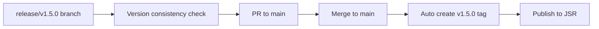

# Breakdown

[](https://jsr.io/@tettuan/breakdown)
[](https://deno.land/x/breakdown)

A powerful CLI tool for creating AI-optimized development instructions using TypeScript and JSON Schema. Convert markdown requirements into structured prompts for AI development agents.

## Quick Start

Install Breakdown globally using JSR:

```bash
deno install --allow-read --allow-write --allow-run --allow-env --allow-net -f --global breakdown jsr:@tettuan/breakdown
```

Convert your markdown requirements to AI-optimized prompts:

```bash
breakdown to project requirements.md -o project_output/
breakdown to issue project_summary.md -o issues_output/
breakdown to task issue.md -o tasks_output/
```

## Overview

Breakdown transforms human-written development requirements into AI-interpretable structured prompts using TypeScript and JSON Schema. It bridges the communication gap between developers and AI systems by providing standardized formats for expressing complex development requirements.

**Key Benefits:**
- Convert markdown specifications into structured AI prompts
- 3-tier breakdown hierarchy: Project → Issue → Task
- Optimized for AI development agents (Claude, Cursor, etc.)
- JSON Schema-based structured output
- Flexible output formats (Markdown/JSON/YAML)

## Core Commands

Breakdown provides three main command types for different workflow stages:

| Command | Purpose | Example |
|---------|---------|---------|
| `to` | Convert input to structured format | `breakdown to project spec.md -o output/` |
| `summary` | Generate consolidated documentation | `breakdown summary project -o summary.md` |
| `defect` | Create fix proposals from errors | `breakdown defect task --from=bug.md -o fixes/` |

## Usage Examples

### Basic Workflow: Requirements → Implementation

Transform unstructured requirements into implementation-ready tasks:

```bash
# 1. Convert requirements to project structure
echo "Build a user authentication system" | breakdown summary project -o auth_project.md

# 2. Break down project into issues
breakdown to issue auth_project.md -o issues/

# 3. Convert issues into actionable tasks
breakdown to task issues/user_management.md -o tasks/
```

### Error Analysis & Fix Generation

Generate fix proposals from error logs and defect reports:

```bash
# Analyze error logs for project-level issues
tail -100 error.log | breakdown defect project -o project_fixes.md

# Create task-level fixes from bug reports
breakdown defect task --from=bug_report.md -o fix_tasks/
```

### Project Breakdown

```bash
breakdown to project <written_project_summary.md> -o <project_dir>
```

### Issue Breakdown

```bash
breakdown to issue <project_summary.md|written_issue.md> -o <issue_dir>
```

### Task Breakdown

```bash
breakdown to task <issue.md|written_task.md> -o <tasks_dir>
```

### Markdown Summary Generation

**Project Summary** Generate project overview from unorganized information:

```bash
echo "<messy_something>" | breakdown summary project -o <project_summary.md>
```

**Issue Summary** Generate issues from task groups:

```bash
breakdown summary issue --from=<aggregated_tasks.md> --edition=task -o=<issue_markdown_dir>
```

**Task Summary** Generate organized tasks from unorganized task information:

```bash
breakdown summary task --from=<unorganized_tasks.md> -o=<task_markdown_dir>
```

### Fix Generation from Defect Information

**Project Level Defect Analysis**

```bash
tail -100 "<error_log_file>" | breakdown defect project -o <project_defect.md>
```

**Issue Level Defect Analysis**

```bash
breakdown defect issue --from=<bug_report.md> -o=<issue_defect_dir>
```

**Task Level Defect Analysis**

```bash
breakdown defect task --from=<improvement_request.md> -o=<task_defect_dir>
```

## Use Case Patterns

### 1. From Unorganized Information to Project Implementation

```bash
echo "<messy_something>" | breakdown summary project -o <project_summary.md>
breakdown to project <project_summary.md> -o <project_dir>
breakdown to issue <project_summary.md> -o <issue_dir>
breakdown to task <issue.md> -o <tasks_dir>
```

### 2. Creating Issues from Task Groups

```bash
breakdown summary issue --from=<aggregated_tasks.md> --edition=task -o=<issue_markdown_dir>
# Edit generated issues if needed
breakdown to task <issue.md> -o <tasks_dir>
```

### 3. Fix Task Generation from Defect Information

```bash
tail -100 "<error_log_file>" | breakdown defect project -o <project_defect.md>
breakdown defect issue --from=<project_defect.md> -o=<issue_defect_dir>
breakdown defect task --from=<issue_defect.md> -o=<task_defect_dir>
```

### 4. Creating Fix Proposals from Improvement Requests

```bash
breakdown defect task --from=<improvement_request.md> -o=<task_defect_dir>
```

## Installation

### Global Installation (Recommended)

Install Breakdown globally for system-wide access:

```bash
deno install --allow-read --allow-write --allow-run --allow-env --allow-net -f --global breakdown jsr:@tettuan/breakdown
```

**Options explained:**
- `--allow-read`: File reading permissions
- `--allow-write`: File writing permissions
- `--allow-run`: Subprocess execution permissions
- `--allow-env`: Environment variable access permissions
- `--allow-net`: Network access permissions
- `-f`: Force overwrite existing installation
- `--global`: Install globally for system-wide access

### Verify Installation

```bash
breakdown --help
breakdown --version
```

### Update to Latest Version

```bash
deno install --allow-read --allow-write --allow-run --allow-env --allow-net -f --global breakdown jsr:@tettuan/breakdown
```

### Alternative Installation Methods

<details>
<summary>Project-Local Installation</summary>

Install for a specific project only:

```bash
deno install --allow-read --allow-write --allow-run --allow-env --allow-net -f --root .deno -n breakdown jsr:@tettuan/breakdown
export PATH="$(pwd)/.deno/bin:$PATH"
```

</details>

<details>
<summary>Library Usage</summary>

Use Breakdown programmatically in TypeScript/JavaScript:

```bash
deno add @tettuan/breakdown
```

```typescript
import { runBreakdown } from "@tettuan/breakdown";

const result = await runBreakdown(["to", "project", "input.md", "-o", "output/"]);
```

</details>

<details>
<summary>Standalone Binary</summary>

Compile as a standalone executable:

```bash
mkdir -p .deno/bin
deno compile --allow-read --allow-write --allow-run --allow-env --allow-net -o .deno/bin/breakdown jsr:@tettuan/breakdown
```

</details>

### Requirements

- **Deno 2.0+** (recommended)
- **Permissions**: File system access required for reading/writing files

## Architecture

Breakdown leverages a powerful 4-package architecture for maximum modularity:

- **[@tettuan/breakdownconfig](https://jsr.io/@tettuan/breakdownconfig)** - Configuration management
- **[@tettuan/breakdownparams](https://jsr.io/@tettuan/breakdownparams)** - CLI parameter parsing  
- **[@tettuan/breakdownprompt](https://jsr.io/@tettuan/breakdownprompt)** - Core prompt generation engine
- **[@tettuan/breakdownlogger](https://jsr.io/@tettuan/breakdownlogger)** - Structured logging

## Documentation & Resources

| Resource | Link |
|----------|------|
| **Full Documentation** | [tettuan.github.io/breakdown](https://tettuan.github.io/breakdown/) |
| **JSR Package** | [jsr.io/@tettuan/breakdown](https://jsr.io/@tettuan/breakdown) |
| **Language** | [English](README.md) \| [日本語](README.ja.md) |

## Development

### Release Workflow

Breakdown uses a structured release process with automated CI/CD workflows:

#### Creating a Release

1. **Create Release Branch**
   ```bash
   # Create release branch with version number
   git checkout -b release/v1.5.0
   ```

2. **Update Version Files**
   ```bash
   # Update version in deno.json
   # "version": "1.4.0" → "1.5.0"
   
   # Update version in lib/version.ts
   # export const VERSION = "1.5.0";
   ```

3. **Push Release Branch**
   ```bash
   git commit -m "chore: bump version to 1.5.0"
   git push origin release/v1.5.0
   ```
   
   > **Version Check**: Automated workflow validates version consistency across files

4. **Create and Merge PR**
   ```bash
   gh pr create --title "Release v1.5.0" --body "Release version 1.5.0"
   gh pr merge --merge
   ```
   
   > **Auto Release**: Merging triggers automatic v-tag creation and JSR publishing

#### Workflow Overview



#### Automated Checks

- **Version Consistency**: Ensures branch name, `deno.json`, and `lib/version.ts` versions match
- **Duplicate Prevention**: Prevents creating duplicate version tags
- **JSR Publishing**: Automatically publishes to [jsr.io/@tettuan/breakdown](https://jsr.io/@tettuan/breakdown)

### Development Setup

```bash
# Clone repository
git clone https://github.com/tettuan/breakdown.git
cd breakdown

# Run tests
deno test

# Run examples
./examples/01_instructions.sh
```

## Contributing

Contributions are welcome! Please check the [documentation site](https://tettuan.github.io/breakdown/) for contribution guidelines.

## License

Published under the terms specified in the package configuration.
