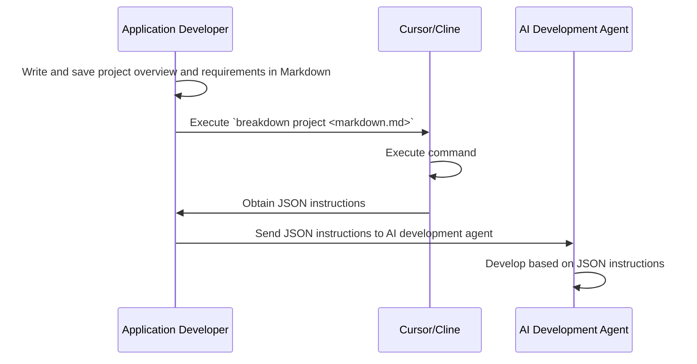

# BreakDown
A development instruction language tool for AI-automated development using TypeScript and JSON.

> Note***: This project is experimental and not yet fully functional.

## Overview

BreakDown is a tool & schema set that uses TypeScript and Deno with AI composer to convert Markdown documents into JSON format to make them easier for AI systems to interpret.

When executed, development requirements written in Markdown are converted into structured JSON that functions as development instructions for AI systems.

By learning the BreakDown syntax, AI systems are expected to interpret these JSON structures and understand development requirements and specifications in advance.
As a result, we expect to simplify the content of instructions and enable concise direction.

This library is designed to work with AI development agents like Cursor and VSCode's Cline. This design is specifically optimized for Cursor and Cline, as these are the primary tools used by the author. The underlying AI model is assumed to be Claude-3.5-sonnet. The syntax and structure are designed to be easily interpreted by other AI models as well.

## Main Expected Features

- Markdown to JSON conversion optimized for AI interpretation
- TypeScript implementation with Deno runtime
- Structured format for AI automated development
- Easy-to-learn syntax for AI systems
- Optimized for Cursor and Cline AI development agents
- Compatibility with Claude-3.5-sonnet and other AI models

## Purpose

The goal is to bridge the gap between human-written specifications and AI-interpretable instructions by providing a standardized way to express development requirements that both humans and AI can work with effectively.

## Process Overview

This library does not generate documents based on rules by itself. It supports AI document generation by providing a structured format that is easy for AI to interpret and work with.



## Future Prospects

This tool itself does not generate any development output. It only optimizes interpretation.
As AI development progresses, even this interpretation domain will evolve as IDEs become more sophisticated and programming languages become optimized for AI development.

Within these prospects, I aim to consistently use natural language alone for system building and application releases.

# Usage

- to: Converts Markdown files to JSON
- summary: Creates Markdown files from summaries

## to JSON
**Create Project Overview**

```
breakdown to project <written_project_summary.md>  -o <project-dir>
```

**Create Issues**

```
breakdown to issue <project_summary.json|written_issue.md>  -o <issue-dir>
```

**Create Tasks**

```
breakdown to task <issue.json|written_task.md>  -o <tasks-dir>
```

For all outputs, specify a directory as the destination.
GitHub Project and Issue numbers are required.
For example, if you specify `-o agent/cursor/projects` with `breakdown to project create_edinet_api.md`, it will generate a file like `agent/cursor/projects/18-edinet-api.json`.

## summary Markdown

**Project**
Write out a project overview. Use `<summary>` from AI responses or write your own text.

Register to GitHub.

```
echo "<summary>" | breakdown summary project -o <project_summary.md>
```

**Issue**
Write out issues.

```
echo "<issue summary>" | breakdown summary issue -o <issue_summary.md>
```

You can also write from a project summary. In this case, specify an output directory as there may be multiple files.

```
breakdown summary <project_summary.md> -o <issue_markdown_dir>
```

**Task**
Write out tasks.

```
echo "<task summary>" | breakdown summary task -o <task_summary.md>
```
You can also write from an issue summary. In this case, specify an output directory as there may be multiple files.

```
breakdown summary <issue_summary.md> -o <task_markdown_dir>
```

# Use Case Patterns

## 1. Write Project Overview and Leave the Rest to AI
Generate Issues from MD and Tasks from Issues.

```
echo "<summary>" | breakdown summary project -o <project_summary.md>
breakdown to project <written_project_summary.md>  -o <project-dir>
breakdown to issue <project_summary.json>  -o <issue-dir>
breakdown to task <issue.json>  -o <tasks-dir>
```

## 2. Create Detailed Issues from Project Overview
Generate Tasks from Issues.

```
echo "<summary>" | breakdown summary project -o <project_summary.md>
breakdown summary <project_summary.md> -o <issue_markdown_dir>
(Edit multiple Issue Markdown files)
breakdown to issue <written_issue_1.md>  -o <issue-dir>
breakdown to task <issue_1.json>  -o <tasks-dir>
breakdown to issue <written_issue_2.md>  -o <issue-dir>
breakdown to task <issue_2.json>  -o <tasks-dir>
```

## 3. Process Specific Tasks
Generate Tasks from Issues.

```
echo "<issue summary>" | breakdown summary issue -o <issue_summary.md>
breakdown to issue <issue_summary.md>  -o <issue-dir>
breakdown to task <issue.json>  -o <tasks-dir>
```

