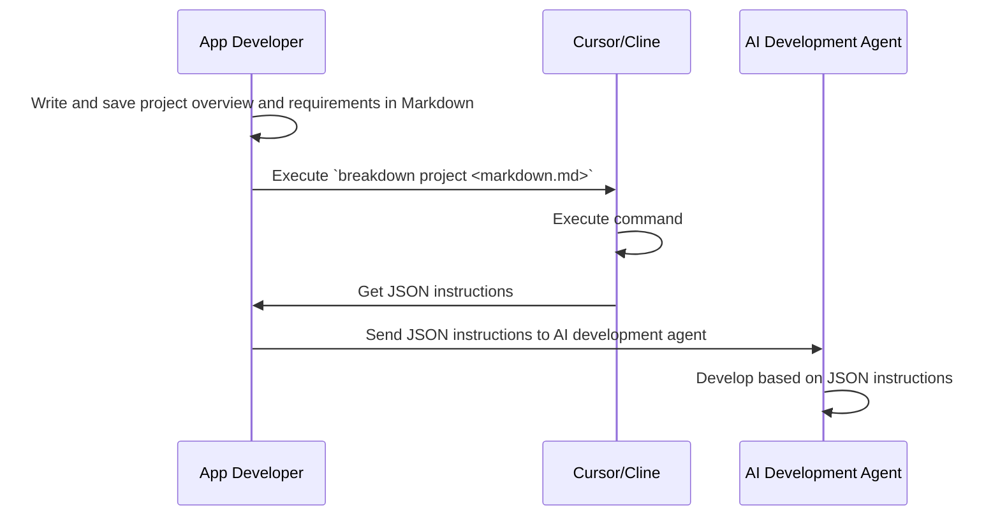

# Breakdown
A development instruction language tool for AI-assisted development using TypeScript and JSON.

> Note: This project is experimental and not yet fully functional.

## Overview

Breakdown is a tool & schema set that uses TypeScript and Deno with AI composer to convert Markdown documents into JSON format to make them easier for AI systems to interpret.

When executed, development requirements written in Markdown are converted into structured JSON that functions as development instructions for AI systems.

By learning the Breakdown syntax, AI systems are expected to interpret these JSON structures and understand development requirements and specifications in advance.
As a result, we expect to simplify the content of instructions and enable concise direction.

This library is designed to work with AI development agents like Cursor and VSCode's Cline. This design is specifically optimized for Cursor and Cline, as these are the primary tools used by the author. The underlying AI model is assumed to be Claude-3.5-sonnet. The syntax and structure are designed to be easily interpreted by other AI models as well.

## Main Expected Features

- Markdown to JSON conversion optimized for AI interpretation
- TypeScript implementation with Deno runtime
- Structured format for AI-assisted development
- Easy-to-learn syntax for AI systems
- Optimized for Cursor and Cline AI development agents
- Compatibility with Claude-3.5-sonnet and other AI models

## Purpose

The goal is to bridge the gap between human-written specifications and AI-interpretable instructions by providing a standardized way to express development requirements that both humans and AI can work with effectively.

## Process Overview

This library doesn't generate documents based on rules by itself. It supports AI document generation by providing a structured format that's easy for AI to interpret and work with.



## Future Prospects

This tool itself doesn't generate any development output. It only optimizes interpretation.
As AI development progresses, the interpretation domain will also evolve through IDE improvements and programming languages becoming optimized for AI development.

Within these prospects, I aim to consistently perform system building and application releases using natural language alone.

# Usage

- to: Converts Markdown files to JSON
- summary: Creates Markdown files from summaries
- defect: Creates requirement Markdown files from error information

## to JSON
**Create Project Overview**

```
breakdown to project <written_project_summary.md>  -o <project-dir>
```

**Create Issues**

```
breakdown to issue <project_summary.json|written_issue.md>  -o <issue-dir>
```

**Create Tasks**

```
breakdown to task <issue.json|written_task.md>  -o <tasks-dir>
```

For all outputs, specify a directory.
GitHub Project and Issue numbers are required.
For example, if you specify `-o agent/cursor/projects` like `breakdown to project create_edinet_api.md -o agent/cursor/projects`, a file like `agent/cursor/projects/18-edinet-api.json` will be generated. If not specified, default settings will be used.

## summary Markdown

**Project**
Write out project overview. For `<summary>`, use text obtained from AI or write your own description.

Register to GitHub.

```
echo "<summary>" | breakdown summary project -o <project_summary.md>
```

**Issue**
Write out issues.

```
echo "<issue summary>" | breakdown summary issue -o <issue_summary.md>
```

You can also write from the project summary. Since this involves breaking down from Project to Issue with different granularity, you need to explicitly specify the input file type.
When breaking down, multiple output files may be generated, so specify an output directory.

```
breakdown summary issue --from-project <project_summary.md> -o <issue_markdown_dir>
```

**Task**
Write out tasks.

```
echo "<task summary>" | breakdown summary task -o <task_summary.md>
```

You can also write from the issue summary. Since this involves breaking down from Issue to Task with different granularity, you need to explicitly specify the input file type.
When breaking down, multiple output files may be generated, so specify an output directory.

```
breakdown summary task --from-issue <issue_summary.md> -o <task_markdown_dir>
```

## defect Markdown
**Project**
Analyze project defect information. For `<error_logs>`, use information obtained from Terminal or found in logs.

```
tail -100 "<error_log_file>" | breakdown defect project -o <project_defect.md>
```

**Issue**
Write out issue fixes.

```
tail -100 "<error_log_file>" | breakdown defect issue -o <issue_defect.md>
```

You can also write from the project fix overview. Since this involves breaking down from Project to Issue with different granularity, you need to explicitly specify the input file type.
When breaking down, multiple output files may be generated, so specify an output directory.

```
breakdown defect issue --from-project <project_defect.md> -o <issue_defect_dir>
```

**Task**
Write out task fixes.

```
tail -100 "<error_log_file>" | breakdown defect task -o <task_defect.md>
```

You can also write from the issue fix overview. Since this involves breaking down from Issue to Task with different granularity, you need to explicitly specify the input file type.
When breaking down, multiple output files may be generated, so specify an output directory.

```
breakdown defect task --from-issue <issue_defect.md> -o <task_defect_dir>
```

# Use Case Patterns

## 1. Write Project Overview and Leave the Rest to AI
Generate Issues from MD, then Tasks from Issues.

```
echo "<summary>" | breakdown summary project -o <project_summary.md>
breakdown to project <written_project_summary.md>  -o <project-dir>
breakdown to issue <project_summary.json>  -o <issue-dir>
breakdown to task <issue.json>  -o <tasks-dir>
```

## 2. Create Detailed Issues from Project Overview
Generate Tasks from Issues.

```
echo "<summary>" | breakdown summary project -o <project_summary.md>
breakdown summary issue <project_summary.md> -o <issue_markdown_dir>
(Edit multiple Issue Markdowns)
breakdown to issue <written_issue_1.md>  -o <issue-dir>
breakdown to task <issue_1.json>  -o <tasks-dir>
breakdown to issue <written_issue_2.md>  -o <issue-dir>
breakdown to task <issue_2.json>  -o <tasks-dir>
```

## 3. Process Detailed Tasks
Generate Tasks from Issues.

```
deno test --allow-read --allow-write --allow-run | breakdown defect issue -o <issue_defect.md>
breakdown to issue <issue_defect.md>  -o <issue-dir>
breakdown to task <issue.json>  -o <tasks-dir>
```

# Setup
Follow these steps to get started:

1. First, set up Deno
2. Then set up Deno installation for CLI use (recommended)
   1. Install to system
   2. Install only to AI development repository

## 4. Create Fix Proposals for Execution Errors
Set up issues to fix based on Terminal error information.

```
echo "<summary>" | breakdown summary project -o <project_summary.md>
breakdown to project <written_project_summary.md>  -o <project-dir>
breakdown to issue <project_summary.json>  -o <issue-dir>
breakdown to task <issue.json>  -o <tasks-dir>
```

## CLI

**Still in preparation**

### 2-1. Install to System

```
deno install --name=breakdown https://deno.land/x/breakdown.ts
```

compile to local directory.
```
deno compile --allow-read --allow-write --allow-env \    
   --output ./.deno/bin/breakdown \                  
   main.ts   
```

### 2-2. Install Only to AI Development Repository

```
deno install --root ./tools --name=breakdown https://deno.land/x/breakdown.ts
```

If you want to use it without installation, you can run it as follows:
Since this is verbose for AI development agents, it's recommended to install it in a location in your PATH.

```
deno run --allow-read --allow-net https://deno.land/x/breakdown.ts
```

# Documents
https://tettuan.github.io/breakdown/
