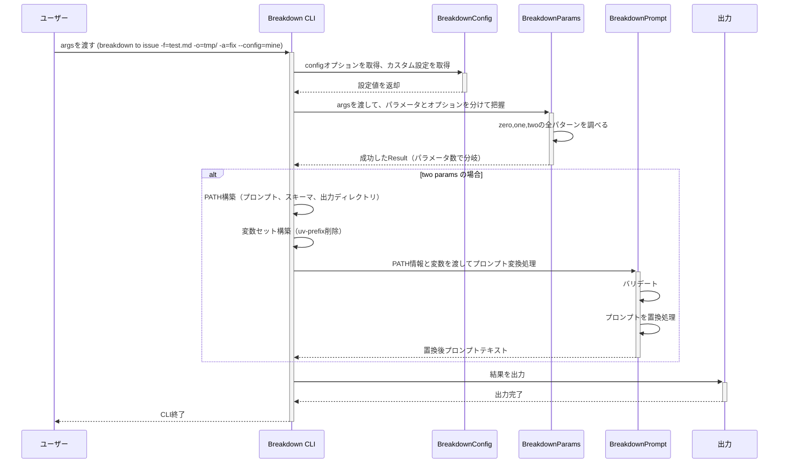
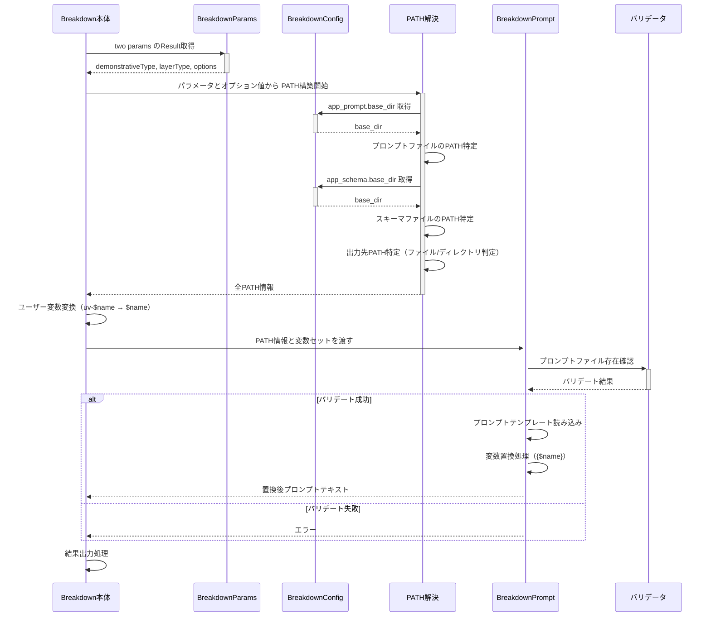
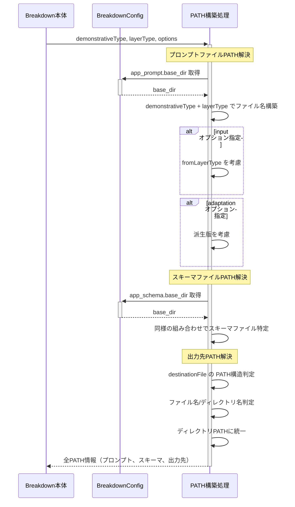

# 設計の階層構造

1 が最上位。中道度が高い。
数字が大きいほど具体。

# 1. 最上位設計

1. CLIにargsを渡す(ex. `./.deno/bin/breakdown to issue -f=test.md, -o=tmp/ -a=fix --config=mine`)
2. breakdownのCLI起動
3. パラメータとオプションを分けて把握
4. パラメータが2個あるとき（two params）、プロンプトを選ぶ
5. プロンプトを、オプション値で置換する
6. 結果を出力する(結果 = 置換後プロンプトのテキスト)
7. CLI終了

# 2. 処理分解

1. configオプションを取得し、カスタム設定を取得 → Breakdown本体で実施
2. argsを受け取って、パラメータとオプションを分けて把握 → BreakdownParams へ移譲
2-1. このとき、BreakdownConfigPrefix にて、パラメータをカスタム設定するprefixが必要（任意）
3. BreakdownParams から Result を受け取り、パラメータの数で分岐（zero,one,two）
4. zero,one,two の処理に分かれて実施

# 2. パラメータの処理

1. BreakdownParams の Result は、 zero,one,two とも取得
2. zero,one,twoを全て調べ、成功したものを採用する
2-1. args → BreakdownParams Result → 成功したものを利用
2-2. Breakdown本体は、 args の分解も行わないし、定義も知らないで済む（関心の分離）
2-2-1. ただし `--config/-c` だけ例外。BreakdownParams の前に設定ファイルを特定する必要があるため避けられない。

# 3. two パラメータの処理

1. Breakdown本体は、BreakdownParams の Result から、PATH構築
2. プロンプトのPATH、Schema特定のPATH、出力ディレクトリに関わるPATHをそれぞれ分けて作成
2-1.  プロンプトやSchema特定のPATHは、BreakdownConfigの設定値、.base_dir を使う
3. 全てのPATHが解決されたあと、変数と一緒に BreakdownPrompt へ渡す
4. BreakdownPrompt がプロンプト変換処理を行って、結果のプロンプト文を返す
5. 出力する

# 3. two パラメータで使える文字の指定

1. 設定ファイルを作成する時に、条件を意識する
2. 設定ファイルを使い、BreakdownConfig値をBreakdownParamsへ渡す
3. Breakdown本体は、twoパラメータで使える文字列の条件に関知しない（設定とBreakdownParamsに移譲）

# 4. PATH解決

1. two params では、demonstrativeType, layerType が使われる。これをパラメータの値からセットする。
1-1. さらに、input オプションが fromLayerType を指定することもできる
1-2. 加えて、adaptation オプションが派生版を指定することもできる
2. パラメータとオプション値の組み合わせから、prompt ファイルを1つ特定する
2-1. Schemaファイルの特定も同様に行う
2-2. 出力先の特定も同様に行う
3. 特定されたプロンプトを読み込むよう、 BreakdownPrompt へPATHを渡す
3-1. BreakdownPrompt がバリデートする
3-2. Breakdown本体はPATHバリデータを持たない

# 5. プロンプトファイルのPATH解決

1. BreakdownConfigの `app_prompt.base_dir`が基底となる。
2. 組み合わせ方は `docs/path.ja.md` に組み合わせの詳細を記載しているので参照すること
3. Validatorがファイルの存在確認を行う必要はない
3-1. BreakdownPrompt がバリデートする

## 留意点: 事前準備が必要

- prompt ファイルは、事前に準備されている前提である。
- CLI実行時には、生成されない。存在しないプロンプトを指定することが、起こり得る

# 5. SchemaファイルのPATH解決

1. BreakdownConfigの `app_schema.base_dir`が基底となる。
2. 組み合わせ方は `docs/path.ja.md` に組み合わせの詳細を記載しているので参照すること
3. Validatorがファイルの存在確認を行う必要はない
3-1. BreakdownPrompt がバリデートする

# 5. Destination のPATH解決

1. destinationFile 指定が、PATH構造を持つか否かで分岐する.
1-1. さらに、指定がファイル名か、ディレクトリ名かで分岐する
1-2. BreakdownPrompt の destination_path は、ディレクトリしか受け取らないのでディレクトリにする
2. 組み合わせ方は `docs/path.ja.md` に組み合わせの詳細を記載しているので参照すること
3. Validatorがファイルの存在確認を行う必要はない
3-1. BreakdownPrompt がバリデートする

# 4. 置換用の変数セット

1. Breakdown本体は、BreakdownParams から Option値のセットを取得する
2. Breakdown本体は、BreakdownPrompt が期待する Variables 形式に変換する
2-1. BreakdownParams が `uv-$name` 形式で返却
2-2. Breakdown本体は、`uv-` を削除して $name だけで Variables を構築
3. Breakdown本体は、BreakdownPrompt へ Variables を渡す(Path情報もBreakdownPromptへ渡す一部)
3-1. BreakdownPromptでは、英数字とアンダースコアのみ使用可能, 先頭は英字のみ, 大文字小文字を区別
3-2. 詳細: https://github.com/tettuan/breakdownprompt/blob/main/docs/variables.ja.md

# 3. カスタムできる種類

1. config: 
  - 標準: app.yml, user.yml
  - カスタム: $prefix-app.yml, $prefix-user.yml
  - カスタム指定方法: CLI オプションで `--config/-c`を使う
    -例: `--config=production`, `-c=system`
2. two パラメータに使える指示詞
  - 標準: 
    - demonstrativetype: to,summary,defect
    - layerType: project,issue,task
  - カスタム: 正規表現パターン
  - カスタム指定方法: 
    - demonstrativetype: config で `params.two.demonstrativeType.pattern`
    - layerType: config で `params.two.layerType.pattern`
    -例: `--config=production`, `-c=system`
3. プロンプトのユーザー変数
  - 標準: なし
  - カスタム: `--uv-$name=value` を プロンプトテンプレートでは {$name} で使う
  - カスタム指定方法: CLI オプションで `--uv-$name=value` を使う
    - BreakdownParams では、 `uv-$name` をキーにして、受け取る
    - プロンプト内部は、{$name} を使う

# シーケンス図

## 大きな粒度のシーケンス図（最上位設計レベル）

## 小さい範囲のシーケンス図（two パラメータ処理の詳細）

## PATH解決の詳細シーケンス図

