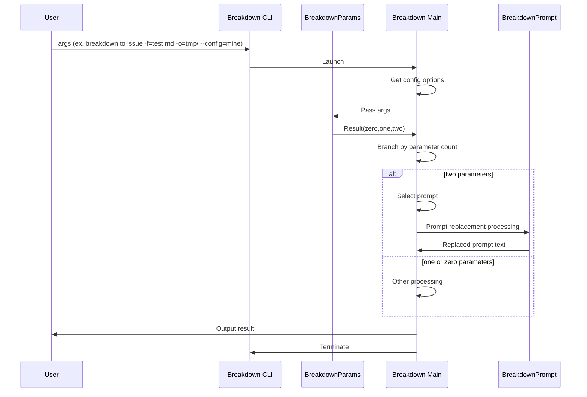
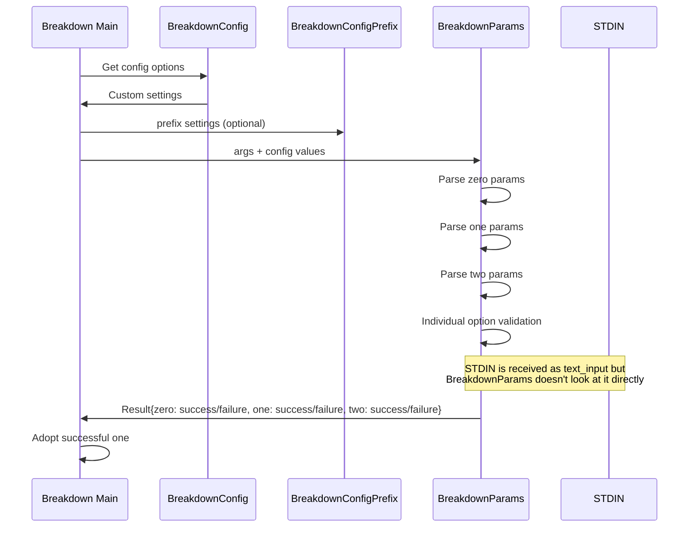
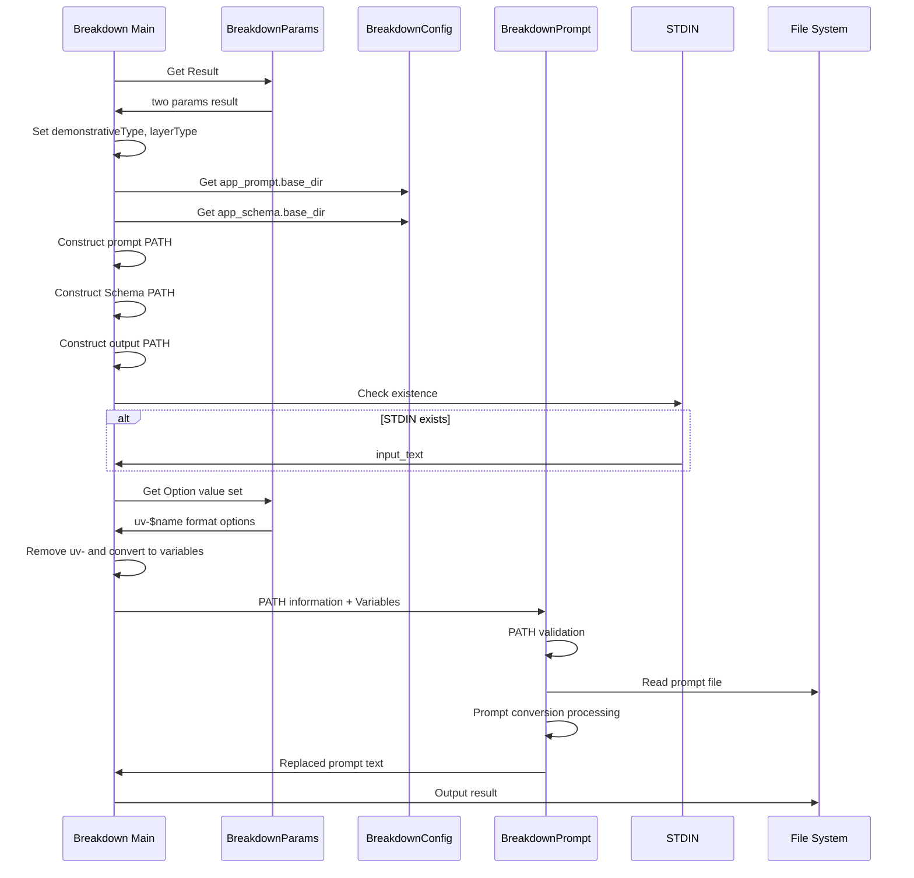
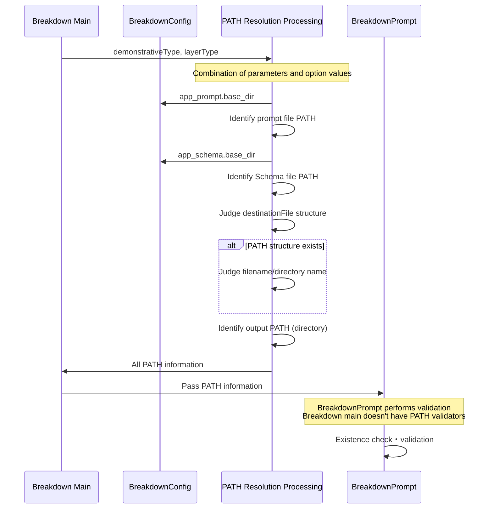

# Design Hierarchy

1 is the top level. High level of abstraction.
The larger the number, the more concrete.

# 1. Top-Level Design

1. Pass args to CLI (ex. `./.deno/bin/breakdown to issue -f=test.md, -o=tmp/ -a=fix --config=mine`)
2. Launch breakdown CLI
3. Parse and understand parameters and options separately
4. When there are two parameters (two params), select a prompt
5. Replace the prompt with option values
6. Output the result (result = text of the replaced prompt)
7. CLI termination

# 1. Module Division

The Breakdown main body has four external modules.
These are internal implementations that were intentionally made external.

They are like the Four Heavenly Kings and can be treated as equals to the main body.

1. BreakdownParams
2. BreakdownConfig
3. BreakdownPrompt
4. BreakdownLogger

# 2. Process Breakdown

1. Get config options and retrieve custom settings → Implemented in Breakdown main body
2. Receive args and parse parameters and options separately → Delegated to BreakdownParams
2-1. At this time, ConfigPrefixDetector needs a prefix for custom parameter configuration (optional)
3. Receive Result from BreakdownParams and branch based on parameter count (zero, one, two)
4. Execute separately for zero, one, two processing

# 2. Parameter Processing

1. BreakdownParams Result acquires zero, one, two all
2. Check all zero, one, two and adopt the successful one
2-1. args → BreakdownParams Result → Use the successful one
2-2. Breakdown main body doesn't need to decompose args or know definitions (separation of concerns)
2-2-1. However, `--config/-c` is an exception. It's unavoidable because the config file needs to be identified before BreakdownParams.

# 3. Reason for Generating zero, one, two in Parameter Processing

1. Breakdown main body doesn't parse args, so it doesn't know the contents
2. Pass args to BreakdownParams
3. BreakdownParams doesn't know how the Result will be used
4. BreakdownParams' responsibility is up to returning analysis results
5. As a result, Breakdown main body passes args, and BreakdownParams returns Result including three Results
5-1. Result has zero, one, two, each with success/failure
6. Breakdown main body branches processing based on zero, one, two judgment results
7. Breakdown main body determines what options are available for each of zero, one, two
7-1. BreakdownParams only validates individual Options
8. BreakdownParams receives STDIN as text_input
8-1. BreakdownParams doesn't look at STDIN

# 3. Two Parameter Processing

1. Breakdown main body constructs PATH from BreakdownParams Result
2. Create prompt PATH, Schema identification PATH, and output directory related PATHs separately
2-1. Prompt and Schema identification PATHs use BreakdownConfig settings, .base_dir
3. Check for STDIN existence, and if it exists, treat it as input_text
4. After all PATHs are resolved, pass them to BreakdownPrompt along with variables
5. BreakdownPrompt performs prompt conversion processing and returns the resulting prompt text
6. Output

# 3. Character Specification for Two Parameters

1. Consider conditions when creating config files
2. Use config files to pass BreakdownConfig values to BreakdownParams
3. Breakdown main body doesn't care about string conditions usable in two parameters (delegated to config and BreakdownParams)

# 4. PATH Resolution

1. In two params, demonstrativeType, layerType are used. Set these from parameter values.
1-1. Additionally, input option can specify fromLayerType
1-2. Furthermore, adaptation option can specify derivative versions
2. Identify one prompt file from the combination of parameters and option values
2-1. Schema file identification is done similarly
2-2. Output destination identification is done similarly
3. Pass PATH to BreakdownPrompt to read the identified prompt
3-1. BreakdownPrompt validates
3-2. Breakdown main body doesn't have PATH validators

# 5. Prompt File PATH Resolution

1. BreakdownConfig's `app_prompt.base_dir` is the base.
2. For combination details, refer to `docs/path.md`
3. Validator doesn't need to check file existence
3-1. BreakdownPrompt validates

## Note: Preparation Required

- Prompt files are assumed to be prepared in advance.
- They are not generated at CLI execution time. Specifying non-existent prompts can occur.

# 5. Schema File PATH Resolution

1. BreakdownConfig's `app_schema.base_dir` is the base.
2. For combination details, refer to `docs/path.md`
3. Validator doesn't need to check file existence
3-1. BreakdownPrompt validates

# 5. Destination PATH Resolution

1. Branch based on whether destinationFile specification has PATH structure.
1-1. Furthermore, branch based on whether the specification is a filename or directory name
1-2. BreakdownPrompt's destination_path only accepts directories, so make it a directory
2. For combination details, refer to `docs/path.md`
3. Validator doesn't need to check file existence
3-1. BreakdownPrompt validates

# 4. Variable Set for Replacement

1. Breakdown main body gets Option value set from BreakdownParams
2. Breakdown main body converts to Variables format expected by BreakdownPrompt
2-1. BreakdownParams returns in `uv-$name` format
2-2. Breakdown main body removes `uv-` and constructs Variables with only $name
3. Breakdown main body passes Variables to BreakdownPrompt (PATH information is also part of what's passed to BreakdownPrompt)
3-1. In BreakdownPrompt, only alphanumeric characters and underscores are allowed, only alphabetic characters at the beginning, case-sensitive
3-2. Details: https://github.com/tettuan/breakdownprompt/blob/main/docs/variables.md

# 3. Customizable Types

Users can specify and customize the following three points:

1. config:
  - Standard: app.yml, user.yml
  - Custom: $prefix-app.yml, $prefix-user.yml
  - Custom specification method: Use `--config/-c` CLI option
    - Example: `--config=production`, `-c=system`
2. Directive words usable in two parameters
  - Standard:
    - demonstrativetype: to, summary, defect
    - layerType: project, issue, task
  - Custom: Regular expression patterns
  - Custom specification method:
    - demonstrativetype: config `params.two.demonstrativeType.pattern`
    - layerType: config `params.two.layerType.pattern`
    - Example: `--config=production`, `-c=system`
3. Prompt user variables
  - Standard: none
  - Custom: Use `--uv-$name=value` in prompt templates as {$name}
  - Custom specification method: Use CLI option `--uv-$name=value`
    - BreakdownParams receives with `uv-$name` as key
    - Inside prompts, use {$name}

# Sequence Diagrams

## 1. Top Level - Overall CLI Flow

## 2. Parameter Processing Level - BreakdownParams Details

## 3. Two Parameter Processing Level - PATH Resolution and Variable Processing

## 4. PATH Resolution Detail Level - File Identification Process

## 5. Variable Processing Detail Level - Custom Variables and Option Processing

## Design Considerations

### Separation of Concerns
- **Breakdown Main**: Doesn't parse args, doesn't know parameter definitions
- **BreakdownParams**: Responsibility up to returning analysis results, doesn't know how results are used  
- **BreakdownPrompt**: Performs PATH validation, main doesn't have validators

### Need for Preparation
- Prompt files are assumed to be prepared in advance
- Not generated at CLI execution time
- Possibility of specifying non-existent prompts

### Customization Points
1. **config**: Specify prefix with `--config/-c`
2. **Parameter patterns**: Control demonstrative/layerType with regular expressions
3. **User variables**: Control prompt variables with `--uv-$name=value`
