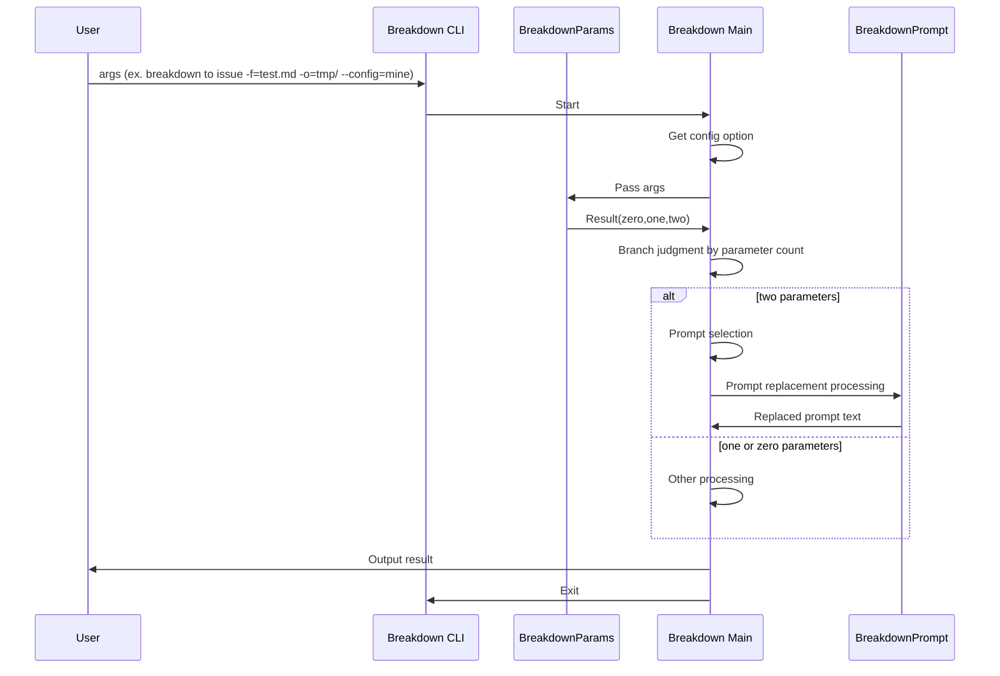
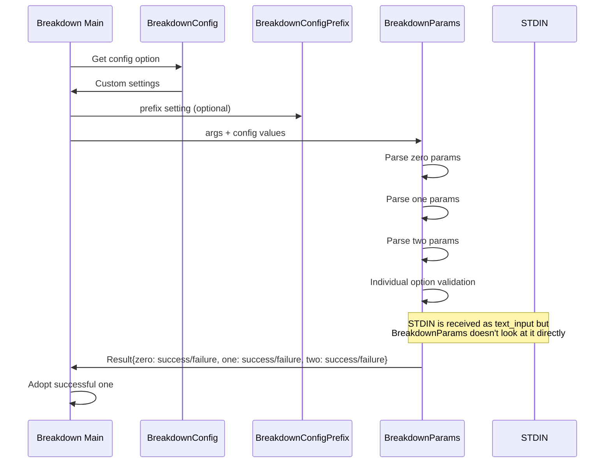
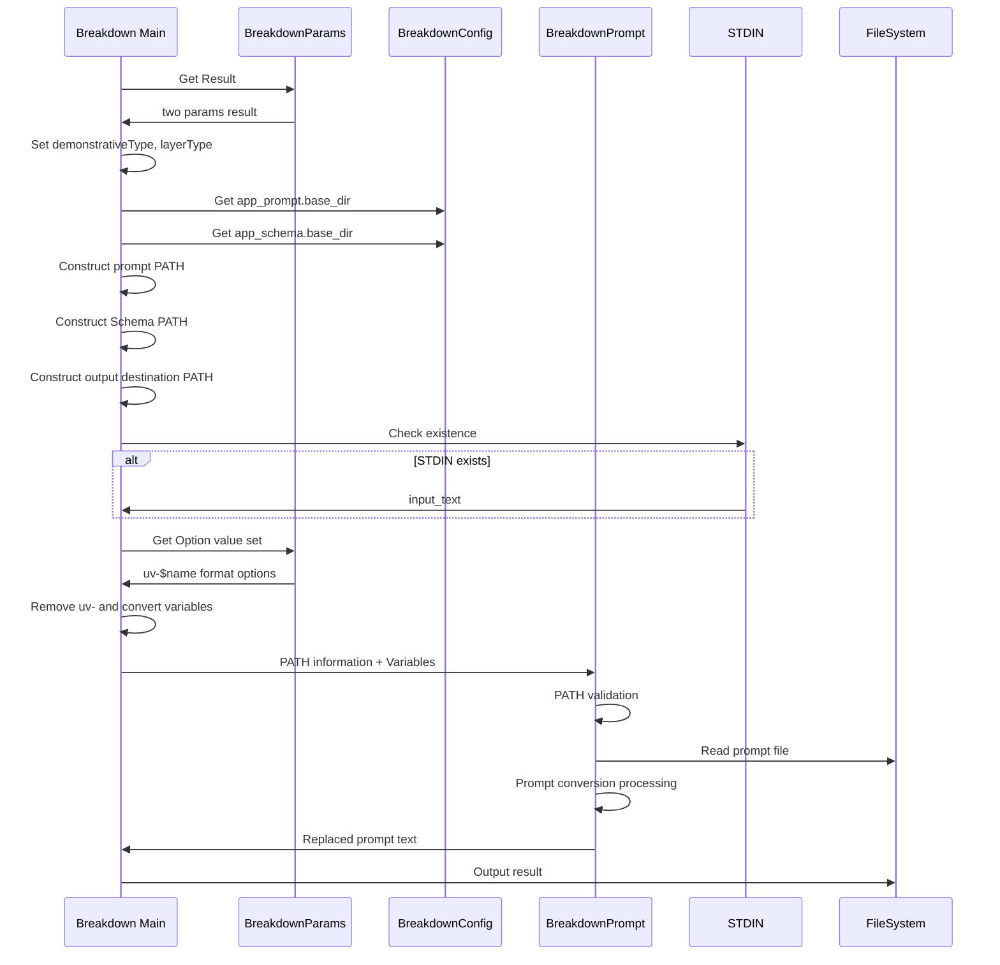
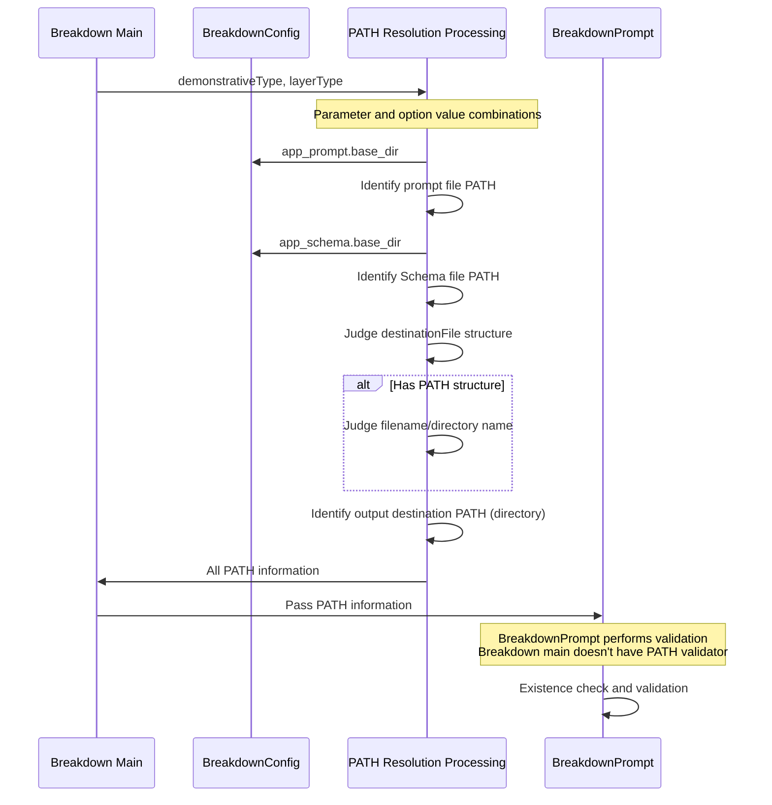
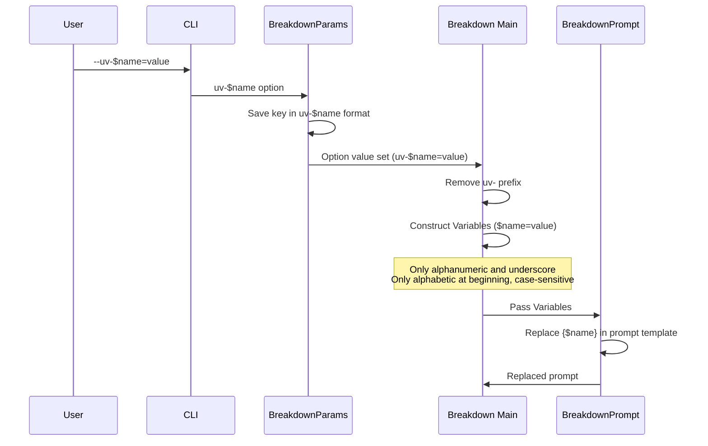

# Design Hierarchical Structure

1 is the top level. High neutrality.
The larger the number, the more specific.

# 1. Top-Level Design

1. Pass args to CLI (ex. `./.deno/bin/breakdown to issue -f=test.md, -o=tmp/ -a=fix --config=mine`)
2. Launch breakdown CLI
3. Understand parameters and options separately
4. When there are 2 parameters (two params), select prompt
5. Replace prompt with option values
6. Output result (result = text of prompt after replacement)
7. Exit CLI

# 2. Process Breakdown

1. Get config option and obtain custom settings → Executed by Breakdown main
2. Receive args and understand parameters and options separately → Delegated to BreakdownParams
2-1. At this time, ConfigPrefixDetector needs prefix for custom configuration of parameters (optional)
3. Receive Result from BreakdownParams and branch by number of parameters (zero, one, two)
4. Execute separately for zero, one, two processes

# 2. Parameter Processing

1. BreakdownParams Result obtains zero, one, two
2. Check all zero, one, two and adopt the successful one
2-1. args → BreakdownParams Result → Use the successful one
2-2. Breakdown main doesn't need to break down args or know definitions (separation of concerns)
2-2-1. However, `--config/-c` is an exception. Configuration file must be identified before BreakdownParams, so it's unavoidable.

# 3. Reason for Generating zero, one, two in Parameter Processing

1. Breakdown main doesn't parse args so doesn't know the contents
2. Pass args to BreakdownParams
3. BreakdownParams doesn't know how Result is used
4. BreakdownParams' responsibility is to return analysis results
5. As a result, Breakdown main passes args, and BreakdownParams returns Result including three Results
5-1. Result has zero, one, two, each having success/failure
6. Breakdown main branches processing based on zero, one, two judgment results
7. Breakdown main determines what options can be taken for each zero, one, two
7-1. BreakdownParams only validates individual Options
8. BreakdownParams receives STDIN as text_input
8-1. BreakdownParams doesn't look at STDIN

# 3. Two Parameter Processing

1. Breakdown main constructs PATH from BreakdownParams Result
2. Create separately PATHs for prompt PATH, Schema identification PATH, and output directory-related PATH
2-1. Prompt and Schema identification PATHs use BreakdownConfig configuration value, .base_dir
3. Check STDIN existence and treat as input_text if present
4. After all PATHs are resolved, pass to BreakdownPrompt with variables
5. BreakdownPrompt performs prompt conversion processing and returns resulting prompt text
6. Output

# 3. Character Specification Usable in Two Parameters

1. Consider conditions when creating configuration files
2. Use configuration files and pass BreakdownConfig values to BreakdownParams
3. Breakdown main doesn't concern itself with character string conditions usable in two parameters (delegated to configuration and BreakdownParams)

# 4. PATH Resolution

1. In two params, demonstrativeType, layerType are used. Set these from parameter values.
1-1. Additionally, input option can specify fromLayerType
1-2. Also, adaptation option can specify derived version
2. Identify one prompt file from parameter and option value combinations
2-1. Schema file identification is done similarly
2-2. Output destination identification is done similarly
3. Pass PATH to BreakdownPrompt to read identified prompt
3-1. BreakdownPrompt validates
3-2. Breakdown main doesn't have PATH validator

# 5. Prompt File PATH Resolution

1. BreakdownConfig's `app_prompt.base_dir` becomes the base.
2. Combination method details are described in `docs/path.md`, so refer to it
3. Validator doesn't need to check file existence
3-1. BreakdownPrompt validates

## Note: Advance Preparation Required

- Prompt files are assumed to be prepared in advance.
- Not generated during CLI execution. It's possible to specify non-existent prompts

# 5. Schema File PATH Resolution

1. BreakdownConfig's `app_schema.base_dir` becomes the base.
2. Combination method details are described in `docs/path.md`, so refer to it
3. Validator doesn't need to check file existence
3-1. BreakdownPrompt validates

# 5. Destination PATH Resolution

1. Branch by whether destinationFile specification has PATH structure or not.
1-1. Additionally, branch by whether specification is filename or directory name
1-2. BreakdownPrompt's destination_path only accepts directories, so make it a directory
2. Combination method details are described in `docs/path.md`, so refer to it
3. Validator doesn't need to check file existence
3-1. BreakdownPrompt validates

# 4. Variable Set for Replacement

1. Breakdown main gets Option value set from BreakdownParams
2. Breakdown main converts to Variables format expected by BreakdownPrompt
2-1. BreakdownParams returns in `uv-$name` format
2-2. Breakdown main removes `uv-` and constructs Variables with only $name
3. Breakdown main passes Variables to BreakdownPrompt (PATH information is also part of what's passed to BreakdownPrompt)
3-1. In BreakdownPrompt, only alphanumeric characters and underscores are usable, only alphabetic characters at the beginning, case-sensitive
3-2. Details: https://github.com/tettuan/breakdownprompt/blob/main/docs/variables.md

# 3. Types of Customization

Users can specify and customize the following 3 points.

1. config: 
  - Standard: app.yml, user.yml
  - Custom: $prefix-app.yml, $prefix-user.yml
  - Custom specification method: Use CLI option `--config/-c`
    - Example: `--config=production`, `-c=system`
2. Directives usable in two parameters
  - Standard: 
    - demonstrativetype: to,summary,defect
    - layerType: project,issue,task
  - Custom: Regular expression pattern
  - Custom specification method: 
    - demonstrativetype: config with `params.two.demonstrativeType.pattern`
    - layerType: config with `params.two.layerType.pattern`
    - Example: `--config=production`, `-c=system`
3. Prompt user variables
  - Standard: none
  - Custom: `--uv-$name=value` used as {$name} in prompt template
  - Custom specification method: Use CLI option `--uv-$name=value`
    - In BreakdownParams, receive with `uv-$name` as key
    - Inside prompt, use {$name}

# Sequence Diagrams

## 1. Top Level - Overall CLI Flow

## 2. Parameter Processing Level - BreakdownParams Details

## 3. Two Parameter Processing Level - PATH Resolution and Variable Processing

## 4. PATH Resolution Detail Level - File Identification Process

## 5. Variable Processing Detail Level - Custom Variables and Option Processing

## Design Considerations

### Separation of Concerns
- **Breakdown Main**: Doesn't parse args, doesn't know parameter definitions
- **BreakdownParams**: Responsibility is to return analysis results, doesn't know how results are used  
- **BreakdownPrompt**: Performs PATH validation, main doesn't have validator

### Need for Advance Preparation
- Prompt files are assumed to be prepared in advance
- Not generated during CLI execution
- Possibility of specifying non-existent prompts

### Customization Points
1. **config**: Specify prefix with `--config/-c`
2. **Parameter patterns**: Control demonstrative/layerType with regular expressions
3. **User variables**: Control variables in prompt with `--uv-$name=value`