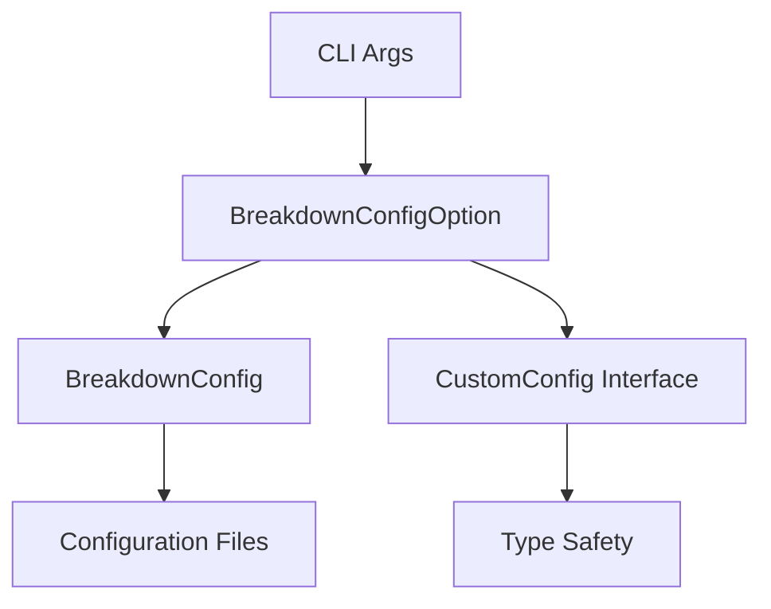

# BreakdownConfigPrefix仕様書

## 概要

BreakdownConfigPrefixは、CLIオプション`--config`および`-c`を通じて設定ファイルのプレフィックスを指定する機能です。このプレフィックスにより、異なる環境や用途に応じた設定ファイルを柔軟に選択できます。

## パッケージ責務範囲

### 1. 責務定義

BreakdownConfigPrefixの責務は、以下の機能に明確に限定されています：

- **CLI引数解析**: `--config=prefix`および`-c=prefix`形式のオプション解析
- **プレフィックス抽出**: 設定値からプレフィックス部分の抽出
- **BreakdownConfig連携**: プレフィックスを用いたBreakdownConfigインスタンス生成
- **CustomConfig管理**: 設定ファイルからのCustomConfig取得と型安全性保証

### 2. 責務境界（やらないこと）

- プレフィックス値のバリデーション（BreakdownConfigの責務）
- 設定ファイルの読み込み処理（BreakdownConfigの責務）
- 設定値の解釈や変換（BreakdownConfigの責務）
- エラーハンドリング（各パッケージの責務）

### 3. 依存関係



## API仕様

### BreakdownConfigOptionクラス

#### コンストラクタ

```typescript
constructor(args: string[], workingDir?: string)
```

**パラメータ**:
- `args`: CLI引数配列
- `workingDir`: 作業ディレクトリ（オプション、デフォルト: `Deno.cwd()`）

**機能**: CLI引数を解析してプレフィックスを抽出

#### メソッド一覧

##### 基本メソッド

```typescript
getConfigPrefix(): string | undefined
```
- **戻り値**: 解析されたプレフィックス、またはundefined
- **用途**: プレフィックス値の取得

```typescript
hasConfigOption(): boolean
```
- **戻り値**: オプションが指定されている場合true
- **用途**: オプション存在確認

##### 設定読み込みメソッド

```typescript
async loadBreakdownConfig(): Promise<void>
```
- **機能**: BreakdownConfigインスタンスの初期化と設定読み込み
- **例外**: 読み込み失敗時にErrorを投げる

```typescript
async getFullConfig(): Promise<FullConfig>
```
- **戻り値**: 完全な設定オブジェクト
- **機能**: 全設定項目の取得

##### CustomConfig管理メソッド

```typescript
async getCustomConfig(): Promise<CustomConfig | undefined>
```
- **戻り値**: CustomConfig、または設定されていない場合undefined
- **機能**: カスタム設定の取得

```typescript
setCustomConfig(customConfig: CustomConfig): void
```
- **パラメータ**: 設定するCustomConfigオブジェクト
- **用途**: テストや動的設定変更

```typescript
async isCustomConfigEnabled(): Promise<boolean>
```
- **戻り値**: CustomConfigが有効化されている場合true
- **機能**: 有効化状態の確認

##### 特定機能確認メソッド

```typescript
async isFindBugsEnabled(): Promise<boolean>
```
- **戻り値**: findBugs機能が有効化されている場合true

```typescript
async getFindBugsConfig(): Promise<CustomConfig["findBugs"] | undefined>
```
- **戻り値**: findBugs設定、または未設定の場合undefined

```typescript
async getSupportedTwoParams(): Promise<string[]>
```
- **戻り値**: サポートされている2パラメータコマンドの配列

```typescript
async isTwoParamSupported(param: string): Promise<boolean>
```
- **パラメータ**: 確認するパラメータ名
- **戻り値**: サポートされている場合true

### 型定義

#### CustomConfig

```typescript
interface CustomConfig {
  enabled?: boolean;
  find?: {
    twoParams?: string[];
  };
  findBugs?: {
    enabled?: boolean;
    sensitivity?: string;
    patterns?: string[];
    includeExtensions?: string[];
    excludeDirectories?: string[];
    maxResults?: number;
    detailedReports?: boolean;
  };
}
```

#### FullConfig

```typescript
interface FullConfig {
  customConfig?: CustomConfig;
  breakdownParams?: {
    version?: string;
    customConfig?: {
      params?: {
        two?: Record<string, unknown>;
      };
      validation?: Record<string, unknown>;
      options?: Record<string, unknown>;
    };
    customParams?: Record<string, unknown>;
  };
  logger?: Record<string, unknown>;
  performance?: Record<string, unknown>;
  output?: Record<string, unknown>;
  security?: Record<string, unknown>;
  features?: Record<string, unknown>;
}
```

## 使用例

### 基本的な使用方法

```typescript
// CLI引数の解析
const args = ["--config=production", "other", "args"];
const configOption = new BreakdownConfigOption(args);

// プレフィックス取得
const prefix = configOption.getConfigPrefix(); // "production"

// 設定の存在確認
if (configOption.hasConfigOption()) {
  console.log("設定プレフィックスが指定されています");
}
```

### 設定ファイル読み込み

```typescript
// BreakdownConfig読み込み
await configOption.loadBreakdownConfig();

// 全設定取得
const fullConfig = await configOption.getFullConfig();
console.log("設定:", fullConfig);

// CustomConfig取得
const customConfig = await configOption.getCustomConfig();
if (customConfig?.enabled) {
  console.log("カスタム設定が有効です");
}
```

### 機能別設定確認

```typescript
// findBugs機能の確認
const isFindBugsEnabled = await configOption.isFindBugsEnabled();
if (isFindBugsEnabled) {
  const findBugsConfig = await configOption.getFindBugsConfig();
  console.log("findBugs設定:", findBugsConfig);
}

// サポートされているコマンドの確認
const supportedParams = await configOption.getSupportedTwoParams();
console.log("サポートコマンド:", supportedParams);

// 特定コマンドのサポート確認
const isSupported = await configOption.isTwoParamSupported("bugs");
console.log("bugsコマンドサポート:", isSupported);
```

### 設定ファイル例

#### production.yml
```yaml
customConfig:
  enabled: true
  findBugs:
    enabled: true
    sensitivity: high
    patterns:
      - "*.bug"
      - "error*"
    includeExtensions:
      - ".ts"
      - ".js"
    excludeDirectories:
      - "node_modules"
      - "dist"
    maxResults: 100
    detailedReports: true
  find:
    twoParams:
      - "bugs"
      - "errors"

breakdownParams:
  version: "1.0.0"
  customConfig:
    validation:
      strict: true
    params:
      two:
        bugs: "high-priority"
    options:
      verbose: true

logger:
  level: "info"
  format: "json"
```

#### development.yml
```yaml
customConfig:
  enabled: true
  findBugs:
    enabled: false
    sensitivity: low
  find:
    twoParams:
      - "bugs"

breakdownParams:
  version: "1.0.0-dev"

logger:
  level: "debug"
  format: "text"
```

### エラーハンドリング

```typescript
try {
  const configOption = new BreakdownConfigOption(args, "/custom/working/dir");
  await configOption.loadBreakdownConfig();
  
  const customConfig = await configOption.getCustomConfig();
  // 設定を使用した処理
} catch (error) {
  if (error instanceof Error) {
    console.error("設定読み込みエラー:", error.message);
  }
  // エラー処理
}
```

### テスト用途

```typescript
// テスト用設定の動的設定
const testConfig: CustomConfig = {
  enabled: true,
  findBugs: {
    enabled: true,
    sensitivity: "test"
  }
};

configOption.setCustomConfig(testConfig);
const isEnabled = await configOption.isCustomConfigEnabled(); // true
```

## アーキテクチャ考慮事項

### 1. 責務分離
- BreakdownConfigPrefixは引数解析とインターフェース提供のみ
- 実際の設定読み込みはBreakdownConfigパッケージが担当
- 設定値の検証や変換は各パッケージが独自に実装

### 2. 型安全性
- TypeScriptインターフェースによる型定義
- 実行時の型チェックはBreakdownConfigが担当
- 未定義値の適切な処理

### 3. 拡張性
- 新しい設定項目は型定義の拡張で対応
- カスタム設定の動的追加サポート
- 後方互換性の維持

### 4. エラー処理
- 各メソッドは適切な例外を投げる
- エラーメッセージは具体的で診断しやすい
- 失敗時の状態管理

この仕様書により、BreakdownConfigPrefixの責務範囲、API設計、使用方法が明確に定義されています。