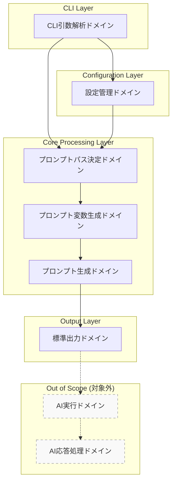
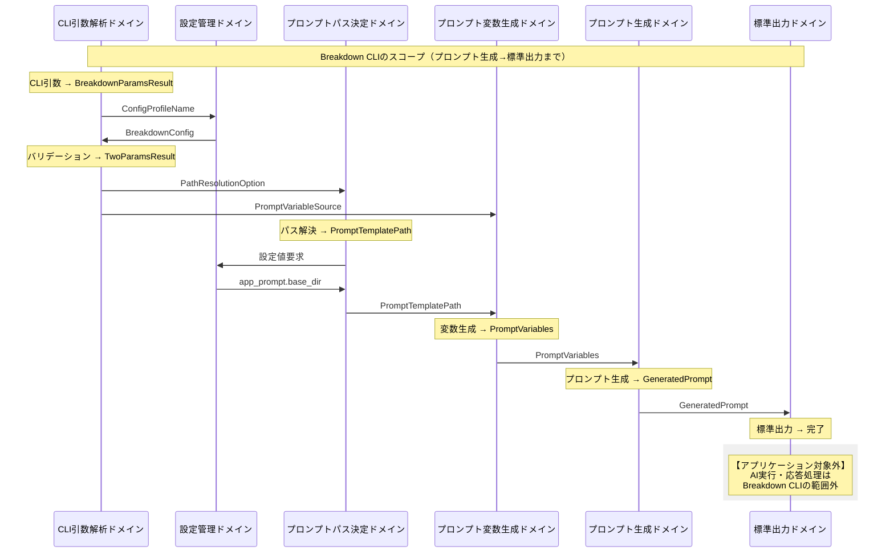
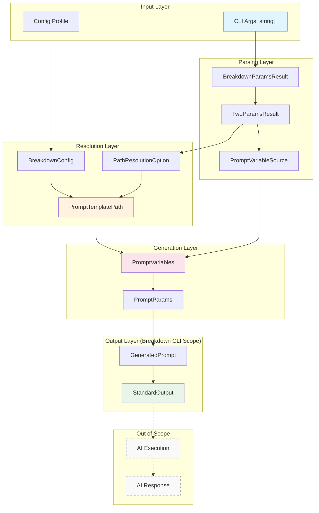
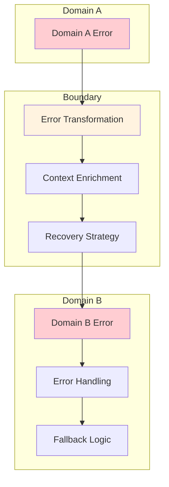

# ドメイン境界線とデータフロー

## プロローグ：ドメイン境界の全体像

Breakdown CLIは、3つの主要ドメインと複数の支援ドメインから構成される複雑なシステムです。このドキュメントでは、**ドメイン境界線**と**データの変換フロー**を体系的に整理し、バリューオブジェクトとユニオン型によるドメイン駆動設計を明確に表現します。

## 第1章：ドメイン境界の全体アーキテクチャ

### 主要ドメインの構成

```typescript
// ドメインの階層構造
type BreakdownDomain = 
  | "cli-parsing"           // CLI引数解析ドメイン
  | "config-management"     // 設定管理ドメイン
  | "prompt-path-resolution" // プロンプトパス決定ドメイン
  | "prompt-variable-generation" // プロンプト変数生成ドメイン
  | "prompt-generation"     // プロンプト生成ドメイン（最終出力）
  | "stdout-output";        // 標準出力ドメイン（標準出力まで）

// 注意：以下のドメインはアプリケーションの対象外
// | "prompt-execution"      // AIへのプロンプト実行（対象外）
// | "ai-response-processing" // AI応答の処理（対象外）
// 
// Breakdown CLIのスコープ：
// プロンプトを作成し、標準出力するまでがアプリケーションの責務範囲
```

### ドメイン境界の定義



## 第2章：バリューオブジェクト設計

### コアバリューオブジェクト

```typescript
// =============================================================================
// Domain Value Objects - ドメイン固有の値オブジェクト
// =============================================================================

/**
 * DirectiveType - 処理方向を表すバリューオブジェクト
 */
type DirectiveType = {
  readonly value: string;
  readonly profile: ConfigProfileName;
  readonly validatedByPattern: boolean;
  
  // ドメイン操作
  isValidForProfile(profile: ConfigProfileName): boolean;
  getPromptDirectory(baseDir: string, layer: LayerType): string;
  equals(other: DirectiveType): boolean;
}

/**
 * LayerType - 階層を表すバリューオブジェクト
 */
type LayerType = {
  readonly value: string;
  readonly validatedByPattern: boolean;
  
  // ドメイン操作
  isValidForDirective(directive: DirectiveType): boolean;
  getPromptFilename(fromLayerType: string, adaptation?: string): string;
  equals(other: LayerType): boolean;
}

/**
 * ConfigProfileName - 設定プロファイル名を表すバリューオブジェクト
 */
type ConfigProfileName = {
  readonly value: string;
  readonly isDefault: boolean;
  readonly prefix: string | null;
  
  // ドメイン操作
  getConfigPath(): string;
  getDirectiveTypes(): readonly DirectiveType[];
  getLayerTypes(): readonly LayerType[];
  equals(other: ConfigProfileName): boolean;
}

/**
 * PromptTemplatePath - プロンプトテンプレートパスを表すバリューオブジェクト
 */
type PromptTemplatePath = {
  readonly fullPath: string;
  readonly status: PathResolutionStatus;
  readonly metadata: PathResolutionMetadata;
  
  // ドメイン操作
  exists(): boolean;
  getDirectory(): string;
  getFilename(): string;
  toString(): string;
}

/**
 * PromptVariables - プロンプト変数を表すバリューオブジェクト
 */
type PromptVariables = {
  readonly inputContent: string;
  readonly inputFilePath?: string;
  readonly outputFilePath?: string;
  readonly schemaContent: string;
  readonly promptFilePath: string;
  readonly inputSource: InputSource;
  readonly uv: Record<string, string>;
  
  // ドメイン操作
  hasInputFile(): boolean;
  hasCustomVariables(): boolean;
  getVariableKeys(): string[];
  toPromptParams(): PromptParams;
}
```

### 支援バリューオブジェクト

```typescript
/**
 * TwoParams - 2パラメータ処理のバリューオブジェクト
 */
type TwoParams = {
  readonly directive: DirectiveType;
  readonly layer: LayerType;
  readonly profile: ConfigProfileName;
  
  // ドメイン操作
  toCommand(): BreakdownCommand;
  validate(): Result<void, TwoParamsValidationError>;
  getPromptPath(fromLayerType?: string, adaptation?: string): PromptPath;
  getSchemaPath(): SchemaPath;
  equals(other: TwoParams): boolean;
}

/**
 * BreakdownConfig - 設定を表すバリューオブジェクト
 */
type BreakdownConfig = {
  readonly profileName: ConfigProfileName;
  readonly app_prompt: PromptConfig;
  readonly app_schema: SchemaConfig;
  readonly customConfig: CustomConfig;
  
  // ドメイン操作
  getPromptBaseDirectory(): string;
  getSchemaBaseDirectory(): string;
  getPatternConfig(): PatternConfig;
  isValidTwoParams(directive: string, layer: string): boolean;
}
```

## 第3章：ユニオン型設計

### コマンド解析結果のユニオン型

```typescript
// =============================================================================
// Union Types - ドメインの選択肢を表現
// =============================================================================

/**
 * BreakdownParamsResult - CLI解析結果のユニオン型
 */
type BreakdownParamsResult = 
  | { type: "zero"; data: ZeroParamsResult }
  | { type: "one"; data: OneParamsResult }
  | { type: "two"; data: TwoParamsResult };

/**
 * ZeroParamsResult - システム情報表示のユニオン型
 */
type ZeroParamsResult = 
  | { kind: "help"; options: SystemOptions }
  | { kind: "version"; options: SystemOptions };

/**
 * OneParamsResult - 管理操作のユニオン型
 */
type OneParamsResult = 
  | { kind: "init"; options: ManagementOptions }
  | { kind: "copy"; options: ManagementOptions }
  | { kind: "delete"; options: ManagementOptions };

/**
 * TwoParamsResult - プロンプト生成のユニオン型
 */
type TwoParamsResult = {
  kind: "prompt-generation";
  params: TwoParams;
  options: PromptVariableSource;
};
```

### パス解決結果のユニオン型

```typescript
/**
 * PathResolutionResult - パス解決結果のユニオン型
 */
type PathResolutionResult = 
  | { status: "found"; path: PromptTemplatePath }
  | { status: "fallback"; path: PromptTemplatePath; reason: string }
  | { status: "error"; error: PathResolutionError };

/**
 * PathResolutionStatus - パス解決状態のユニオン型
 */
type PathResolutionStatus = 
  | "Found"
  | "Fallback"
  | "Error";

/**
 * InputSource - 入力源のユニオン型
 */
type InputSource = 
  | "file"
  | "stdin"
  | "both";
```

### エラーのユニオン型

```typescript
/**
 * BreakdownError - システム全体のエラーのユニオン型
 */
type BreakdownError = 
  | { domain: "cli-parsing"; error: CLIParsingError }
  | { domain: "config-management"; error: ConfigError }
  | { domain: "prompt-path-resolution"; error: PathResolutionError }
  | { domain: "prompt-variable-generation"; error: VariableGenerationError }
  | { domain: "prompt-generation"; error: PromptGenerationError }
  | { domain: "stdout-output"; error: OutputError };

// 注意：以下のエラー型はアプリケーションの対象外
// | { domain: "prompt-execution"; error: PromptExecutionError }
// | { domain: "ai-response-processing"; error: ResponseProcessingError }

/**
 * PathResolutionError - パス解決エラーのユニオン型
 */
type PathResolutionError = 
  | { kind: "InvalidParameterCombination"; directive: string; layer: string }
  | { kind: "BaseDirectoryNotFound"; baseDir: string }
  | { kind: "TemplateFileNotFound"; templatePath: string }
  | { kind: "FallbackExhausted"; attemptedPaths: string[] };

/**
 * VariableGenerationError - 変数生成エラーのユニオン型
 */
type VariableGenerationError = 
  | { kind: "FileNotFound"; filePath: string }
  | { kind: "FileReadError"; filePath: string; reason: string }
  | { kind: "STDINTimeout"; timeoutMs: number }
  | { kind: "InvalidCustomVariable"; key: string; value: string };
```

## 第4章：ドメイン間データフロー

### 完全なデータフロー図



### 段階的データ変換フロー



## 第5章：ドメイン境界の詳細仕様

### 1. CLI引数解析ドメイン → 設定管理ドメイン

```typescript
// 境界インターフェース
interface CLIToConfigBoundary {
  // 入力
  configProfileName: ConfigProfileName;
  
  // 出力
  breakdownConfig: BreakdownConfig;
  
  // 契約
  loadConfig(profileName: ConfigProfileName): Result<BreakdownConfig, ConfigError>;
}

// データ変換
const transformCLIToConfig = (args: string[]): ConfigProfileName => {
  const configOption = extractConfigOption(args);
  return ConfigProfileName.create(configOption ?? "breakdown");
};
```

### 2. 設定管理ドメイン → プロンプトパス決定ドメイン

```typescript
// 境界インターフェース
interface ConfigToPathBoundary {
  // 入力
  pathResolutionOption: PathResolutionOption;
  breakdownConfig: BreakdownConfig;
  
  // 出力
  promptTemplatePath: PromptTemplatePath;
  
  // 契約
  resolvePath(
    option: PathResolutionOption, 
    config: BreakdownConfig
  ): Result<PromptTemplatePath, PathResolutionError>;
}

// データ変換
const transformConfigToPath = (
  twoParams: TwoParams,
  config: BreakdownConfig
): PathResolutionOption => {
  return {
    adaptation: twoParams.options.adaptation,
    baseDirectory: config.app_prompt.base_dir,
    directive: twoParams.params.directive,
    layer: twoParams.params.layer
  };
};
```

### 3. プロンプトパス決定ドメイン → プロンプト変数生成ドメイン

```typescript
// 境界インターフェース
interface PathToVariablesBoundary {
  // 入力
  promptTemplatePath: PromptTemplatePath;
  promptVariableSource: PromptVariableSource;
  
  // 出力
  promptVariables: PromptVariables;
  
  // 契約
  generateVariables(
    templatePath: PromptTemplatePath,
    source: PromptVariableSource
  ): Result<PromptVariables, VariableGenerationError>;
}

// データ変換
const transformPathToVariables = (
  templatePath: PromptTemplatePath,
  source: PromptVariableSource
): PromptVariables => {
  return {
    inputContent: source.fromFile ? readFile(source.fromFile) : source.stdinContent ?? "",
    inputFilePath: source.fromFile ? resolve(source.fromFile) : undefined,
    outputFilePath: source.destinationFile ? resolve(source.destinationFile) : undefined,
    schemaContent: source.useSchema ? readSchemaFile(templatePath) : "",
    promptFilePath: templatePath.fullPath,
    inputSource: determineInputSource(source),
    uv: source.customVariables ?? {}
  };
};
```

### 4. プロンプト変数生成ドメイン → プロンプト生成ドメイン

```typescript
// 境界インターフェース
interface VariablesToPromptBoundary {
  // 入力
  promptVariables: PromptVariables;
  
  // 出力
  generatedPrompt: GeneratedPrompt;
  
  // 契約
  generatePrompt(
    variables: PromptVariables
  ): Result<GeneratedPrompt, PromptGenerationError>;
}

// データ変換
const transformVariablesToPrompt = (
  variables: PromptVariables
): PromptParams => {
  return {
    template_file: variables.promptFilePath,
    variables: {
      inputContent: variables.inputContent,
      inputFilePath: variables.inputFilePath ?? "",
      outputFilePath: variables.outputFilePath ?? "",
      schemaContent: variables.schemaContent,
      inputSource: variables.inputSource,
      ...variables.uv
    }
  };
};
```

### 5. プロンプト生成ドメイン → 標準出力ドメイン

```typescript
// 境界インターフェース
interface PromptToOutputBoundary {
  // 入力
  generatedPrompt: GeneratedPrompt;
  
  // 出力
  outputResult: StandardOutputResult;
  
  // 契約
  outputToStdout(
    prompt: GeneratedPrompt
  ): Result<StandardOutputResult, OutputError>;
}

// データ変換
const transformPromptToOutput = (
  prompt: GeneratedPrompt
): StandardOutputData => {
  return {
    content: prompt.content,
    metadata: prompt.metadata,
    timestamp: new Date().toISOString()
  };
};
```

### 注意：アプリケーションスコープ外のドメイン

```typescript
// 以下のドメインはBreakdown CLIの対象外
// 
// interface PromptExecutionBoundary {
//   // AI実行サービス（Claude, GPT等）へのプロンプト送信
//   executeWithAI(prompt: GeneratedPrompt): Result<AIResponse, AIError>;
// }
// 
// interface ResponseProcessingBoundary {
//   // AI応答の処理・整形
//   processResponse(response: AIResponse): Result<ProcessedResult, ProcessingError>;
// }
// 
// Breakdown CLIの責務範囲：
// ユーザー入力 → プロンプト生成 → 標準出力 まで
```

## 第6章：エラーハンドリングの境界設計

### ドメイン間エラー伝播

```typescript
// エラー伝播の型安全な設計
type DomainErrorPropagation = {
  // 各ドメインのエラーを上位に伝播
  propagate<T extends BreakdownError>(error: T): BreakdownError;
  
  // エラー回復戦略
  recover<T extends BreakdownError>(error: T): RecoveryAction;
  
  // エラー情報の豊富化
  enrich<T extends BreakdownError>(error: T, context: ErrorContext): T;
};

// 回復戦略のユニオン型
type RecoveryAction = 
  | { kind: "retry"; maxAttempts: number }
  | { kind: "fallback"; alternativePath: string }
  | { kind: "user-intervention"; message: string }
  | { kind: "abort"; reason: string };
```

### 境界でのエラー変換



## 第7章：境界の実装パターン

### 1. Smart Constructor パターン

```typescript
// 境界での型安全な生成
namespace DirectiveType {
  export function create(
    value: string,
    profile: ConfigProfileName
  ): Result<DirectiveType, InvalidDirectiveError> {
    // バリデーション
    if (!isValidDirective(value, profile)) {
      return Result.error({
        kind: "InvalidDirective",
        value,
        profile,
        validDirectives: getValidDirectives(profile)
      });
    }
    
    // 成功時の生成
    return Result.ok({
      value,
      profile,
      validatedByPattern: true,
      isValidForProfile: (p) => p.equals(profile),
      getPromptDirectory: (baseDir, layer) => `${baseDir}/${value}/${layer.value}`,
      equals: (other) => other.value === value && other.profile.equals(profile),
      toString: () => value
    });
  }
}
```

### 2. Factory パターン

```typescript
// 境界での複雑な生成処理
class PromptVariablesFactory {
  create(
    templatePath: PromptTemplatePath,
    source: PromptVariableSource,
    config: BreakdownConfig
  ): Result<PromptVariables, VariableGenerationError> {
    try {
      // 段階的な変換
      const inputProcessing = this.processInput(source);
      const pathResolution = this.resolvePaths(source, config);
      const schemaProcessing = this.processSchema(templatePath, source);
      const variableIntegration = this.integrateVariables(
        inputProcessing,
        pathResolution,
        schemaProcessing,
        source
      );
      
      return Result.ok(variableIntegration);
    } catch (error) {
      return Result.error(this.convertError(error));
    }
  }
}
```

### 3. Strategy パターン

```typescript
// 境界での処理戦略の選択
interface PathResolutionStrategy {
  resolve(
    option: PathResolutionOption,
    config: BreakdownConfig
  ): Result<PromptTemplatePath, PathResolutionError>;
}

class StandardPathResolutionStrategy implements PathResolutionStrategy {
  resolve(
    option: PathResolutionOption,
    config: BreakdownConfig
  ): Result<PromptTemplatePath, PathResolutionError> {
    // 標準的なパス解決ロジック
    const basePath = config.app_prompt.base_dir;
    const directoryPath = `${basePath}/${option.directive.value}/${option.layer.value}`;
    const fileName = this.buildFileName(option);
    const fullPath = `${directoryPath}/${fileName}`;
    
    return this.validatePath(fullPath);
  }
}
```

## エピローグ：境界の価値

このドメイン境界設計により、Breakdown CLIは以下の価値を実現します：

### 1. 明確なアプリケーションスコープ
- **範囲の明確化**: プロンプト生成から標準出力まで
- **責務の限定**: AI実行・応答処理は対象外
- **境界の明示**: 何を行い、何を行わないかの明確化

### 2. 型安全性の確保
- バリューオブジェクトによる不変性
- ユニオン型による状態の明確化
- Smart Constructorによる生成時バリデーション

### 3. 責務の明確化
- 各ドメインの単一責任
- 境界での明確なデータ変換
- エラー処理の局所化

### 4. 拡張性の実現
- 新しいドメインの追加容易性
- 既存境界への影響最小化
- 設定による動的な挙動変更

### 5. 保守性の向上
- ドメイン固有の用語による理解促進
- 境界での変換ロジックの集約
- テスト可能な設計

### 6. 統合の容易性
- 標準出力による他ツールとの連携
- パイプライン処理への組み込み
- 外部システムとの疎結合

## 関連ドキュメント

- [option_types.ja.md](./option_types.ja.md): オプション型の詳細
- [prompt_template_path.ja.md](./prompt_template_path.ja.md): プロンプトパス決定ドメイン
- [prompt_variables.ja.md](./prompt_variables.ja.md): プロンプト変数生成ドメイン
- [two_params_types.ja.md](./two_params_types.ja.md): 2パラメータ型の詳細

---

**設計原則**: Domain-Driven Design, Value Objects, Union Types  
**実装パターン**: Smart Constructor, Factory, Strategy  
**文書作成**: 2025年1月5日
