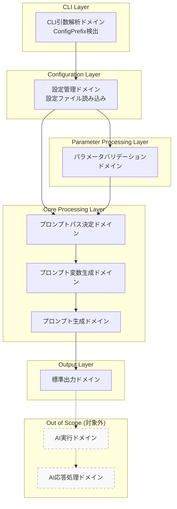
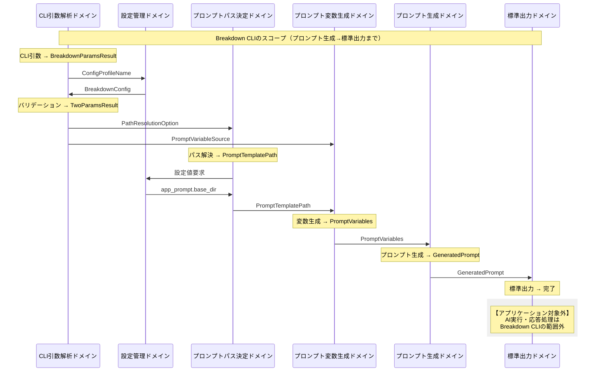
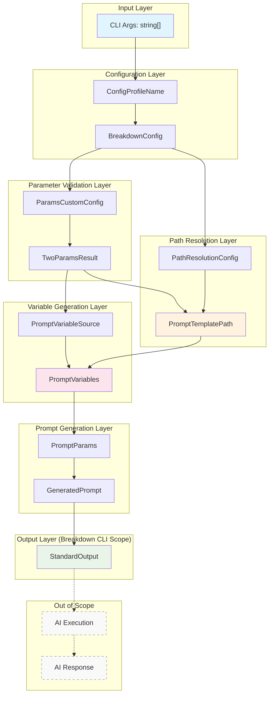
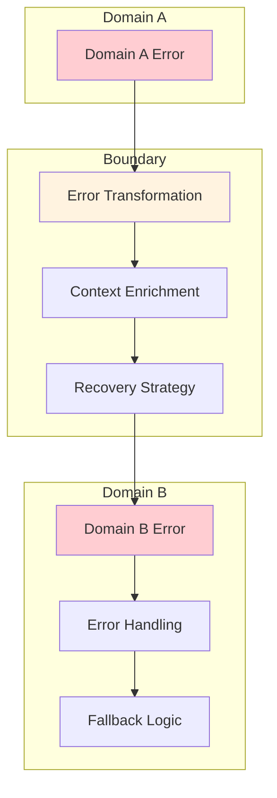

# ドメイン境界線とデータフロー

## プロローグ：ドメイン境界の全体像

Breakdown CLIは、3つの主要ドメインと複数の支援ドメインから構成される複雑なシステムです。このドキュメントでは、**ドメイン境界線**と**データの変換フロー**を体系的に整理し、バリューオブジェクトとユニオン型によるドメイン駆動設計を明確に表現します。

## 第1章：ドメイン境界の全体アーキテクチャ

### 主要ドメインの構成

```typescript
// ドメインの階層構造
type BreakdownDomain = 
  | "cli-parsing"           // CLI引数解析ドメイン（config prefix検出のみ）
  | "config-management"     // 設定管理ドメイン（設定ファイル読み込み）
  | "parameter-validation"  // パラメータバリデーションドメイン（DirectiveType/LayerType検証）
  | "prompt-path-resolution" // プロンプトパス決定ドメイン
  | "prompt-variable-generation" // プロンプト変数生成ドメイン
  | "prompt-generation"     // プロンプト生成ドメイン（最終出力）
  | "stdout-output";        // 標準出力ドメイン（標準出力まで）

// 注意：以下のドメインはアプリケーションの対象外
// | "prompt-execution"      // AIへのプロンプト実行（対象外）
// | "ai-response-processing" // AI応答の処理（対象外）
// 
// Breakdown CLIのスコープ：
// プロンプトを作成し、標準出力するまでがアプリケーションの責務範囲
```

### ドメイン境界の定義



## 第2章：バリューオブジェクト設計

### コアバリューオブジェクト

```typescript
// =============================================================================
// Domain Value Objects - ドメイン固有の値オブジェクト
// =============================================================================

/**
 * DirectiveType - 処理方向を表すバリューオブジェクト
 */
type DirectiveType = {
  readonly value: string;
  readonly validatedByPattern: boolean;
  
  // ドメイン操作
  equals(other: DirectiveType): boolean;
  toString(): string;
}

/**
 * LayerType - 階層を表すバリューオブジェクト
 */
type LayerType = {
  readonly value: string;
  readonly validatedByPattern: boolean;
  
  // ドメイン操作
  equals(other: LayerType): boolean;
  toString(): string;
}
  // ドメイン操作
  equals(other: LayerType): boolean;
  toString(): string;
}

/**
 * ConfigProfileName - 設定プロファイル名を表すバリューオブジェクト
 * 
 * 責務: 設定プロファイル名の管理のみ
 * ConfigProfileNameはBreakdownConfigへの「名前」としてのみ機能し、
 * DirectiveTypeやLayerTypeなどの設定値を直接返す責務は持たない
 */
type ConfigProfileName = {
  readonly value: string;
  readonly isDefault: boolean;
  
  // 単一責務: 設定ファイルのパス解決のみ
  getConfigPath(): string;
  
  // デフォルト値関連の操作
  static createDefault(): ConfigProfileName;
  static fromCliOption(option: string | null | undefined): ConfigProfileName;
  
  // 型安全な比較
  equals(other: ConfigProfileName): boolean;
  toString(): string;
}

/**
 * BreakdownConfig - アプリケーション設定を表すバリューオブジェクト
 * 
 * JSRパッケージから読み込まれた設定データと独自設定の統合型
 * ParamsCustomConfigとPathResolutionConfigの2つの役割に分離される
 */
type BreakdownConfig = {
  readonly profileName: ConfigProfileName;
  
  // パラメータバリデーション用の設定値
  readonly directivePatterns: string;      // PARAMS ドメインで使用
  readonly layerPatterns: string;          // PARAMS ドメインで使用
  
  // パス解決用の設定値
  readonly app_prompt: {                   // PATH ドメインで使用
    readonly base_dir: string;             // プロンプトテンプレートのベースディレクトリ
    readonly working_dir?: string;         // 作業ディレクトリ（相対パス解決用）
  };
  readonly app_schema: {                   // PATH ドメインで使用
    readonly base_dir: string;             // スキーマファイルのベースディレクトリ
  };
  
  // 寿命管理: BreakdownConfigは以下2つの変換後に寿命を終える
  toParamsCustomConfig(): ParamsCustomConfig;
  toPathResolutionConfig(): PathResolutionConfig;
}

/**
 * ParamsCustomConfig - パラメータバリデーション用設定
 * 
 * 役割1: CLI argsからDirectiveType/LayerType解析、オプション解析
 * 寿命: BreakdownParamsによる解析処理でのみ使用
 */
type ParamsCustomConfig = {
  readonly breakdown: {
    readonly params: {
      readonly two: {
        readonly demonstrativeType: PatternConfig;
        readonly layerType: PatternConfig;
      };
    };
  };
  
  // ドメイン操作
  validateDirective(value: string): Result<DirectiveType, ValidationError>;
  validateLayer(value: string): Result<LayerType, ValidationError>;
}

/**
 * PathResolutionConfig - パス解決用設定
 * 
 * 役割2: workingdirやpromptパスの構成要素としてbase_dirを持つ
 * 寿命: プロンプトパス決定ドメインで継続的に使用
 */
type PathResolutionConfig = {
  readonly promptBaseDir: string;          // プロンプトテンプレートの基準ディレクトリ
  readonly schemaBaseDir: string;          // スキーマファイルの基準ディレクトリ
  readonly workingDir?: string;            // 相対パス解決時の作業ディレクトリ
  
  // ドメイン操作
  resolvePromptPath(directive: DirectiveType, layer: LayerType): string;
  resolveSchemaPath(directive: DirectiveType, layer: LayerType): string;
  resolveWorkingPath(relativePath: string): string; // working_dir基準の相対パス解決
}

/**
 * PromptTemplatePath - プロンプトテンプレートパスを表すバリューオブジェクト
 */
type PromptTemplatePath = {
  readonly fullPath: string;
  readonly status: PathResolutionStatus;
  readonly metadata: PathResolutionMetadata;
  
  // ドメイン操作
  exists(): boolean;
  getDirectory(): string;
  getFilename(): string;
  toString(): string;
}

/**
 * PromptVariables - プロンプト変数を表すバリューオブジェクト
 */
type PromptVariables = {
  readonly inputContent: string;
  readonly inputFilePath?: string;
  readonly outputFilePath?: string;
  readonly schemaContent: string;
  readonly promptFilePath: string;
  readonly inputSource: InputSource;
  readonly uv: Record<string, string>;
  
  // ドメイン操作
  hasInputFile(): boolean;
  hasCustomVariables(): boolean;
  getVariableKeys(): string[];
  toPromptParams(): PromptParams;
}
```

### 支援バリューオブジェクト

```typescript
/**
 * TwoParams - 2パラメータ処理のバリューオブジェクト
 * 
 * DirectiveType/LayerTypeの検証済みの状態を保持
 * 寿命が長く、アプリケーション全体を通してプロンプト変数生成まで使用される
 */
type TwoParams = {
  readonly directive: DirectiveType;
  readonly layer: LayerType;
  
  // ドメイン操作
  equals(other: TwoParams): boolean;
  toString(): string;
}
```

## 第3章：ユニオン型設計

### コマンド解析結果のユニオン型

```typescript
// =============================================================================
// Union Types - ドメインの選択肢を表現
// =============================================================================

/**
 * BreakdownParamsResult - CLI解析結果のユニオン型
 */
type BreakdownParamsResult = 
  | { type: "zero"; data: ZeroParamsResult }
  | { type: "one"; data: OneParamsResult }
  | { type: "two"; data: TwoParamsResult };

/**
 * ZeroParamsResult - システム情報表示のユニオン型
 */
type ZeroParamsResult = 
  | { kind: "help"; options: SystemOptions }
  | { kind: "version"; options: SystemOptions };

/**
 * OneParamsResult - 管理操作のユニオン型
 */
type OneParamsResult = 
  | { kind: "init"; options: ManagementOptions }
  | { kind: "copy"; options: ManagementOptions }
  | { kind: "delete"; options: ManagementOptions };

/**
 * TwoParamsResult - プロンプト生成のユニオン型
 * 
 * BreakdownParamsの解析結果として生成され、
 * プロンプト変数生成ドメインまで継続的に使用される
 */
type TwoParamsResult = {
  kind: "prompt-generation";
  params: TwoParams;                    // 検証済みDirectiveType/LayerType
  options: PromptVariableSource;        // Variable Generation Layerで使用される入力ソース情報
};
```

### パス解決結果のユニオン型

```typescript
/**
 * PathResolutionResult - パス解決結果のユニオン型
 */
type PathResolutionResult = 
  | { status: "found"; path: PromptTemplatePath }
  | { status: "fallback"; path: PromptTemplatePath; reason: string }
  | { status: "error"; error: PathResolutionError };

/**
 * PathResolutionStatus - パス解決状態のユニオン型
 */
type PathResolutionStatus = 
  | "Found"
  | "Fallback"
  | "Error";

/**
 * InputSource - 入力源のユニオン型
 */
type InputSource = 
  | "file"
  | "stdin"
  | "both";
```

### エラーのユニオン型

```typescript
/**
 * BreakdownError - システム全体のエラーのユニオン型
 */
type BreakdownError = 
  | { domain: "cli-parsing"; error: CLIParsingError }
  | { domain: "config-management"; error: ConfigError }
  | { domain: "prompt-path-resolution"; error: PathResolutionError }
  | { domain: "prompt-variable-generation"; error: VariableGenerationError }
  | { domain: "prompt-generation"; error: PromptGenerationError }
  | { domain: "stdout-output"; error: OutputError };

// 注意：以下のエラー型はアプリケーションの対象外
// | { domain: "prompt-execution"; error: PromptExecutionError }
// | { domain: "ai-response-processing"; error: ResponseProcessingError }

/**
 * PathResolutionError - パス解決エラーのユニオン型
 */
type PathResolutionError = 
  | { kind: "InvalidParameterCombination"; directive: string; layer: string }
  | { kind: "BaseDirectoryNotFound"; baseDir: string }
  | { kind: "TemplateFileNotFound"; templatePath: string }
  | { kind: "FallbackExhausted"; attemptedPaths: string[] };

/**
 * VariableGenerationError - 変数生成エラーのユニオン型
 */
type VariableGenerationError = 
  | { kind: "FileNotFound"; filePath: string }
  | { kind: "FileReadError"; filePath: string; reason: string }
  | { kind: "STDINTimeout"; timeoutMs: number }
  | { kind: "InvalidCustomVariable"; key: string; value: string };
```

## 第4章：ドメイン間データフロー

### 完全なデータフロー図



### 段階的データ変換フロー



## 第5章：ドメイン境界の詳細仕様

### 1. CLI引数解析ドメイン → 設定管理ドメイン

```typescript
// 境界インターフェース
interface CLIToConfigBoundary {
  // 入力（ConfigProfileNameの責務を限定）
  configProfileName: ConfigProfileName;
  
  // 出力
  breakdownConfig: BreakdownConfig;
  
  // 契約
  loadConfig(profileName: ConfigProfileName): Result<BreakdownConfig, ConfigError>;
}

// データ変換（デフォルト値自動適用）
const transformCLIToConfig = (args: string[]): ConfigProfileName => {
  const configOption = extractConfigOption(args); // null | undefined | string
  return ConfigProfileName.fromCliOption(configOption); // 自動的にデフォルト値適用
};

// 使用例（ConfigProfileNameの寿命が短いことを示す）
const cliArgs = ["to", "issue", "--config=production"];
const profile = transformCLIToConfig(cliArgs); // ConfigProfileName作成
const config = await loadConfig(profile);      // BreakdownConfig取得
// この時点でConfigProfileNameの寿命は終了
```

### 2. 設定管理ドメイン → パラメータバリデーションドメイン

```typescript
// 境界インターフェース
interface ConfigToParamsBoundary {
  // 入力
  rawArgs: string[];
  paramsCustomConfig: ParamsCustomConfig;
  
  // 出力
  twoParamsResult: TwoParamsResult;
  
  // 契約
  validateParams(
    args: string[],
    config: ParamsCustomConfig
  ): Result<TwoParamsResult, ParameterParsingError>;
}

// データ変換（BreakdownConfigの分割）
const transformConfigToParams = (
  config: BreakdownConfig
): ParamsCustomConfig => {
  return {
    breakdown: {
      params: {
        two: {
          demonstrativeType: {
            pattern: config.directivePatterns,
            errorMessage: "Invalid demonstrative type"
          },
          layerType: {
            pattern: config.layerPatterns,
            errorMessage: "Invalid layer type"
          }
        }
      }
    }
  };
};

// この時点でBreakdownConfigの役割1（パラメータバリデーション）は完了
```

### 3. パラメータバリデーションドメイン → プロンプトパス決定ドメイン

```typescript
// 境界インターフェース
interface ParamsToPathBoundary {
  // 入力
  twoParamsResult: TwoParamsResult;
  pathResolutionConfig: PathResolutionConfig;
  
  // 出力
  promptTemplatePath: PromptTemplatePath;
  
  // 契約
  resolvePath(
    params: TwoParamsResult,
    config: PathResolutionConfig
  ): Result<PromptTemplatePath, PathResolutionError>;
}

// データ変換（BreakdownConfigの分割）
const transformConfigToPath = (
  config: BreakdownConfig
): PathResolutionConfig => {
  return {
    promptBaseDir: config.app_prompt.base_dir,
    schemaBaseDir: config.app_schema.base_dir,
    workingDir: config.app_prompt.working_dir,
    resolvePromptPath: (directive, layer) => 
      `${config.app_prompt.base_dir}/${directive.value}/${layer.value}`,
    resolveSchemaPath: (directive, layer) => 
      `${config.app_schema.base_dir}/${directive.value}/${layer.value}`,
    resolveWorkingPath: (relativePath) => 
      config.app_prompt.working_dir 
        ? `${config.app_prompt.working_dir}/${relativePath}`
        : relativePath
  };
};

// この時点でBreakdownConfigの役割2（パス解決）も完了
// BreakdownConfigの寿命が終了
```

### 4. プロンプトパス決定ドメイン → プロンプト変数生成ドメイン

```typescript
// 境界インターフェース
interface PathToVariablesBoundary {
  // 入力
  promptTemplatePath: PromptTemplatePath;
  promptVariableSource: PromptVariableSource; // TwoParamsResult.optionsから抽出
  
  // 出力
  promptVariables: PromptVariables;
  
  // 契約
  generateVariables(
    templatePath: PromptTemplatePath,
    source: PromptVariableSource
  ): Result<PromptVariables, VariableGenerationError>;
}

// データ変換（TwoParamsResultからPromptVariableSourceを抽出）
const extractPromptVariableSource = (
  twoParamsResult: TwoParamsResult
): PromptVariableSource => {
  return twoParamsResult.options; // TwoParamsResultのoptions値がPromptVariableSource
};

// プロンプト変数の生成
const transformPathToVariables = (
  templatePath: PromptTemplatePath,
  source: PromptVariableSource
): PromptVariables => {
  return {
    inputContent: source.fromFile ? readFile(source.fromFile) : source.stdinContent ?? "",
    inputFilePath: source.fromFile ? resolve(source.fromFile) : undefined,
    outputFilePath: source.destinationFile ? resolve(source.destinationFile) : undefined,
    schemaContent: source.useSchema ? readSchemaFile(templatePath) : "",
    promptFilePath: templatePath.fullPath,
    inputSource: determineInputSource(source),
    uv: source.customVariables ?? {}
  };
};
```

### 5. プロンプト変数生成ドメイン → プロンプト生成ドメイン

```typescript
// 境界インターフェース
interface VariablesToPromptBoundary {
  // 入力
  promptVariables: PromptVariables;
  
  // 出力
  generatedPrompt: GeneratedPrompt;
  
  // 契約
  generatePrompt(
    variables: PromptVariables
  ): Result<GeneratedPrompt, PromptGenerationError>;
}

// データ変換
const transformVariablesToPrompt = (
  variables: PromptVariables
): PromptParams => {
  return {
    template_file: variables.promptFilePath,
    variables: {
      inputContent: variables.inputContent,
      inputFilePath: variables.inputFilePath ?? "",
      outputFilePath: variables.outputFilePath ?? "",
      schemaContent: variables.schemaContent,
      inputSource: variables.inputSource,
      ...variables.uv
    }
  };
};
```

### 6. プロンプト生成ドメイン → 標準出力ドメイン

```typescript
// 境界インターフェース
interface PromptToOutputBoundary {
  // 入力
  generatedPrompt: GeneratedPrompt;
  
  // 出力
  outputResult: StandardOutputResult;
  
  // 契約
  outputToStdout(
    prompt: GeneratedPrompt
  ): Result<StandardOutputResult, OutputError>;
}

// データ変換
const transformPromptToOutput = (
  prompt: GeneratedPrompt
): StandardOutputData => {
  return {
    content: prompt.content,
    metadata: prompt.metadata,
    timestamp: new Date().toISOString()
  };
};
```

### 注意：アプリケーションスコープ外のドメイン

```typescript
// 以下のドメインはBreakdown CLIの対象外
// 
// interface PromptExecutionBoundary {
//   // AI実行サービス（Claude, GPT等）へのプロンプト送信
//   executeWithAI(prompt: GeneratedPrompt): Result<AIResponse, AIError>;
// }
// 
// interface ResponseProcessingBoundary {
//   // AI応答の処理・整形
//   processResponse(response: AIResponse): Result<ProcessedResult, ProcessingError>;
// }
// 
// Breakdown CLIの責務範囲：
// ユーザー入力 → プロンプト生成 → 標準出力 まで
```

## 第6章：エラーハンドリングの境界設計

### ドメイン間エラー伝播

```typescript
// エラー伝播の型安全な設計
type DomainErrorPropagation = {
  // 各ドメインのエラーを上位に伝播
  propagate<T extends BreakdownError>(error: T): BreakdownError;
  
  // エラー回復戦略
  recover<T extends BreakdownError>(error: T): RecoveryAction;
  
  // エラー情報の豊富化
  enrich<T extends BreakdownError>(error: T, context: ErrorContext): T;
};

// 回復戦略のユニオン型
type RecoveryAction = 
  | { kind: "retry"; maxAttempts: number }
  | { kind: "fallback"; alternativePath: string }
  | { kind: "user-intervention"; message: string }
  | { kind: "abort"; reason: string };
```

### 境界でのエラー変換



## 第7章：境界の実装パターン

### 1. Smart Constructor パターン

```typescript
// 境界での型安全な生成（デフォルト値自動適用）
namespace DirectiveType {
  export function create(
    value: string,
    config: ParamsCustomConfig
  ): Result<DirectiveType, InvalidDirectiveError> {
    // バリデーション
    if (!isValidDirective(value, config)) {
      return Result.error({
        kind: "InvalidDirective",
        value,
        validDirectives: getValidDirectives(config)
      });
    }
    
    // 成功時の生成
    return Result.ok({
      value,
      validatedByPattern: true,
      equals: (other) => other.value === value,
      toString: () => value
    });
  }
}

namespace ConfigProfileName {
  export function createDefault(): ConfigProfileName {
    return {
      value: "default",
      isDefault: true,
      getConfigPath: () => "./config/default-app.yml",
      equals: (other) => other.value === "default" && other.isDefault,
      toString: () => "default"
    };
  }
  
  export function create(value: string): ConfigProfileName {
    return {
      value,
      isDefault: value === "default",
      getConfigPath: () => value === "default" 
        ? "./config/default-app.yml" 
        : `./config/${value}-app.yml`,
      equals: (other) => other.value === value,
      toString: () => value
    };
  }
  
  export function fromCliOption(option: string | null | undefined): ConfigProfileName {
    if (option === null || option === undefined || option === "") {
      return ConfigProfileName.createDefault();
    }
    return ConfigProfileName.create(option);
  }
}
```

### 2. Factory パターン

```typescript
// 境界での複雑な生成処理
class PromptVariablesFactory {
  create(
    templatePath: PromptTemplatePath,
    source: PromptVariableSource,
    config: BreakdownConfig
  ): Result<PromptVariables, VariableGenerationError> {
    try {
      // 段階的な変換
      const inputProcessing = this.processInput(source);
      const pathResolution = this.resolvePaths(source, config);
      const schemaProcessing = this.processSchema(templatePath, source);
      const variableIntegration = this.integrateVariables(
        inputProcessing,
        pathResolution,
        schemaProcessing,
        source
      );
      
      return Result.ok(variableIntegration);
    } catch (error) {
      return Result.error(this.convertError(error));
    }
  }
}
```

### 3. Strategy パターン

```typescript
// 境界での処理戦略の選択
interface PathResolutionStrategy {
  resolve(
    option: PathResolutionOption,
    config: BreakdownConfig
  ): Result<PromptTemplatePath, PathResolutionError>;
}

class StandardPathResolutionStrategy implements PathResolutionStrategy {
  resolve(
    option: PathResolutionOption,
    config: BreakdownConfig
  ): Result<PromptTemplatePath, PathResolutionError> {
    // 標準的なパス解決ロジック
    const basePath = config.app_prompt.base_dir;
    const directoryPath = `${basePath}/${option.directive.value}/${option.layer.value}`;
    const fileName = this.buildFileName(option);
    const fullPath = `${directoryPath}/${fileName}`;
    
    return this.validatePath(fullPath);
  }
}
```

## エピローグ：境界の価値

このドメイン境界設計により、Breakdown CLIは以下の価値を実現します：

### 1. 明確なアプリケーションスコープ
- **範囲の明確化**: プロンプト生成から標準出力まで
- **責務の限定**: AI実行・応答処理は対象外
- **境界の明示**: 何を行い、何を行わないかの明確化

### 2. 責務の明確化と寿命管理
- **ConfigProfileName**: 設定ファイル名の管理のみ（短寿命）
- **BreakdownConfig**: 2つの役割に分離後に寿命終了
- **TwoParamsResult**: 検証済み状態での長寿命オブジェクト
- **各ドメインの単一責任**: 明確な境界と変換

### 3. 型安全性の確保
- バリューオブジェクトによる不変性
- ユニオン型による状態の明確化
- Smart Constructorによる生成時バリデーション
- デフォルト値の自動適用による型安全性の維持

### 4. 拡張性の実現
- 新しいドメインの追加容易性
- 既存境界への影響最小化
- 設定による動的な挙動変更

### 5. 保守性の向上
- ドメイン固有の用語による理解促進
- 境界での変換ロジックの集約
- テスト可能な設計

### 6. 利便性の向上
- **デフォルト値の自動適用**: 設定省略時の自動的な標準動作
- **型安全性の維持**: null/undefinedを排除した型システム
- **シンプルなAPI**: 複雑な設定なしに即座に利用可能
- **段階的な設定**: 標準動作から始めて必要に応じてカスタマイズ

### 7. 統合の容易性
- 標準出力による他ツールとの連携
- パイプライン処理への組み込み
- 外部システムとの疎結合

## 関連ドキュメント

- [option_types.ja.md](./option_types.ja.md): オプション型の詳細
- [prompt_template_path.ja.md](./prompt_template_path.ja.md): プロンプトパス決定ドメイン
- [prompt_variables.ja.md](./prompt_variables.ja.md): プロンプト変数生成ドメイン
- [two_params_types.ja.md](./two_params_types.ja.md): 2パラメータ型の詳細

---

**設計原則**: Domain-Driven Design, Value Objects, Union Types  
**実装パターン**: Smart Constructor, Factory, Strategy  
**文書作成**: 2025年7月20日

---

## CHANGELOG

### 設定値フローの明確化（2025年7月20日）
- **ドメイン境界図の改善**: Configuration LayerからCore Processing Layerへの設定値の流れを明示
- **図の簡素化**: 重複する線を削除し、ドメイン間の基本的な依存関係のみを表示
- **TwoParamsResult.optionsの明確化**: Variable Generation Layerで使用されるPromptVariableSourceの流れを段階的データ変換フローに追加
- **base_dir/working_dirの用途明確化**: どのドメインで使用されるかをコメントで明記
- **PathResolutionConfig**: working_dir対応とresolveWorkingPath()メソッド追加
- **BreakdownConfig**: 設定値の用途をコメントで明示（PARAMS/PATHドメイン別）

### 責務変更の記録
- **ConfigProfileName**: DirectiveType/LayerType提供責務を削除
- **BreakdownConfig**: 2つの役割（パラメータバリデーション・パス解決）に分離
- **TwoParams**: profile参照を削除、純粋なDirective/Layer保持のみ
- **DirectiveType/LayerType**: プロファイル依存プロパティを削除

### ドメイン境界の変更
- パラメータバリデーションドメインを独立化
- 設定管理からパラメータバリデーションへの明確な分離
- ConfigProfileNameの寿命を設定読み込みまでに限定
- Configuration LayerからCore Processing Layerへの設定値の流れを明確化
