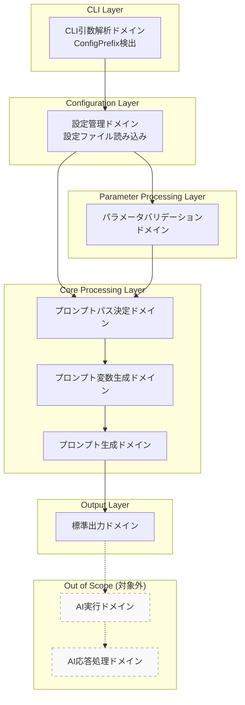
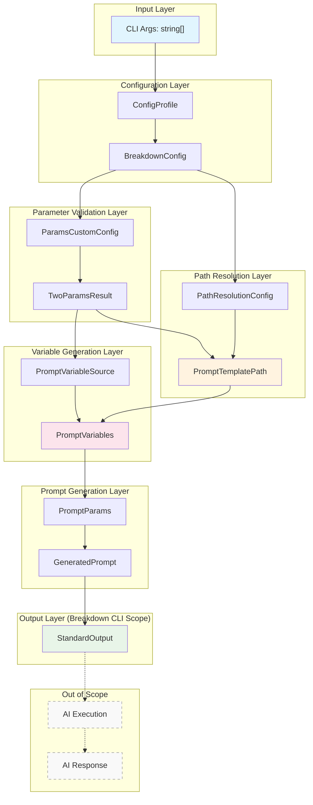
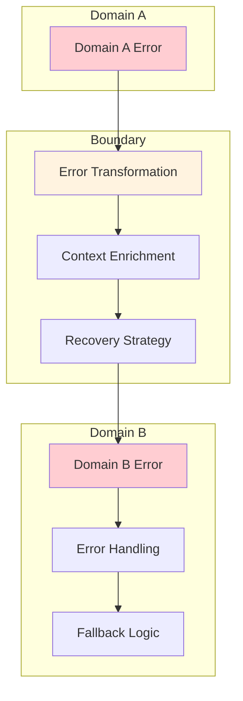

# ドメイン境界線とデータフロー

## プロローグ：ドメイン境界の全体像

Breakdown CLIは、3つの主要ドメインと複数の支援ドメインから構成される複雑なシステムです。このドキュメントでは、**ドメイン境界線**と**データの変換フロー**を体系的に整理し、バリューオブジェクトとユニオン型によるドメイン駆動設計を明確に表現します。

## 第1章：ドメイン境界の全体アーキテクチャ

### 主要ドメインの構成

```typescript
// ドメインの階層構造
type BreakdownDomain = 
  | "cli-parsing"           // CLI引数解析ドメイン（config prefix検出のみ）
  | "config-management"     // 設定管理ドメイン（設定ファイル読み込み）
  | "parameter-validation"  // パラメータバリデーションドメイン（DirectiveType/LayerType検証）
  | "prompt-path-resolution" // プロンプトパス決定ドメイン
  | "prompt-variable-generation" // プロンプト変数生成ドメイン
  | "prompt-generation"     // プロンプト生成ドメイン（最終出力）
  | "stdout-output";        // 標準出力ドメイン（標準出力まで）

// 注意：以下のドメインはアプリケーションの対象外
// | "prompt-execution"      // AIへのプロンプト実行（対象外）
// | "ai-response-processing" // AI応答の処理（対象外）
// 
// Breakdown CLIのスコープ：
// プロンプトを作成し、標準出力するまでがアプリケーションの責務範囲
```

### ドメイン境界の定義



## 第2章：バリューオブジェクト設計

### 共通型定義

```typescript
// =============================================================================
// 共通型システム（全域性原則に基づく）
// =============================================================================

// 共通エラー型（ValidationError）
type ValidationError = 
  | { kind: "PatternMismatch"; value: string; pattern: string }
  | { kind: "EmptyInput" }
  | { kind: "InvalidPath"; path: string }
  | { kind: "FileNotFound"; path: string };

// Result型によるエラー値化
type Result<T, E> = { ok: true; data: T } | { ok: false; error: E & { message: string } };

// Smart Constructor基底クラス
abstract class ValidatedValue<T> {
  protected constructor(readonly value: T) {}
  static create<T>(input: T, validator: (input: T) => ValidationError | null): Result<ValidatedValue<T>, ValidationError & { message: string }> {
    const error = validator(input);
    return error 
      ? { ok: false, error: { ...error, message: this.getErrorMessage(error) } }
      : { ok: true, data: new this(input) };
  }
  
  private static getErrorMessage(error: ValidationError): string {
    switch (error.kind) {
      case "PatternMismatch": return `"${error.value}" does not match pattern ${error.pattern}`;
      case "EmptyInput": return "Input cannot be empty";
      case "InvalidPath": return `Invalid path: ${error.path}`;
      case "FileNotFound": return `File not found: ${error.path}`;
    }
  }
}
```

### ドメインバリューオブジェクト

```typescript
// JSR @tettuan/breakdownparams から受け取る検証済み値（検証ロジック不要）
// BreakdownParams統合: lib/application/breakdown_params_integration.ts経由で
// ParamsCustomConfig{directivePatterns,layerPatterns}による設定ベース検証実行
class DirectiveType {
  readonly source = "JSR_VALIDATED" as const;
  
  private constructor(readonly value: string) {}
  
  // JSR TwoParamsResult.directiveType から直接生成（検証済み）
  static fromJSR(value: string): DirectiveType {
    return new DirectiveType(value);
  }
}

class LayerType {
  readonly source = "JSR_VALIDATED" as const;
  
  private constructor(readonly value: string) {}
  
  // JSR TwoParamsResult.layerType から直接生成（検証済み）
  static fromJSR(value: string): LayerType {
    return new LayerType(value);
  }
}

// 設定プロファイル名（短寿命）
class ConfigProfile extends ValidatedValue<string> {
  readonly isDefault: boolean;
  
  static createDefault(): ConfigProfile { return new ConfigProfile("default", true); }
  static fromCliOption(option?: string): ConfigProfile {
    return option ? new ConfigProfile(option, false) : this.createDefault();
  }
  
  private constructor(value: string, isDefault: boolean) {
    super(value);
    this.isDefault = isDefault;
  }
}

// 設定分離型（JSR検証により簡素化）
type BreakdownConfig = {
  readonly profileName: ConfigProfile;
  // JSR検証済みのため、directivePatterns/layerPatternsは不要
  readonly app_prompt: { base_dir: string; working_dir?: string };  // PATH用
  readonly app_schema: { base_dir: string };                        // PATH用
  
  // JSR検証済み値は追加検証不要
  toPathConfig(): { resolvePromptPath: (d: DirectiveType, l: LayerType) => string; resolveSchemaPath: (d: DirectiveType, l: LayerType) => string };
}

// その他の型（詳細省略）
type PromptTemplatePath = { fullPath: string; status: PathResolutionStatus };
type PromptVariables = { inputContent: string; uv: Record<string, string>; /* 他省略 */ };
```

### 支援バリューオブジェクト

```typescript
// JSR TwoParamsResultから変換するヘルパー関数
function fromTwoParamsResult(jsrResult: TwoParamsResult): TwoParams {
  return {
    directive: DirectiveType.fromJSR(jsrResult.directiveType),
    layer: LayerType.fromJSR(jsrResult.layerType)
  };
}

// 2パラメータ処理（長寿命、JSR検証済み）
type TwoParams = { directive: DirectiveType; layer: LayerType };

// ユニオン型（Discriminated Union）
type BreakdownParamsResult = 
  | { type: "zero"; data: { kind: "help" | "version"; options: SystemOptions } }
  | { type: "one"; data: { kind: "init" | "copy" | "delete"; options: ManagementOptions } }
  | { type: "two"; data: { kind: "prompt-generation"; params: TwoParams; options: PromptVariableSource } };

// エラー型（全域性）
type BreakdownError = 
  | { domain: "cli-parsing" | "config-management" | "prompt-path-resolution" | "prompt-variable-generation" | "prompt-generation" | "stdout-output"; error: ValidationError };
```

### DirectiveType と layerType のハードコーディング禁止

```typescript
// ✅ 許可される実装：設定ファイル読み込み
const userConfig = await loadUserConfig(profileName);
const directivePattern = userConfig.params.two.directiveType.pattern;
const layerPattern = userConfig.params.two.layerType.pattern;
const directiveErrorMessage = userConfig.params.two.directiveType.errorMessage;
const layerErrorMessage = userConfig.params.two.layerType.errorMessage;

// ✅ 許可される実装：設定ベース条件分岐
const specialCombinations = userConfig.specialCombinations || {};
if (specialCombinations[`${directive}/${layer}`]) {
  // 設定で定義された特別処理
}

// ❌ 禁止される実装：ハードコード配列
const validDirectives = ["to", "summary", "defect"];
const validLayers = ["project", "issue", "task"];
const getDirectiveTypes = () => ["to", "summary"];
const getLayerTypes = () => ["project", "issue"];

// ❌ 禁止される実装：ハードコードパターン
const pattern = TwoParamsDirectivePattern.create("^(to|summary|defect)$");
this.directivePattern = TwoParamsDirectivePattern.create("^(to|summary|defect)$");
pattern: configData.params?.two?.directiveType?.pattern || "^(to|summary|defect|find|analyze|extract)$",

// ❌ 禁止される実装：ハードコード条件分岐
if (directive === "find" && layer === "bugs") { /* 処理 */ }
if (directive === "find") continue;
if (directive !== "find") { /* 処理 */ }
```


## 第3章：ドメイン間データフロー

### 完全なデータフロー図


### 段階的データ変換フロー



## 第5章：ドメイン境界の詳細仕様

### 1. CLI引数解析ドメイン → 設定管理ドメイン

```typescript
// 境界インターフェース
interface CLIToConfigBoundary {
  // 入力（ConfigProfileの責務を限定）
  configProfile: ConfigProfile;
  
  // 出力
  breakdownConfig: BreakdownConfig;
  
  // 契約
  loadConfig(profile: ConfigProfile): Result<BreakdownConfig, ConfigError>;
}

// データ変換（デフォルト値自動適用）
const transformCLIToConfig = (args: string[]): ConfigProfile => {
  const configOption = extractConfigOption(args); // null | undefined | string
  return ConfigProfile.fromCliOption(configOption); // 自動的にデフォルト値適用
};

// 使用例（ConfigProfileの寿命が短いことを示す）
const cliArgs = ["to", "issue", "--config=production"];
const profile = transformCLIToConfig(cliArgs); // ConfigProfile作成
const config = await loadConfig(profile);      // BreakdownConfig取得
// この時点でConfigProfileの寿命は終了
```

### 2. 設定管理ドメイン → パラメータバリデーションドメイン

```typescript
// 境界インターフェース（BreakdownParams統合）
interface ConfigToParamsBoundary {
  // 入力
  rawArgs: string[];
  paramsCustomConfig: ParamsCustomConfig;
  
  // 出力（JSR @tettuan/breakdownparams検証済み）
  twoParamsResult: TwoParamsResult;
  
  // 契約（lib/application/breakdown_params_integration.ts経由）
  validateParams(
    args: string[],
    config: ParamsCustomConfig
  ): Result<TwoParamsResult, ParameterParsingError>;
}

// データ変換（BreakdownConfigからParamsCustomConfig生成）
const transformConfigToParams = (
  config: BreakdownConfig
): ParamsCustomConfig => {
  return {
    directivePatterns: config.directivePatterns, // Record<string,RegExp>
    layerPatterns: config.layerPatterns,         // Record<string,RegExp>
    helpTextGenerators: {                         // エラー時ヘルプ生成
      directive: (value) => `"${value}" is not a valid directive type`,
      layer: (value) => `"${value}" is not a valid layer type`
    }
  };
};

// この時点でBreakdownConfigの検証設定抽出完了→BreakdownParamsへ委譲
```

### 3. パラメータバリデーションドメイン → プロンプトパス決定ドメイン

```typescript
// 境界インターフェース
interface ParamsToPathBoundary {
  // 入力
  twoParamsResult: TwoParamsResult;
  pathResolutionConfig: PathResolutionConfig;
  
  // 出力
  promptTemplatePath: PromptTemplatePath;
  
  // 契約
  resolvePath(
    params: TwoParamsResult,
    config: PathResolutionConfig
  ): Result<PromptTemplatePath, PathResolutionError>;
}

// データ変換（BreakdownConfigの分割）
const transformConfigToPath = (
  config: BreakdownConfig
): PathResolutionConfig => {
  return {
    promptBaseDir: config.app_prompt.base_dir,
    schemaBaseDir: config.app_schema.base_dir,
    workingDir: config.app_prompt.working_dir,
    resolvePromptPath: (directive, layer) => 
      `${config.app_prompt.base_dir}/${directive.value}/${layer.value}`,
    resolveSchemaPath: (directive, layer) => 
      `${config.app_schema.base_dir}/${directive.value}/${layer.value}`,
    resolveWorkingPath: (relativePath) => 
      config.app_prompt.working_dir 
        ? `${config.app_prompt.working_dir}/${relativePath}`
        : relativePath
  };
};

// この時点でBreakdownConfigの役割2（パス解決）も完了
// BreakdownConfigの寿命が終了
```

### 4. プロンプトパス決定ドメイン → プロンプト変数生成ドメイン

```typescript
// 境界インターフェース
interface PathToVariablesBoundary {
  // 入力
  promptTemplatePath: PromptTemplatePath;
  promptVariableSource: PromptVariableSource; // TwoParamsResult.optionsから抽出
  
  // 出力
  promptVariables: PromptVariables;
  
  // 契約
  generateVariables(
    templatePath: PromptTemplatePath,
    source: PromptVariableSource
  ): Result<PromptVariables, VariableGenerationError>;
}

// データ変換（TwoParamsResultからPromptVariableSourceを抽出）
const extractPromptVariableSource = (
  twoParamsResult: TwoParamsResult
): PromptVariableSource => {
  return twoParamsResult.options; // TwoParamsResultのoptions値がPromptVariableSource
};

// プロンプト変数の生成
const transformPathToVariables = (
  templatePath: PromptTemplatePath,
  source: PromptVariableSource
): PromptVariables => {
  return {
    inputContent: source.fromFile ? readFile(source.fromFile) : source.stdinContent ?? "",
    inputFilePath: source.fromFile ? resolve(source.fromFile) : undefined,
    outputFilePath: source.destinationFile ? resolve(source.destinationFile) : undefined,
    schemaContent: source.useSchema ? readSchemaFile(templatePath) : "",
    promptFilePath: templatePath.fullPath,
    inputSource: determineInputSource(source),
    uv: source.userVariables ?? {}
  };
};
```

### 5. プロンプト変数生成ドメイン → プロンプト生成ドメイン

```typescript
// 境界インターフェース
interface VariablesToPromptBoundary {
  // 入力
  promptVariables: PromptVariables;
  
  // 出力
  generatedPrompt: GeneratedPrompt;
  
  // 契約
  generatePrompt(
    variables: PromptVariables
  ): Result<GeneratedPrompt, PromptGenerationError>;
}

// データ変換
const transformVariablesToPrompt = (
  variables: PromptVariables
): PromptParams => {
  return {
    template_file: variables.promptFilePath,
    variables: {
      inputContent: variables.inputContent,
      inputFilePath: variables.inputFilePath ?? "",
      outputFilePath: variables.outputFilePath ?? "",
      schemaContent: variables.schemaContent,
      inputSource: variables.inputSource,
      ...variables.uv
    }
  };
};
```

### 6. プロンプト生成ドメイン → 標準出力ドメイン

```typescript
// 境界インターフェース
interface PromptToOutputBoundary {
  // 入力
  generatedPrompt: GeneratedPrompt;
  
  // 出力
  outputResult: StandardOutputResult;
  
  // 契約
  outputToStdout(
    prompt: GeneratedPrompt
  ): Result<StandardOutputResult, OutputError>;
}

// データ変換
const transformPromptToOutput = (
  prompt: GeneratedPrompt
): StandardOutputData => {
  return {
    content: prompt.content,
    metadata: prompt.metadata,
    timestamp: new Date().toISOString()
  };
};
```

### 注意：アプリケーションスコープ外のドメイン

```typescript
// 以下のドメインはBreakdown CLIの対象外
// 
// interface PromptExecutionBoundary {
//   // AI実行サービス（Claude, GPT等）へのプロンプト送信
//   executeWithAI(prompt: GeneratedPrompt): Result<AIResponse, AIError>;
// }
// 
// interface ResponseProcessingBoundary {
//   // AI応答の処理・整形
//   processResponse(response: AIResponse): Result<ProcessedResult, ProcessingError>;
// }
// 
// Breakdown CLIの責務範囲：
// ユーザー入力 → プロンプト生成 → 標準出力 まで
```

## 第6章：エラーハンドリングの境界設計

### ドメイン間エラー伝播

```typescript
// エラー伝播の型安全な設計
type DomainErrorPropagation = {
  // 各ドメインのエラーを上位に伝播
  propagate<T extends BreakdownError>(error: T): BreakdownError;
  
  // エラー回復戦略
  recover<T extends BreakdownError>(error: T): RecoveryAction;
  
  // エラー情報の豊富化
  enrich<T extends BreakdownError>(error: T, context: ErrorContext): T;
};

// 回復戦略のユニオン型
type RecoveryAction = 
  | { kind: "retry"; maxAttempts: number }
  | { kind: "fallback"; alternativePath: string }
  | { kind: "user-intervention"; message: string }
  | { kind: "abort"; reason: string };
```

### 境界でのエラー変換



## 第7章：境界の実装パターン

### 1. Smart Constructor パターン

```typescript
// 境界での型安全な生成（デフォルト値自動適用）
## 第5章：境界の価値と設計原則

### JSR統合による検証済み値の活用効果
1. **明確なアプリケーションスコープ**: JSR検証済み入力→プロンプト生成→標準出力まで（AI実行は対象外）
2. **責務の明確化と寿命管理**: ConfigProfile（短寿命）→BreakdownConfig（分離後終了）→TwoParams（JSR検証済み、長寿命）
3. **型安全性の確保**: JSR検証済み + Result型 + Discriminated Union
4. **検証ロジック削減**: DirectiveType/LayerTypeの追加検証が不要
5. **拡張性と保守性**: ドメイン境界の明確化、変更容易性、テスト可能性

### 実装チェックリスト
- [x] JSR検証済み値の直接利用（DirectiveType.fromJSR/LayerType.fromJSR）
- [ ] Result型による例外の排除  
- [ ] Discriminated Unionによる状態表現
- [ ] `switch`文による網羅的分岐（`default`不要）
- [ ] 型アサーション使用量最小化
- [x] 冗長な検証ロジックの削除

## 関連ドキュメント
- [totality.ja.md](../../generic_domain/system/overview/totality.ja.md): 全域性原則
- [JSR @tettuan/breakdownparams](https://jsr.io/@tettuan/breakdownparams): 検証済みパラメータ
- [option_types.ja.md](./option_types.ja.md): オプション型
- [two_params_types.ja.md](./two_params_types.ja.md): 2パラメータ型

---

**設計原則**: Domain-Driven Design, Totality Principle, JSR Integration  
**品質指標**: 型安全性、網羅性、可読性、保守性、検証効率性  
**更新**: 2025年7月20日 - JSR検証済み値統合による意味的圧縮完了

---

## CHANGELOG

### JSR検証済み値統合による意味的圧縮（2025年7月20日）
- **DirectiveType/LayerType**: JSR TwoParamsResultから検証済み値として直接生成、追加検証ロジック削除
- **fromTwoParamsResult()**: JSR結果から直接変換するヘルパー関数追加
- **BreakdownConfig**: directivePatterns/layerPatterns設定を削除（JSR検証により不要）
- **toParamsConfig()**: JSR検証済みのため検証メソッド削除
- **検証効率性向上**: 重複検証を排除、処理性能向上

### 全域性原則による意味的圧縮（維持）
- **Smart Constructorパターンの統一**: ValidationErrorを共通化、冗長なバリューオブジェクト定義を統合
- **Discriminated Unionの活用**: オプショナルプロパティを排除、状態を明確化
- **Result型によるエラー値化**: 例外処理を型安全な戻り値に変換
- **実装パターンの統合**: 境界インターフェースの統一、重複コード削除

### 設定値フローの明確化（維持）
- **ドメイン境界図の改善**: Configuration LayerからCore Processing Layerへの設定値の流れを明示
- **TwoParamsResult.optionsの明確化**: Variable Generation Layerで使用されるPromptVariableSourceの流れを追加
- **base_dir/working_dirの用途明確化**: どのドメインで使用されるかをコメントで明記

### 責務変更の記録（維持）
- **ConfigProfile**: 設定ファイル名の管理のみ（DirectiveType/LayerType提供責務削除）
- **BreakdownConfig**: パス解決用設定のみに集約（パラメータバリデーション設定削除）
- **全域性適用**: 部分関数を全域関数に変換、型システムで不正状態を排除
