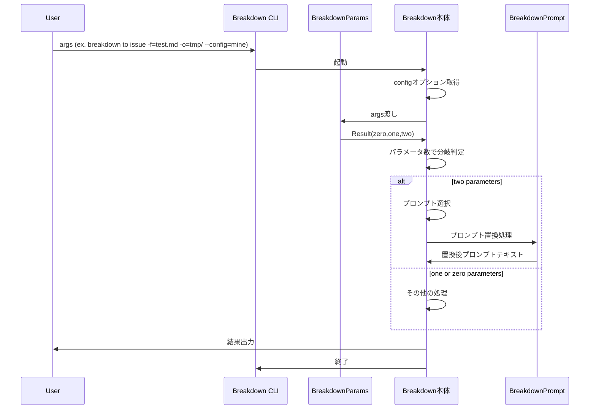
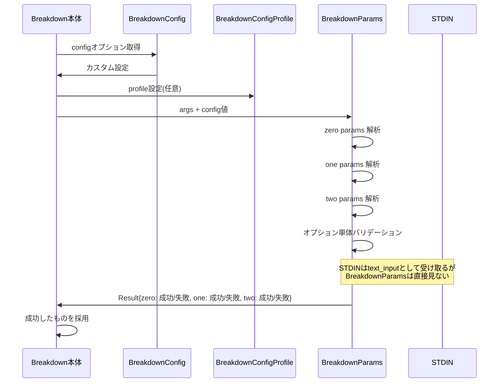
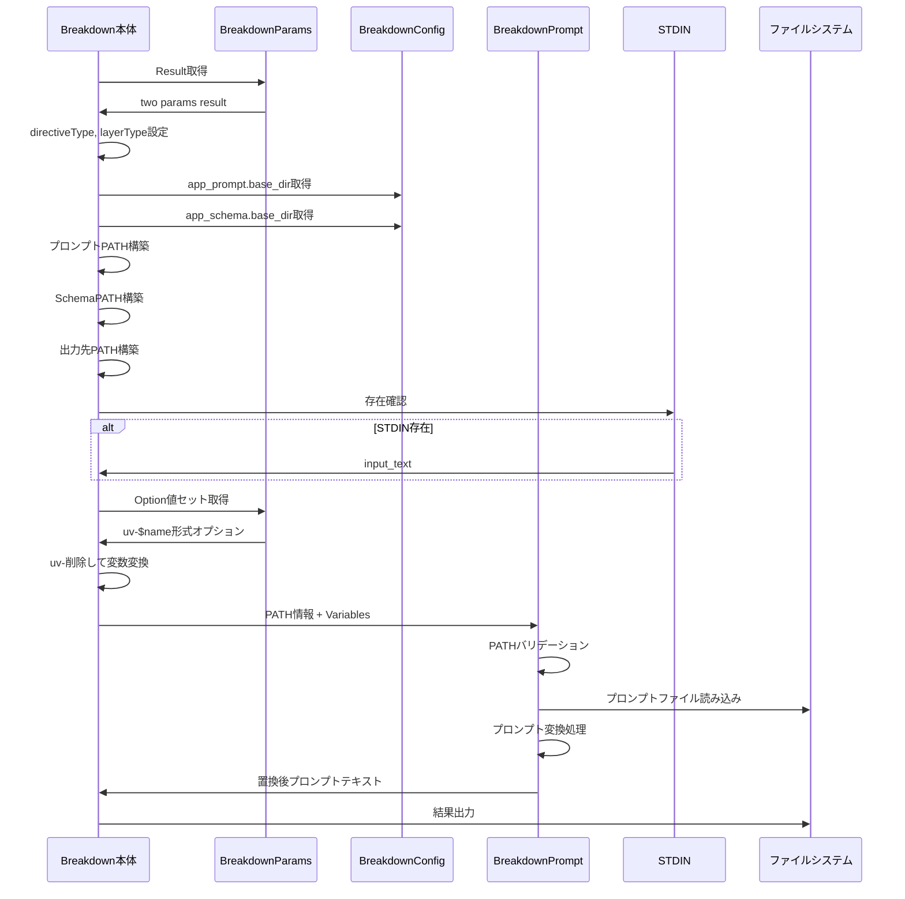
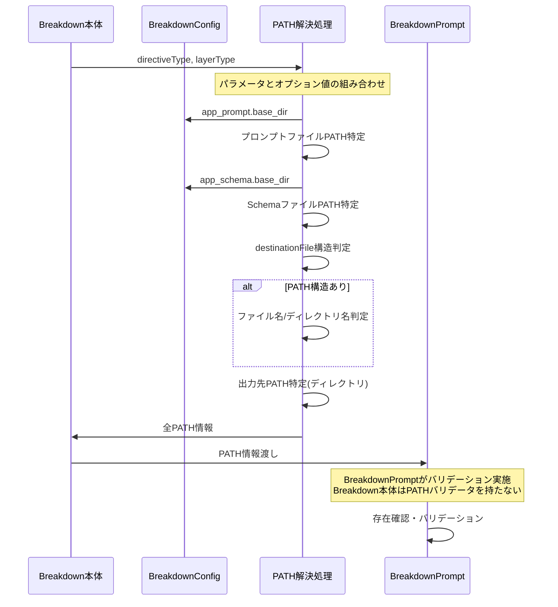
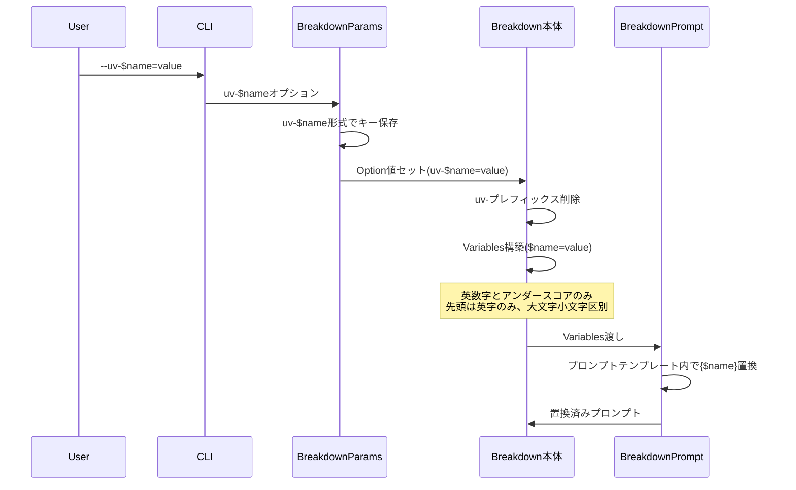

# 設計の階層構造

> **本ドキュメントの位置付け**: 「5段階の段階的シーケンス図」による俯瞰説明に特化した文書。
> - **詳細な処理フロー**: [processing-flow.ja.md](./processing-flow.ja.md)
> - **ドメイン境界とデータフロー**: [domain_boundaries_flow.ja.md](../../../domain_core/domain_boundaries_flow.ja.md)
> - **DirectiveType / LayerType の正本定義**: [two_params_types.ja.md](../../../domain_core/two_params_types.ja.md)
> - **全域性原則**: [totality.ja.md](./totality.ja.md)

Level.1 が最上位（最も抽象的）。
数字が大きいほど解像度が高く（具体的）になる。

- **Level.1**: システム全体の概念・抽象的設計
- **Level.2**: コンポーネント間の設計・アーキテクチャ
- **Level.3**: 実装詳細・具体的処理

# Level.1 最上位設計

1. CLIにargsを渡す(ex. `./.deno/bin/breakdown to issue -f=test.md, -o=tmp/ -a=fix --config=mine`)
2. breakdownのCLI起動
3. argsをパラメータとオプションへ分離
4. パラメータが2個あるとき（two params）、プロンプトを選ぶ
5. プロンプトを、オプション値で置換する
6. 結果を出力する(結果 = 置換後プロンプトのテキスト)
7. CLI終了

# Level.1 分割されたモジュールの位置付け

Breakdown本体は、4つの外部モジュールを持っている。
これらは、内部実装を意図的に外部実装したものである。

いわば四天王のような存在で、Breakdown本体と同等の存在である。

1. BreakdownParams
2. BreakdownConfig
3. BreakdownPrompt
4. BreakdownLogger

# Level.2 CLI起動とargsの分離処理アーキテクチャ

1. configオプションを取得し、カスタム設定を取得 → Breakdown本体で実施
2. argsを受け取って、パラメータとオプションを分けて把握 → BreakdownParams へ移譲
2-1. このとき、ConfigProfileDetector にて、パラメータをカスタム設定するprofileが必要（任意）
2-1-1. ConfigProfileDetectorは、ConfigProfile型として型安全性を保証し、有効性検証済みのprofile名を返す
3. BreakdownParams から Result を受け取り、パラメータの数で分岐（zero,one,two）
4. zero,one,two の処理に分岐して実施

# Level.2 パラメータの分離後の結果取得アーキテクチャ

1. BreakdownParams の Result は、 zero,one,two とも取得
2. zero,one,twoを全て調べ、成功したものを採用する
2-1. args → BreakdownParams Result → 成功したものを利用
2-2. Breakdown本体は、 args の分解も行わないし、定義も知らないで済む（関心の分離）
2-2-1. ただし `--config/-c` だけ例外。BreakdownParams の前に設定ファイルを特定する必要があるため避けられない。

## 2-1. パラメータ型の詳細

DirectiveType / LayerType の意味、ConfigProfile との関係、TwoParamsResult / OneParamsResult / ZeroParamsResult の判別可能な結合型構成は、正本である [two_params_types.ja.md](../../../domain_core/two_params_types.ja.md) を参照してください。

# Level.3 パラメータの処理でzero,one,twoとも生成する理由

1. Breakdown本体は、 args を parse しないので中身を知らない
2. args を BreakdownParams へ渡す
3. BreakdownParams は、 Resultがどのように使われるかを知らない
4. BreakdownParams は解析結果を返すまでが責務
5. 結果、Breakdown本体は args を渡し、BreakdownParams は3つのResultを含めてResultとする
5-1. Result が zero,one,two を持ち、それぞれは。成功/失敗 を持つ
6. Breakdown本体は zero,one,two の判定結果から、処理を分岐する
7. Breakdown本体は zero,one,two それぞれに応じて、取れるオプションが何かを判定する
7-1. BreakdownParams は、 Option単体のバリデーションのみ実施
8. BreakdownParams は、 text_input として、STDINを受け取る
8-1. BreakdownParams は STDIN を見ない

# Level.3 two パラメータの処理

1. Breakdown本体は、BreakdownParams の Result から、PATH構築
2. プロンプトのPATH、Schema特定のPATH、出力ディレクトリに関わるPATHをそれぞれ分けて作成
2-1.  プロンプトやSchema特定のPATHは、BreakdownConfigの設定値、.base_dir を使う
3. STDIN の存在を確認し、あれば input_text として扱う
4. 全てのPATHが解決されたあと、変数と一緒に BreakdownPrompt へ渡す
5. BreakdownPrompt がプロンプト変換処理を行って、結果のプロンプト文を返す
6. 出力する

# Level.3 two パラメータで使える文字の指定

1. 設定ファイルを作成する時に、条件を意識する
2. 設定ファイルを使い、BreakdownConfig値をBreakdownParamsへ渡す
3. Breakdown本体は、twoパラメータで使える文字列の条件に関知しない（設定とBreakdownParamsに移譲）

# Level.2 プロンプト選択アーキテクチャ(PATH解決)

1. two params では、DirectiveType, LayerType が使われる。これをパラメータの値からセットする。
1-1. さらに、input オプションが fromLayerType を指定することもできる
1-2. 加えて、adaptation オプションが派生版を指定することもできる
2. パラメータとオプション値の組み合わせから、prompt ファイルを1つ特定する
2-1. Schemaファイルの特定も同様に行う
2-2. 出力先の特定も同様に行う
3. 特定されたプロンプトを読み込むよう、 BreakdownPrompt へPATHを渡す
3-1. BreakdownPrompt がバリデートする
3-2. Breakdown本体はPATHバリデータを持たない

## 4-1. PATH解決における型安全性

PATH解決における Smart Constructor / WorkingDirectoryResult / AbsolutePath / FilePath の詳細、および DirectiveType / LayerType のパターンベースバリデーションの効果は [two_params_types.ja.md](../../../domain_core/two_params_types.ja.md) を参照してください。

PromptVariablesFactory による具体的なパス解決ルール（プロンプト/スキーマ/入出力）は [app_factory.ja.md](../../factory/app_factory.ja.md) を参照してください。

# Level.3 プロンプトファイルのPATH解決

1. BreakdownConfigの `app_prompt.base_dir`が基底となる。
2. 組み合わせ方は `docs/path.ja.md` に組み合わせの詳細を記載しているので参照すること
3. Validatorがファイルの存在確認を行う必要はない
3-1. BreakdownPrompt がバリデートする

## 留意点: 事前準備が必要

- prompt ファイルは、事前に準備されている前提である。
- CLI実行時には、生成されない。存在しないプロンプトを指定することが、起こり得る

# Level.3 SchemaファイルのPATH解決

1. BreakdownConfigの `app_schema.base_dir`が基底となる。
2. 組み合わせ方は `docs/path.ja.md` に組み合わせの詳細を記載しているので参照すること
3. Validatorがファイルの存在確認を行う必要はない
3-1. BreakdownPrompt がバリデートする

# Level.3 Destination のPATH解決

1. destinationFile 指定が、PATH構造を持つか否かで分岐する.
1-1. さらに、指定がファイル名か、ディレクトリ名かで分岐する
1-2. BreakdownPrompt の destination_path は、ディレクトリしか受け取らないのでディレクトリにする
2. 組み合わせ方は `docs/path.ja.md` に組み合わせの詳細を記載しているので参照すること
3. Validatorがファイルの存在確認を行う必要はない
3-1. BreakdownPrompt がバリデートする

# Level.2 置換処理アーキテクチャ

1. Breakdown本体は、BreakdownParams から Option値のセットを取得する
2. Breakdown本体は、BreakdownPrompt が期待する Variables 形式に変換する
2-1. BreakdownParams が `uv-$name` 形式で返却
2-2. Breakdown本体は、`uv-` を削除して $name だけで Variables を構築
3. Breakdown本体は、BreakdownPrompt へ Variables を渡す(Path情報もBreakdownPromptへ渡す一部)
3-1. BreakdownPromptでは、英数字とアンダースコアのみ使用可能, 先頭は英字のみ, 大文字小文字を区別
3-2. 詳細: https://github.com/tettuan/breakdownprompt/blob/main/docs/variables.ja.md

## 4-1. PromptVariablesの構成と変容プロセス

PromptVariableSource → PromptVariables → PromptParams の3段階変容、および StandardVariable / FilePathVariable / StdinVariable / UserVariable の4つの変数型の詳細は、正本である [prompt_variables.ja.md](../../../domain_core/prompt_variables.ja.md) を参照してください。

# Level.1 カスタムできる種類

以下の3点をユーザーが指定し、カスタム運用できる。

1. config: 
  - 標準: default-app.yml, default-user.yml
  - カスタム: $profile-app.yml, $profile-user.yml
  - カスタム指定方法: CLI オプションで `--config/-c`を使う
    -例: `--config=production`, `-c=system`
2. two パラメータに使える指示詞
  - 標準: 
    - DirectiveType: to,summary,defect
    - LayerType: project,issue,task
  - カスタム: 正規表現パターン
  - カスタム指定方法: 
    - DirectiveType: config で `params.two.DirectiveType.pattern`
    - LayerType: config で `params.two.LayerType.pattern`
    -例: `--config=production`, `-c=system`
3. プロンプトのユーザー変数
  - 標準: なし
  - カスタム: `--uv-$name=value` を プロンプトテンプレートでは {$name} で使う
  - カスタム指定方法: CLI オプションで `--uv-$name=value` を使う
    - BreakdownParams では、 `uv-$name` をキーにして、受け取る
    - プロンプト内部は、{$name} を使う

# Level.2 シーケンス図

## Level.2.1 最上位レベル - CLI全体フロー

## Level.2.2 パラメータ処理レベル - BreakdownParams詳細

## Level.2.3 Two パラメータ処理レベル - PATH解決と変数処理

## Level.2.4 PATH解決詳細レベル - ファイル特定プロセス

## Level.2.5 変数処理詳細レベル - カスタム変数とオプション処理

## Level.1 設計上の注意点

### Level.1.1 関心の分離
- **Breakdown本体**: args解析を行わない、パラメータ定義を知らない
- **BreakdownParams**: 解析結果を返すまでが責務、結果の使われ方を知らない  
- **BreakdownPrompt**: PATHバリデーションを実施、本体はバリデータを持たない

### Level.1.2 事前準備の必要性
- プロンプトファイルは事前に準備されている前提
- CLI実行時には生成されない
- 存在しないプロンプトを指定する可能性がある

### Level.1.3 型安全性による防御

全域性原則・Smart Constructor・Discriminated Union・Result型による型安全性設計の詳細は、正本である [totality.ja.md](./totality.ja.md) を参照してください。あわせて、ドメイン境界における全域性の適用例は [domain_boundaries_flow.ja.md](../../../domain_core/domain_boundaries_flow.ja.md) を参照してください。

### Level.1.4 カスタマイズポイント
1. **config**: `--config/-c`でprofile指定
2. **パラメータパターン**: 正規表現でdirective/layerType制御
3. **ユーザー変数**: `--uv-$name=value`でプロンプト内変数制御

---

## CHANGELOG

### 2026-04-18: 設計ドキュメント整理
- DirectiveType / LayerType / ParamsResult の型詳細説明を [two_params_types.ja.md](../../../domain_core/two_params_types.ja.md) への参照に置換
- PromptVariables 3段階変容と4つの変数型の説明を [prompt_variables.ja.md](../../../domain_core/prompt_variables.ja.md) への参照に置換
- 全域性原則・Smart Constructor・Result型の解説を [totality.ja.md](./totality.ja.md) と [domain_boundaries_flow.ja.md](../../../domain_core/domain_boundaries_flow.ja.md) への参照に置換
- PATH解決における型安全性のうち、PromptVariablesFactory 起点の解説は [app_factory.ja.md](../../factory/app_factory.ja.md) への参照に集約
- 文書の独自価値である「5段階の段階的シーケンス図による深掘り」を保持

