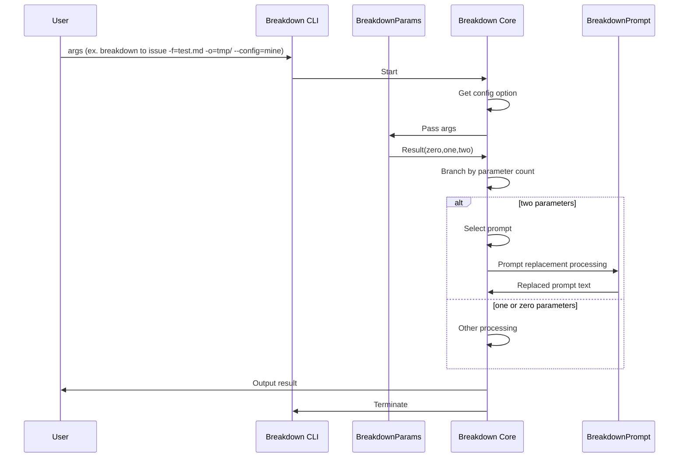
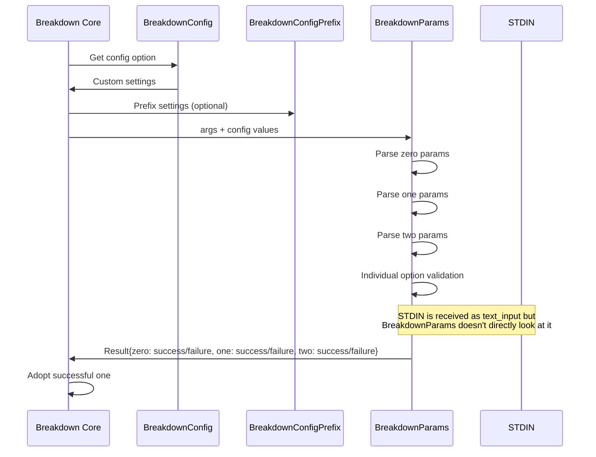
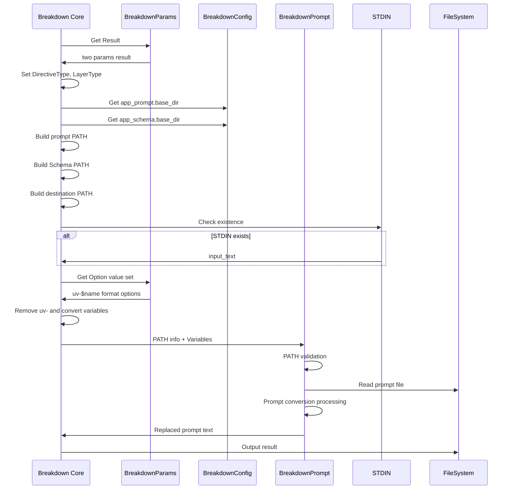
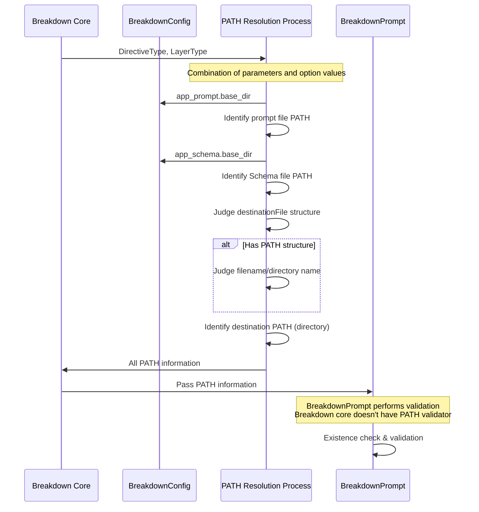
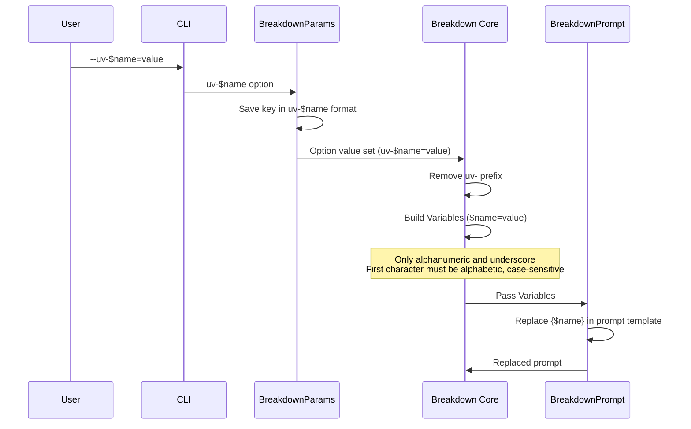

# Design Hierarchy

1 is the top level. High level of abstraction.
The larger the number, the more concrete.

# 1. Top-Level Design
2. Directive words usable in two parameters
  - Standard:
    - DirectiveType: to, summary, defect
    - LayerType: project, issue, task
  - Custom: Regular expression patterns
  - Custom specification:
    - DirectiveType: `params.two.DirectiveType.pattern` in configs args to CLI (ex. `./.deno/bin/breakdown to issue -f=test.md, -o=tmp/ -a=fix --config=mine`)
2. Start Breakdown CLI
3. Separate and understand parameters and options
4. When there are two parameters (two params), select a prompt
5. Replace the prompt with option values
6. Output the result (result = text of the replaced prompt)
7. CLI termination

# 1. Positioning of Split Modules

The Breakdown core has four external modules.
These are internal implementations that have been intentionally externalized.

They are like the Four Heavenly Kings, equivalent to the Breakdown core.

1. BreakdownParams
2. BreakdownConfig
3. BreakdownPrompt
4. BreakdownLogger

# 2. Process Breakdown

1. Get config option and retrieve custom settings → Implemented in Breakdown core
2. Receive args and separate parameters and options → Delegate to BreakdownParams
2-1. At this time, ConfigPrefixDetector needs a prefix to customize parameters (optional)
3. Receive Result from BreakdownParams and branch by number of parameters (zero, one, two)
4. Branch to zero, one, two processing

# 2. Parameter Processing

1. BreakdownParams Result retrieves zero, one, two
2. Check all zero, one, two and adopt the successful one
2-1. args → BreakdownParams Result → Use the successful one
2-2. Breakdown core doesn't decompose args or know definitions (separation of concerns)
2-2-1. However, `--config/-c` is an exception. It's unavoidable because the config file needs to be identified before BreakdownParams.

# 3. Reason for Generating zero, one, two in Parameter Processing

1. Breakdown core doesn't parse args, so it doesn't know the contents
2. Pass args to BreakdownParams
3. BreakdownParams doesn't know how the Result will be used
4. BreakdownParams's responsibility is only to return analysis results
5. As a result, Breakdown core passes args, and BreakdownParams returns a Result containing 3 Results
5-1. Result has zero, one, two, each with success/failure
6. Breakdown core branches processing based on zero, one, two judgment results
7. Breakdown core determines what options can be taken according to each zero, one, two
7-1. BreakdownParams only validates individual Options
8. BreakdownParams receives STDIN as text_input
8-1. BreakdownParams doesn't look at STDIN

# 3. Two Parameter Processing

1. Breakdown core builds PATH from BreakdownParams Result
2. Create separate PATHs for prompt PATH, Schema identification PATH, and output directory PATH
2-1. For prompt and Schema identification PATHs, use BreakdownConfig setting value .base_dir
3. Check for STDIN existence and treat as input_text if present
4. After all PATHs are resolved, pass them with variables to BreakdownPrompt
5. BreakdownPrompt performs prompt conversion processing and returns the resulting prompt text
6. Output

# 3. Character Specification for Two Parameters

1. Be aware of conditions when creating config files
2. Use config file and pass BreakdownConfig values to BreakdownParams
3. Breakdown core is not aware of the conditions for strings that can be used with two parameters (delegated to config and BreakdownParams)

# 4. PATH Resolution

1. In two params, DirectiveType and LayerType are used. Set these from parameter values.
1-1. Additionally, the input option may specify fromLayerType
1-2. Furthermore, the adaptation option may specify a derived version
2. Identify one prompt file from the combination of parameters and option values
2-1. Schema file identification is done similarly
2-2. Output destination identification is done similarly
3. Pass PATH to BreakdownPrompt to load the identified prompt
3-1. BreakdownPrompt validates
3-2. Breakdown core doesn't have a PATH validator

# 5. Prompt File PATH Resolution

1. BreakdownConfig's `app_prompt.base_dir` is the base.
2. See `docs/path.ja.md` for combination details
3. Validator doesn't need to check file existence
3-1. BreakdownPrompt validates

## Note: Preparation Required in Advance

- Prompt files are assumed to be prepared in advance.
- They are not generated during CLI execution. It's possible to specify a non-existent prompt

# 5. Schema File PATH Resolution

1. BreakdownConfig's `app_schema.base_dir` is the base.
2. See `docs/path.ja.md` for combination details
3. Validator doesn't need to check file existence
3-1. BreakdownPrompt validates

# 5. Destination PATH Resolution

1. Branch based on whether destinationFile specification has PATH structure or not.
1-1. Further branch based on whether the specification is a filename or directory name
1-2. BreakdownPrompt's destination_path only accepts directories, so make it a directory
2. See `docs/path.ja.md` for combination details
3. Validator doesn't need to check file existence
3-1. BreakdownPrompt validates

# 4. Variable Set for Replacement

1. Breakdown core gets Option value set from BreakdownParams
2. Breakdown core converts to Variables format expected by BreakdownPrompt
2-1. BreakdownParams returns in `uv-$name` format
2-2. Breakdown core removes `uv-` and constructs Variables with just $name
3. Breakdown core passes Variables to BreakdownPrompt (Path information is also part of what's passed to BreakdownPrompt)
3-1. In BreakdownPrompt, only alphanumeric and underscore can be used, first character must be alphabetic, case-sensitive
3-2. Details: https://github.com/tettuan/breakdownprompt/blob/main/docs/variables.ja.md

# 3. Customizable Types

Users can specify and customize the following three points.

1. config: 
  - Standard: app.yml, user.yml
  - Custom: $prefix-app.yml, $prefix-user.yml
  - Custom specification method: Use `--config/-c` in CLI options
    - Example: `--config=production`, `-c=system`
2. Directive words usable in two parameters
  - Standard: 
    - directiveType: to, summary, defect
    - layerType: project, issue, task
  - Custom: Regular expression patterns
  - Custom specification method: 
    - directiveType: `params.two.directiveType.pattern` in config
    - layerType: `params.two.layerType.pattern` in config
    - Example: `--config=production`, `-c=system`
3. User variables in prompts
  - Standard: None
  - Custom: Use `--uv-$name=value` in CLI and {$name} in prompt template
  - Custom specification method: Use `--uv-$name=value` in CLI options
    - BreakdownParams receives with `uv-$name` as key
    - Inside prompts, use {$name}

# Sequence Diagrams

## 1. Top Level - Overall CLI Flow

## 2. Parameter Processing Level - BreakdownParams Details

## 3. Two Parameter Processing Level - PATH Resolution and Variable Processing

## 4. PATH Resolution Detail Level - File Identification Process

## 5. Variable Processing Detail Level - Custom Variables and Option Processing

## Design Notes

### Separation of Concerns
- **Breakdown Core**: Doesn't parse args, doesn't know parameter definitions
- **BreakdownParams**: Responsibility is only to return analysis results, doesn't know how results are used
- **BreakdownPrompt**: Performs PATH validation, core doesn't have validator

### Need for Advance Preparation
- Prompt files are assumed to be prepared in advance
- Not generated during CLI execution
- It's possible to specify non-existent prompts

### Customization Points
1. **config**: Specify prefix with `--config/-c`
2. **Parameter patterns**: Control DirectiveType/LayerType with regular expressions
3. **User variables**: Control in-prompt variables with `--uv-$name=value`