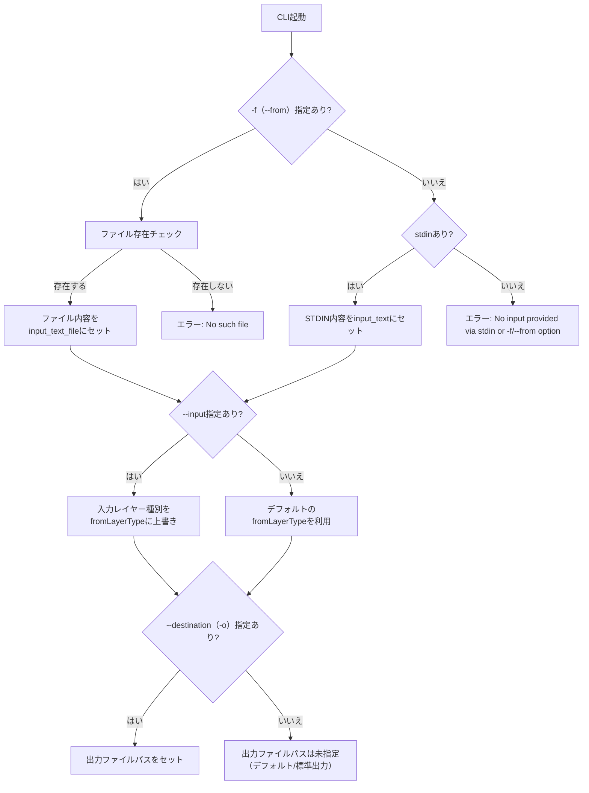

# breakdown 引数の仕様

> **パラメータからパス解決への流れ・実装例については [app_factory.ja.md](./app_factory.ja.md) も参照してください。**

## パラメータ処理の実装

https://jsr.io/@tettuan/breakdownparams を使用します。最新版はJSRを確認すること。 README
https://github.com/tettuan/breakdownparams を読み把握すること。 オプション詳細は
https://github.com/tettuan/breakdownparams/blob/HEAD/docs/options.md に記載があります。

```ts
import { ParamsParser } from "@tettuan/breakdownparams";

const parser = new ParamsParser();

// Parse arguments
const result = parser.parse(Deno.args);

// Handle different result types
switch (result.type) {
  case "zero-params":
    if (result.help) {
      console.log("Show help message");
    }
    if (result.version) {
      console.log("Show version");
    }
    break;

  case "one":
    if (result.command === "init") {
      console.log("Initialize project");
    }
    break;

  case "two":
    console.log(`Demonstrative: ${result.demonstrativeType}`);
    console.log(`Layer: ${result.layerType}`);
    if (result.options.fromFile) {
      console.log(`From file: ${result.options.fromFile}`);
    }
    break;
}
```

## 基本コマンド

```bash
./.deno/bin/breakdown
```

## 引数

まず、引数の数に応じて処理が変わります。

### Result Types from breakdownparams

```
ZeroParamsResult: For commands with no parameters or help/version flags
OneParamsResult: For single commands like "init"
TwoParamsResult: For commands with demonstrative and layer type
```

### ZeroParamsResult = ヘルプやバージョン確認:

ex.

```bash
./.deno/bin/breakdown --help
```

#### OneParamsResult = 初期化などアプリケーションへの変更

- `init` : 初期設定を行う。

### TwoParamsResult = 分解処理

ex.

```bash
./.deno/bin/breakdown `<DemonstrativeType>` `<layerType>` \
  --from=`<file>` \
  --destination=`<output_file>` \
  --input=`<from_layer_type>` \
  --adaptation=`<adaptation_type>` \
```

ex.

```bash
./.deno/bin/breakdown to issue \
  --from=project.md \
  --destination=issue_details \
  --input=project \
  --adaptation=strict \
```

### オプション一覧

#### 基本オプション

- プロンプト指定に利用
  - `-a, --adaptation=<adaptation_type>`: プロンプトの種類を指定（例: strict, a など）
  - `-i, --input=<from_layer_type>`: usecase:入力レイヤーの種類を指定, system: fromLayerType を上書き
- テンプレート変数（ see `BreakdownPrompt` documents ）の値に利用
  - `-f, --from=<file>`: usecase:入力ファイルを指定, system: `{input_text_file}` を置き換え
  - `-o, --destination=<output_file>`: usecase:出力先を指定, system: `{destination_path}` を置き換え

- STDIN 
  - テンプレート変数の値に利用。 `{input_text}` を置き換え

#### 拡張オプション (v1.0.1新機能)

##### カスタム変数オプション (--uv-*)

テンプレート内で参照可能なユーザー定義変数を設定できます。

###### 基本的な使用方法

```bash
# 単一のカスタム変数
./.deno/bin/breakdown to issue \
  --from=project.md \
  --uv-userName=太郎

# 複数のカスタム変数
./.deno/bin/breakdown to issue \
  --from=project.md \
  --uv-userName=太郎 \
  --uv-projectName=マイプロジェクト \
  --uv-version=1.0.0 \
  --uv-environment=production
```

###### カスタム変数の仕様

- **形式**: `--uv-変数名=値`
- **変数名**: 英数字とアンダースコア（_）が使用可能
- **値**: 任意の文字列（スペースを含む場合はクォートで囲む）

###### テンプレート内での参照方法

プロンプトテンプレート内では `{uv.変数名}` の形式で参照します：

```markdown
# プロンプトテンプレート例
プロジェクト名: {uv.projectName}
担当者: {uv.userName}
バージョン: {uv.version}
環境: {uv.environment}

入力ファイル: {input_text_file}
```

###### 実行例

```bash
# ユーザー情報を含むイシュー作成
./.deno/bin/breakdown to issue \
  --from=requirements.md \
  --uv-userName=太郎 \
  --uv-assignee=花子 \
  --uv-priority=high

# プロジェクト情報を含むドキュメント生成
./.deno/bin/breakdown to documentation \
  --from=design.md \
  --uv-projectName=ECサイト \
  --uv-version=2.1.0 \
  --uv-releaseDate=2024-04-01

# 複数言語対応の例
./.deno/bin/breakdown to translation \
  --from=content.md \
  --uv-sourceLang=日本語 \
  --uv-targetLang=英語 \
  --uv-translator=山田太郎
```

###### 注意事項

- カスタム変数名は大文字小文字を区別します（`userName` と `username` は別の変数）
- 同じ変数名を複数回指定した場合、最後の値が使用されます
- テンプレート内で未定義の変数を参照した場合、置換されずにそのまま残ります

##### 拡張パラメータ機能

###### --extended オプション

拡張パラメータモードを有効化します。このモードでは、通常のパラメータに加えて、より詳細な設定や高度な機能が利用可能になります。

```bash
./.deno/bin/breakdown to issue \
  --from=project.md \
  --extended
```

**用途:**
- 詳細なデバッグ情報の出力
- 追加のメタデータ処理
- 高度なテンプレート機能の有効化
- 実行時統計情報の収集

**実例:**
```bash
# 拡張モードでプロジェクトをissueに分解
./.deno/bin/breakdown to issue \
  --from=large_project.md \
  --extended \
  --destination=issues/

# 結果: 通常より詳細な分解結果と処理統計を出力
# - 処理時間: 2.3秒
# - 入力サイズ: 45KB
# - 生成issue数: 12件
# - 使用テンプレート: issue_extended.md
```

###### --custom-validation オプション

カスタムバリデーションルールを有効化します。プロジェクト固有のバリデーション要件に対応できます。

```bash
./.deno/bin/breakdown to issue \
  --from=project.md \
  --custom-validation
```

**用途:**
- 入力ファイルの構造検証
- カスタムフォーマットのチェック
- プロジェクト固有のルール適用
- ドメイン特有の制約検証

**実例:**
```bash
# カスタムバリデーションを使用してプロジェクトファイルを検証
./.deno/bin/breakdown to issue \
  --from=project_with_custom_format.md \
  --custom-validation \
  --uv-validator=project_rules.json

# project_rules.json の例:
# {
#   "required_sections": ["概要", "要件", "スケジュール"],
#   "max_file_size": "10MB",
#   "allowed_formats": ["markdown", "yaml"],
#   "custom_checks": {
#     "issue_prefix": "PROJ-",
#     "date_format": "YYYY-MM-DD"
#   }
# }
```

###### --error-format=detailed オプション

エラー発生時の表示形式を制御します。`detailed`を指定すると、詳細なエラー情報とスタックトレースを表示します。

```bash
./.deno/bin/breakdown to issue \
  --from=project.md \
  --error-format=detailed
```

**用途:**
- デバッグ時の詳細なエラー情報取得
- エラーの根本原因の特定
- 開発環境での問題解析
- CI/CDパイプラインでの詳細ログ

**利用可能な値:**
- `simple`: 簡潔なエラーメッセージのみ（デフォルト）
- `detailed`: 詳細なエラー情報とスタックトレース
- `json`: JSON形式でエラー情報を出力

**実例:**
```bash
# 詳細エラー形式でデバッグ
./.deno/bin/breakdown to issue \
  --from=non_existent_file.md \
  --error-format=detailed

# 出力例:
# Error: ファイルが見つかりません
# 詳細: non_existent_file.md
# スタックトレース:
#   at FileReader.read (file_reader.ts:45:10)
#   at BreakdownApp.process (app.ts:123:15)
#   at main (cli.ts:78:20)
# 
# 環境情報:
#   Deno: 1.40.0
#   Breakdown: 2.0.0
#   OS: Darwin x64

# JSON形式でエラー出力（自動化ツール向け）
./.deno/bin/breakdown to issue \
  --from=project.md \
  --error-format=json \
  2> error_log.json

# error_log.json の例:
# {
#   "error": "ValidationError",
#   "message": "必須セクションが見つかりません",
#   "details": {
#     "missing_sections": ["要件", "スケジュール"],
#     "file": "project.md",
#     "line": null
#   },
#   "timestamp": "2024-03-20T10:30:45.123Z",
#   "version": "2.0.0"
# }
```

###### 拡張パラメータの組み合わせ例

```bash
# フル機能を有効化した例
./.deno/bin/breakdown to issue \
  --from=complex_project.md \
  --extended \
  --custom-validation \
  --error-format=detailed \
  --uv-project=enterprise \
  --uv-validation-config=strict_rules.json \
  --destination=output/issues/

# CI/CD環境での使用例
./.deno/bin/breakdown to task \
  --from=requirements.md \
  --extended \
  --error-format=json \
  --custom-validation \
  --uv-environment=ci \
  --uv-branch=$GITHUB_REF \
  2> build_errors.json || exit 1

# 開発環境でのデバッグ例
./.deno/bin/breakdown to test \
  --from=test_specs.md \
  --extended \
  --custom-validation \
  --error-format=detailed \
  --uv-coverage=true \
  --uv-report-format=html \
  --destination=test_results/
```

##### 設定ファイルサポート

BreakdownParams v1.0.1以降、設定ファイルを使用してデフォルト値や環境別設定を管理できます。設定ファイルを使用することで、チーム全体で統一された設定を共有し、環境ごとの差異を簡単に管理できます。

###### .breakdownrc.jsonの完全な例

`.breakdownrc.json`は、プロジェクトのルートディレクトリまたはカレントディレクトリに配置するJSON形式の設定ファイルです。

```json
// .breakdownrc.json の完全な例
{
  "defaultOptions": {
    // 基本オプションのデフォルト値
    "adaptation": "strict",
    "input": "project",
    "destination": "./output",
    "from": null,
    
    // 拡張オプションのデフォルト値
    "extended": false,
    "customValidation": false,
    "errorFormat": "simple",
    
    // カスタム変数のデフォルト値
    "customVariables": {
      "environment": "development",
      "debug": "false",
      "maxRetries": "3"
    }
  },
  
  "customValidation": {
    "requireFrom": true,
    "allowEmptyDestination": false,
    "requiredSections": ["概要", "要件", "スケジュール"],
    "filePatterns": {
      "allowed": ["*.md", "*.txt", "*.yaml"],
      "denied": ["*.exe", "*.bin"]
    }
  },
  
  "userVariables": {
    // デフォルトのカスタム変数
    "author": "デフォルト作成者",
    "version": "1.0.0",
    "language": "ja",
    "timezone": "Asia/Tokyo"
  },
  
  "environments": {
    "production": {
      "defaultOptions": {
        "adaptation": "strict",
        "errorFormat": "simple",
        "customValidation": true
      },
      "customValidation": {
        "strictMode": true,
        "maxFileSize": 1048576 // 1MB
      },
      "userVariables": {
        "environment": "production",
        "debugMode": false
      }
    },
    "development": {
      "defaultOptions": {
        "adaptation": "flexible",
        "errorFormat": "detailed",
        "extended": true
      },
      "customValidation": {
        "strictMode": false,
        "allowEmptyDestination": true
      },
      "userVariables": {
        "environment": "development",
        "debugMode": true,
        "logLevel": "verbose"
      }
    },
    "test": {
      "defaultOptions": {
        "adaptation": "mock",
        "errorFormat": "json",
        "customValidation": false
      },
      "userVariables": {
        "environment": "test",
        "skipValidation": true
      }
    }
  }
}
```

###### 設定ファイルの検索順序

BreakdownParamsは以下の順序で設定ファイルを検索します：

1. **カレントディレクトリ** (`./`): `./.breakdownrc.json`
2. **ホームディレクトリ** (`~/`): `~/.breakdownrc.json`
3. **システムディレクトリ** (`/etc/`): `/etc/breakdownrc.json`

最初に見つかった設定ファイルが読み込まれ、以降の検索は行われません。

###### 設定の優先順位

設定値は以下の優先順位で適用されます（上位ほど優先度が高い）：

1. **コマンドライン引数**: 直接指定された値が最優先
   ```bash
   breakdown to test --adaptation=strict --uv-author="John Doe"
   ```

2. **環境変数**: BREAKDOWN_で始まる環境変数
   ```bash
   export BREAKDOWN_ADAPTATION=flexible
   export BREAKDOWN_UV_AUTHOR="Jane Doe"
   ```

3. **設定ファイル**: .breakdownrc.jsonの値
   ```json
   {
     "defaultOptions": {
       "adaptation": "strict"
     },
     "userVariables": {
       "author": "Default Author"
     }
   }
   ```

###### NODE_ENVでの環境切替

`NODE_ENV`環境変数を使用して、環境別の設定を自動的に適用できます：

```bash
# 本番環境の設定を使用
NODE_ENV=production breakdown to test --from=specs.md

# 開発環境の設定を使用（デフォルト）
NODE_ENV=development breakdown to test --from=specs.md

# テスト環境の設定を使用
NODE_ENV=test breakdown to test --from=specs.md
```

環境別設定は、グローバル設定とマージされ、環境固有の値が優先されます。

###### デフォルト値の定義方法

設定ファイルでは、3つのレベルでデフォルト値を定義できます：

1. **グローバルデフォルト値**（`defaultOptions`）
   ```json
   {
     "defaultOptions": {
       "adaptation": "strict",
       "input": "project",
       "destination": "./output",
       "errorFormat": "simple"
     }
   }
   ```

2. **カスタム変数のデフォルト値**（`userVariables`）
   ```json
   {
     "userVariables": {
       "author": "Anonymous",
       "projectName": "Untitled",
       "version": "0.0.1",
       "tags": ["draft"]
     }
   }
   ```

3. **環境別のデフォルト値**（`environments.<env>.defaultOptions`）
   ```json
   {
     "environments": {
       "production": {
         "defaultOptions": {
           "adaptation": "strict",
           "errorFormat": "simple"
         }
       }
     }
   }
   ```

**具体的な使用例：**

```bash
# 設定ファイルのデフォルト値が適用される
./.deno/bin/breakdown to issue
# adaptation: "strict" （デフォルト値）
# input: "project" （デフォルト値）
# errorFormat: "simple" （デフォルト値）

# コマンドライン引数で上書き
./.deno/bin/breakdown to issue --adaptation=flexible
# adaptation: "flexible" （コマンドラインで上書き）
# input: "project" （デフォルト値）
# errorFormat: "simple" （デフォルト値）
```

###### 環境別設定（production/development）

環境別設定により、開発・テスト・本番環境で異なる設定を使用できます。

**development環境の設定例：**
```json
{
  "environments": {
    "development": {
      "defaultOptions": {
        "adaptation": "flexible",
        "errorFormat": "detailed",
        "extended": true,
        "customValidation": false
      },
      "customValidation": {
        "strictMode": false,
        "allowEmptyDestination": true,
        "warnOnMissingSection": true
      },
      "userVariables": {
        "environment": "development",
        "debugMode": true,
        "logLevel": "verbose",
        "outputPath": "./dev-output"
      }
    }
  }
}
```

**production環境の設定例：**
```json
{
  "environments": {
    "production": {
      "defaultOptions": {
        "adaptation": "strict",
        "errorFormat": "simple",
        "extended": false,
        "customValidation": true
      },
      "customValidation": {
        "strictMode": true,
        "allowEmptyDestination": false,
        "requiredSections": ["概要", "要件", "承認", "リリース計画"],
        "maxFileSize": 1048576, // 1MB
        "timeout": 10000 // 10秒
      },
      "userVariables": {
        "environment": "production",
        "debugMode": false,
        "logLevel": "error",
        "outputPath": "./dist"
      }
    }
  }
}
```

**環境の指定方法：**
```bash
# 環境変数で指定
BREAKDOWN_ENV=production ./.deno/bin/breakdown to issue --from=project.md

# コマンドライン引数で指定
./.deno/bin/breakdown to issue --from=project.md --env=production

# NODE_ENVを使用（BREAKDOWN_ENVが未設定の場合）
NODE_ENV=production ./.deno/bin/breakdown to issue --from=project.md
```

###### 設定ファイルの優先順位

設定値は以下の優先順位で適用されます（数字が小さいほど優先度が高い）：

1. **コマンドライン引数**
   ```bash
   ./.deno/bin/breakdown to issue --adaptation=loose
   ```

2. **環境変数**
   ```bash
   BREAKDOWN_ADAPTATION=flexible ./.deno/bin/breakdown to issue
   ```

3. **環境別設定**（environments.production など）
   ```json
   {
     "environments": {
       "production": {
         "defaultOptions": {
           "adaptation": "strict"
         }
       }
     }
   }
   ```

4. **グローバルデフォルト設定**（defaultOptions）
   ```json
   {
     "defaultOptions": {
       "adaptation": "normal"
     }
   }
   ```

5. **BreakdownParamsの内部デフォルト値**

**優先順位の実例：**

```json
// .breakdownrc.json
{
  "defaultOptions": {
    "adaptation": "normal",
    "errorFormat": "simple"
  },
  "environments": {
    "production": {
      "defaultOptions": {
        "adaptation": "strict"
      }
    }
  }
}
```

```bash
# ケース1: デフォルト環境（development）
./.deno/bin/breakdown to issue --from=project.md
# adaptation: "normal" （グローバルデフォルト）

# ケース2: production環境
BREAKDOWN_ENV=production ./.deno/bin/breakdown to issue --from=project.md
# adaptation: "strict" （production環境設定）

# ケース3: コマンドライン引数で上書き
BREAKDOWN_ENV=production ./.deno/bin/breakdown to issue --from=project.md --adaptation=flexible
# adaptation: "flexible" （コマンドライン引数が最優先）
```

**設定ファイルの検索パス：**

設定ファイルは以下の順序で検索されます：

1. カレントディレクトリの `.breakdownrc.json`
2. カレントディレクトリの `.breakdownrc.js`
3. プロジェクトルートの `breakdown.config.json`
4. プロジェクトルートの `breakdown.config.js`
5. ユーザーホームディレクトリの `.breakdownrc.json`

最初に見つかった設定ファイルが使用され、複数の設定ファイルはマージされません。

##### オプションルール (OptionRule)

オプションの動作を細かく制御できます：

###### フラグオプション

値を取らないオプションの定義が可能です。

```typescript
// フラグオプションの定義例
const optionRules = {
  flags: ["verbose", "quiet", "debug", "extended", "custom-validation"],
};

// 使用例
// --verbose フラグのみ（値なし）
./.deno/bin/breakdown to issue --from=project.md --verbose

// 複数のフラグ指定
./.deno/bin/breakdown to issue --from=project.md --verbose --debug
```

###### 必須オプション指定

特定のコマンドで必須となるオプションを定義できます。

```typescript
// 必須オプションの定義例
const optionRules = {
  required: {
    "to": ["from"], // toコマンドでは--fromが必須
    "init": [], // initコマンドでは必須オプションなし
  },
};

// エラー例：--fromがない場合
./.deno/bin/breakdown to issue
// Error: Required option '--from' is missing for 'to' command

// 正しい使用例
./.deno/bin/breakdown to issue --from=project.md
```

###### 型定義（string/number/boolean）

オプションの値の型を明示的に定義できます。

```typescript
// 型定義の例
const optionRules = {
  types: {
    "port": "number",
    "timeout": "number",
    "verbose": "boolean",
    "from": "string",
    "destination": "string",
    "max-retries": "number",
  },
};

// 使用例
// 数値型オプション
./.deno/bin/breakdown server --port=8080 --timeout=30000

// 型エラーの例
./.deno/bin/breakdown server --port="abc"
// Error: Option '--port' expects a number but received 'abc'

// boolean型の扱い
./.deno/bin/breakdown to issue --from=project.md --verbose=true
./.deno/bin/breakdown to issue --from=project.md --verbose=false
./.deno/bin/breakdown to issue --from=project.md --verbose  // trueとして扱われる
```

###### エラーハンドリング

####### 空値の扱い方

```typescript
// 空値ハンドリングの定義
const optionRules = {
  allowEmpty: {
    "destination": true,  // 空値を許可
    "from": false,       // 空値を禁止
  },
};

// エラー例：空値が許可されていない場合
./.deno/bin/breakdown to issue --from=""
// Error: Option '--from' cannot be empty

// 正常例：空値が許可されている場合
./.deno/bin/breakdown to issue --from=project.md --destination=""
// destinationは空文字列として処理される

// 値なしオプションの扱い
./.deno/bin/breakdown to issue --from=project.md --destination
// フラグとして扱われるか、デフォルト値が使用される
```

####### 未知のオプションへの対応

```typescript
// 未知のオプションハンドリング
const optionRules = {
  strictMode: true, // 未知のオプションを拒否
  allowUnknown: false,
};

// エラー例：未知のオプション
./.deno/bin/breakdown to issue --from=project.md --unknown-option=value
// Error: Unknown option '--unknown-option'

// 警告モード（strictMode: false）
const optionRules = {
  strictMode: false,
  warnUnknown: true,
};

// 警告例
./.deno/bin/breakdown to issue --from=project.md --typo-option=value
// Warning: Unknown option '--typo-option' will be ignored
// 処理は続行される
```

####### 重複オプションの処理

```typescript
// 重複オプションハンドリング
const optionRules = {
  duplicateStrategy: {
    default: "last",    // デフォルト：最後の値を使用
    "from": "error",    // --from: 重複時エラー
    "uv-*": "merge",    // カスタム変数：値をマージ
    "tags": "array",    // タグ：配列として収集
  },
};

// エラー例：重複が許可されていない
./.deno/bin/breakdown to issue --from=file1.md --from=file2.md
// Error: Option '--from' specified multiple times

// 最後の値を使用（デフォルト動作）
./.deno/bin/breakdown to issue --from=project.md --adaptation=strict --adaptation=loose
// --adaptation=loose が使用される

// 配列として収集
./.deno/bin/breakdown to issue --from=project.md --tags=bug --tags=enhancement --tags=urgent
// tags: ["bug", "enhancement", "urgent"]

// カスタム変数のマージ
./.deno/bin/breakdown to issue --from=project.md --uv-env=dev --uv-env=test
// 実装により、最後の値使用またはエラー
```

###### 完全な設定例

```typescript
// breakdownparams.config.ts での OptionRule 設定例
export const optionRules = {
  // フラグオプション（値を取らない）
  flags: ["verbose", "quiet", "debug", "extended", "help", "version"],
  
  // コマンドごとの必須オプション
  required: {
    "to": ["from"],  // toコマンドでは--fromまたはstdinが必須
    "init": [],      // initコマンドは必須オプションなし
  },
  
  // 型定義
  types: {
    "from": "string",
    "destination": "string",
    "input": "string",
    "adaptation": "string",
    "port": "number",
    "timeout": "number",
    "max-retries": "number",
    "verbose": "boolean",
    "quiet": "boolean",
    "debug": "boolean",
  },
  
  // 空値の許可設定
  allowEmpty: {
    "destination": true,   // 出力先は空でもOK
    "from": false,        // 入力ファイルは空不可
    "adaptation": false,  // adaptation型は空不可
  },
  
  // 重複オプションの処理戦略
  duplicateStrategy: {
    default: "last",      // デフォルト：最後の値
    "from": "error",      // 入力ファイルは重複エラー
    "uv-*": "last",       // カスタム変数は最後の値
    "tags": "array",      // タグは配列として収集
  },
  
  // エラーハンドリング設定
  errorHandling: {
    strictMode: true,     // 未知のオプションを拒否
    warnUnknown: false,   // 警告表示（strictMode=falseの場合）
    throwOnError: true,   // エラー時に例外をスロー
  },
};

# doubleコマンドのパラメータバリデーション仕様

## バリデーションの責務について
- Breakdown CLIのパラメータバリデーションは**Factoryの責務ではなく、Validatorの責務**です。
- Factoryは「パス・パラメータの構築」に専念し、入力値の妥当性チェック（存在確認・必須判定・型チェック等）はValidatorが担います。

1. **責務分離の原則**
2. **バリデーションの一元化**

## 概要
- Breakdown CLIのパラメータ（-f, --input, -o, stdin）は、組み合わせごとに必須/任意、値の有無、エラー条件が定められています。
- Factoryはパス・パラメータ構築時に、下記バリデーション仕様に従い入力値を検証します。

## 判定フローチャート



## パラメータ組み合わせ表

| -f（--from） | stdin | --input（-i） | --destination（-o） | 組み合わせ数 | 備考 |
|:------------:|:-----:|:-------------:|:------------------:|:------------:|:------|
| 必須/任意    | 任意  | 任意          | 任意               | 2x2x2=8      | -fまたはstdinどちらか必須 |
| 指定時値必須 | 値任意| 指定時値必須   | 指定時値任意        |              |      |

- -f（--from）: 指定があれば値必須、ファイル存在必須
- stdin: 存在すれば値利用、なければ利用しない
- --input: 任意、指定時は値必須（fromLayerType上書き用途）
- --destination: 任意、指定時は値任意（キーのみでもOK）

## まとめ
- [ -f or stdin ] のいずれかが必須（両方無しはエラー）
- -f指定時はファイル存在必須、値必須
- stdinは存在すれば値利用、なければ利用しない
- --inputはfromLayerType上書き用途のみ
- --destinationは出力先指定（任意）

## バリデータ設計
- Breakdown CLIのパラメータバリデーションは、Strategyパターンで設計する。
- BreakdownParamsの結果タイプ（NoParams, Single, Double）ごとにStrategy（バリデータクラス）を分離する。
- 各Strategyは、そのコマンドタイプに必要なバリデーション責務のみを持つ。
- サブディレクトリ `lib/cli/validators/` 配下に、
  - `base_validator.ts`（Strategyインターフェース）
  - `single_command_validator.ts`（SingleParamResult用）
  - `double_command_validator.ts`（DoubleParamsResult用）
  - `no_params_command_validator.ts`（NoParamsResult用）
  - `command_options_validator.ts`（Strategy選択・実行のFacade）
  などを配置し、責務分離・拡張性・テスト容易性を高める。
- これにより、コマンドタイプごとのバリデーション仕様追加・変更が容易となる。
