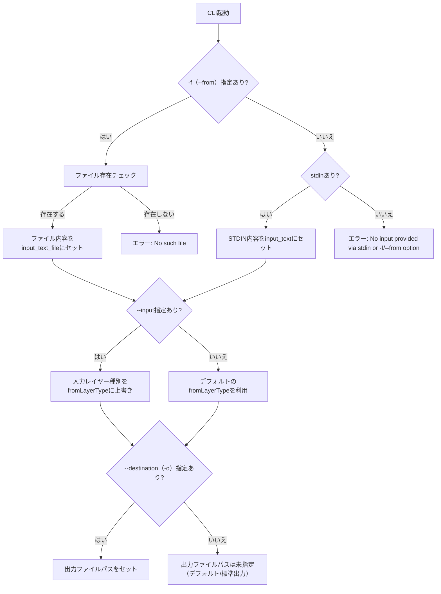

# breakdown 引数の仕様

> **パラメータからパス解決への流れ・実装例については [app_factory.ja.md](./app_factory.ja.md) も参照してください。**

## パラメータ処理の実装

https://jsr.io/@tettuan/breakdownparams を使用します。最新版はJSRを確認すること。 README
https://github.com/tettuan/breakdownparams を読み把握すること。 オプション詳細は
https://github.com/tettuan/breakdownparams/blob/HEAD/docs/options.md に記載があります。

```ts
import { ParamsParser } from "jsr:@tettuan/breakdownparams@^0.1.10";

const parser = new ParamsParser();

// Parse arguments
const result = parser.parse(Deno.args);

// Handle different result types
switch (result.type) {
  case "no-params":
    if (result.help) {
      console.log("Show help message");
    }
    if (result.version) {
      console.log("Show version");
    }
    break;

  case "single":
    if (result.command === "init") {
      console.log("Initialize project");
    }
    break;

  case "double":
    console.log(`Demonstrative: ${result.demonstrativeType}`);
    console.log(`Layer: ${result.layerType}`);
    if (result.options.fromFile) {
      console.log(`From file: ${result.options.fromFile}`);
    }
    break;
}
```

## 基本コマンド

```bash
./.deno/bin/breakdown
```

## 引数

まず、引数の数に応じて処理が変わります。

### Result Types from breakdownparams

```
NoParamsResult: For commands with no parameters or help/version flags
SingleParamResult: For single commands like "init"
DoubleParamsResult: For commands with demonstrative and layer type
```

### NoParamsResult = ヘルプやバージョン確認:

ex.

```bash
./.deno/bin/breakdown --help
```

#### SingleParamResult = 初期化などアプリケーションへの変更

- `init` : 初期設定を行う。

### DoubleParamsResult = 分解処理

ex.

```bash
./.deno/bin/breakdown `<DemonstrativeType>` `<layerType>` \
  --from `<file>` \
  --destination `<output_file>` \
  --input `<from_layer_type>` \
  --adaptation `<adaptation_type>` \
```

ex.

```bash
./.deno/bin/breakdown to issue \
  --from project.md \
  --destination issue_details \
  --input project \
  --adaptation strict \
```

### オプション一覧

- `-f, --from <file>`: 入力ファイルを指定
- `-o, --destination <output_file>`: 出力先を指定
- `-i, --input <from_layer_type>`: 入力レイヤーの種類を指定
- `-a, --adaptation <adaptation_type>`: プロンプトの種類を指定（例: strict, a など）

# doubleコマンドのパラメータバリデーション仕様

## バリデーションの責務について
- Breakdown CLIのパラメータバリデーションは**Factoryの責務ではなく、Validatorの責務**です。
- Factoryは「パス・パラメータの構築」に専念し、入力値の妥当性チェック（存在確認・必須判定・型チェック等）はValidatorが担います。

1. **責務分離の原則**
2. **バリデーションの一元化**

## 概要
- Breakdown CLIのパラメータ（-f, --input, -o, stdin）は、組み合わせごとに必須/任意、値の有無、エラー条件が定められています。
- Factoryはパス・パラメータ構築時に、下記バリデーション仕様に従い入力値を検証します。

## 判定フローチャート



## パラメータ組み合わせ表

| -f（--from） | stdin | --input（-i） | --destination（-o） | 組み合わせ数 | 備考 |
|:------------:|:-----:|:-------------:|:------------------:|:------------:|:------|
| 必須/任意    | 任意  | 任意          | 任意               | 2x2x2=8      | -fまたはstdinどちらか必須 |
| 指定時値必須 | 値任意| 指定時値必須   | 指定時値任意        |              |      |

- -f（--from）: 指定があれば値必須、ファイル存在必須
- stdin: 存在すれば値利用、なければ利用しない
- --input: 任意、指定時は値必須（fromLayerType上書き用途）
- --destination: 任意、指定時は値任意（キーのみでもOK）

## まとめ
- [ -f or stdin ] のいずれかが必須（両方無しはエラー）
- -f指定時はファイル存在必須、値必須
- stdinは存在すれば値利用、なければ利用しない
- --inputはfromLayerType上書き用途のみ
- --destinationは出力先指定（任意）

## バリデータ設計
- Breakdown CLIのパラメータバリデーションは、Strategyパターンで設計する。
- BreakdownParamsの結果タイプ（NoParams, Single, Double）ごとにStrategy（バリデータクラス）を分離する。
- 各Strategyは、そのコマンドタイプに必要なバリデーション責務のみを持つ。
- サブディレクトリ `lib/cli/validators/` 配下に、
  - `base_validator.ts`（Strategyインターフェース）
  - `single_command_validator.ts`（SingleParamResult用）
  - `double_command_validator.ts`（DoubleParamsResult用）
  - `no_params_command_validator.ts`（NoParamsResult用）
  - `command_options_validator.ts`（Strategy選択・実行のFacade）
  などを配置し、責務分離・拡張性・テスト容易性を高める。
- これにより、コマンドタイプごとのバリデーション仕様追加・変更が容易となる。
