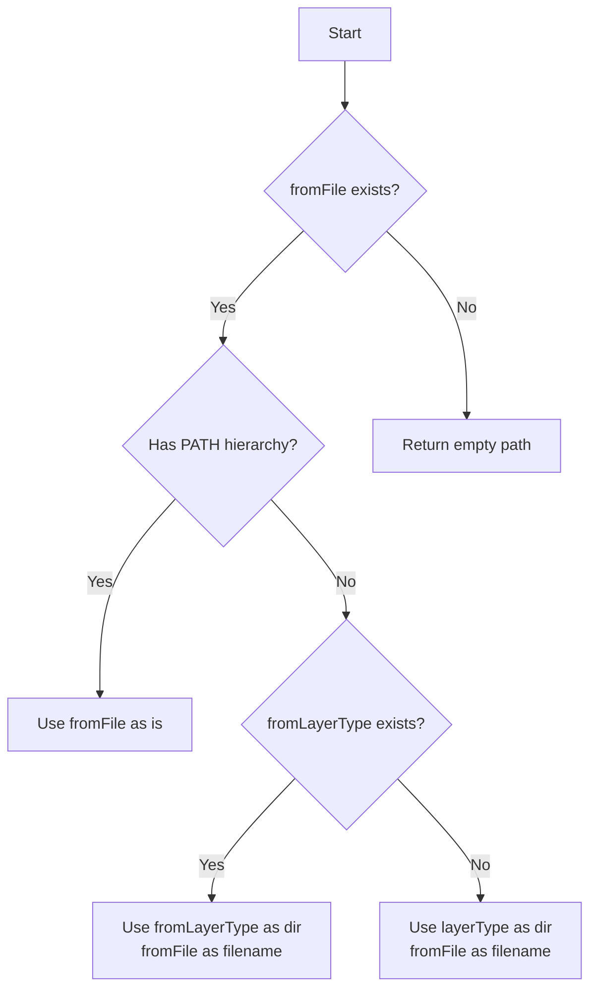

# オプション（パラメータ値）に基づくPATH処理

path を解釈するための仕様である。 PATHは2つの前提が揃うと決まる。

1. 設定値が存在する
2. パラメータを2つ受け取った(breakdownparamsのDoubleParamsResult)

## 基本構造

1. PATHの最上位ディレクトリは、プロジェクトのroot。

- 絶対PATHは用いない。
- URL APIを推奨しているが、受け渡し時には相対パスで渡す。

2. 続けて、設定値を用いる。

- プロンプト : `app_prompt.base_dir`
- Schema : `app_schema.base_dir`
- その他 : `working_dir`

3. その次に、パラメータ2つの組み合わせでPATHを構成する。

- 「PATH組み合わせ」を参照

# PATH組み合わせ

パラメータ2つ(breakdownparamsのDoubleParamsResult)の時に組み合わせる。

```yaml
- DoubleParamsResult
  - demonstrativeType
  - layerType
  - options
  - fromFile (-f)
  - destinationFile (-o)
  - fromLayerType (-i)
```

## プロンプト

- dir : {demonstrativeType}/{layerType}
- filename : f_{fromLayerType}.md

プロンプトファイル例： `lib/prompts/to/issue/f_issue.md`

### fromLayerType が空白時

fromLayerType が指定されていない時、 fromFile から fromLayerType に相当する値を判定する。 ex.
fromLayerType が空白で fromFile が `something/created/123_issue_file.md` のとき、 fromFile に
`issue` を含むため、fromLayerType の代わりに fromFile から `issue` を特定する。fromLayerType
が取りうる値は project, issue, task なので、fromFile
を3つのワードでスキャンすることによって実現できる。

## Schema

- dir : {demonstrativeType}/{layerType}
- filename : `base.schema.md`
  - デフォルト値を `base.schema.md` で固定

Schemaファイル例： `lib/schema/to/issue/base.schema.md`

## Inputファイル

パラメータの値に応じてPATH処理が分かれる。

```yaml
- fromFile が PATH階層を持つ時
- fromFile が ファイル名のみを持つ時
  - fromLayerType の指定がある時
- fromFile が 空白の時（指定がないとき）
```

### パラメータの優先順位

fromFileパラメータが最優先される。fromFileが存在する場合、他のパラメータは使用されない。



それぞれ、次の処理を行う。

### fromFile が PATH階層を持つ時

そのまま fromFile を利用する。他のパラメータは使われない。

- dir & filename : {fromFile}

### fromFile が ファイル名のみを持つ時

- fromLayerType の指定がない時
  - dir : {layerType}
  - filename : {fromFile}
- fromLayerType の指定がある時
  - dir : {fromLayerType}
  - filename : {fromFile}

### fromFile が 空白の時（あるいは指定がないとき）

PATHおよびファイル名を空白で返す。

## Outputファイル

パラメータの値に応じてPATH処理が分かれる。

```yaml
- destinationFile が PATH階層を持つファイルの時
- destinationFile が ファイル名のみを持つ時
- destinationFile が 「PATH階層を持つディレクトリ」の時
- destinationFile が 空白の時（指定がないとき）
```

それぞれ、次の処理を行う。

### destinationFile が PATH階層を持つファイルの時

指定された destinationFile の値をそのまま使う。

- ファイル判定:
  同一名のディレクトリが存在しないこと、拡張子が付与されている(ファイル名に.が1つ以上含まれている)ことの2点
  - 同名のディレクトリの存在を確認してから、ファイル判定を行う。

### destinationFile が ファイル名のみを持つ時

- dir : {layerType}
- filename : {destinationFile}

### destinationFile が 「PATH階層を持つディレクトリ」の時

指定された destinationFile の値をディレクトリに使う。

- ファイル判定:
  同一名のディレクトリが存在しないこと、拡張子(ファイル名に.が1つ以上含まれている)が付与されていることの2点
- ディレクトリ判定は上記以外。
  - ディレクトリの存在を確認してから、ファイル判定を行う。

- dir : destinationFile
- filename : {yyyymmdd}_{ランダムなハッシュ値}.md ( ex. 20250211_e81d0bd.md )

### destinationFile が 空白の時（指定がないとき）

- dir : {layerType}
- filename : {yyyymmdd}_{ランダムなハッシュ値}.md ( ex. 20250211_e81d0bd.md )

# 「PATH階層を持つディレクトリ」の判定

- ./file.mdや../file.mdのような相対パスはPATH階層を持つ。
- test/file.mdは明確にPATH階層を持つ。
- Windows環境での\パスセパレータの扱いはPATHである。OSのpath解析に依存する。

# ファイル拡張子

- 入力ファイルに拡張子がない場合、自動的に.mdを付与しない。
- 出力ファイルは常に.md拡張子である必要はない。

# 出力先の階層作成

- 階層を再帰的に作成する。出力のタイミングで行うため、PATH判定時には作成しない。

# ハッシュ値生成の仕様

- 10文字-16文字程度
- 衝突時は再生性する（重複を許可しない）
- 生成アルゴリズムはファイル名に適したものとする。
