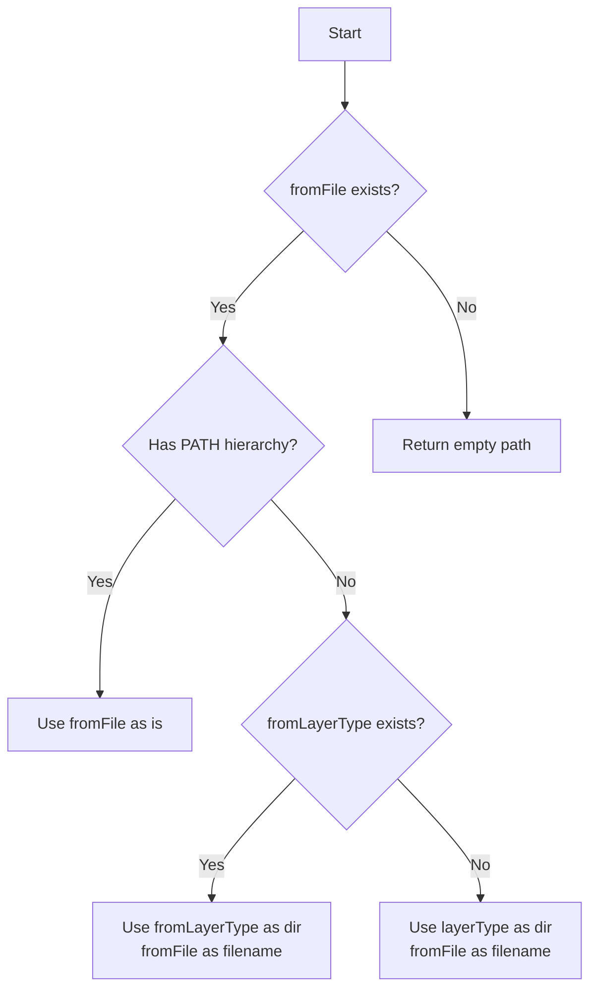

# PATH Processing Based on Option (Parameter Values)

This is a specification for interpreting paths. A PATH is determined when two prerequisites are met:

1. Configuration values exist
2. Two parameters are received (DoubleParamsResult from breakdownparams)

## Basic Structure

1. The top-level directory of the PATH is the project root.

- Absolute PATHs are not used.
- URL API is recommended, but paths are passed as relative paths during transfers.

2. Next, configuration values are used.

- Prompts: `app_prompt.base_dir`
- Schema: `app_schema.base_dir`
- Others: `working_dir`

3. Then, the PATH is constructed using a combination of two parameters.

- Refer to "PATH Combinations"

# PATH Combinations

Combined when there are two parameters (DoubleParamsResult from breakdownparams).

```yaml
- DoubleParamsResult
  - demonstrativeType
  - layerType
  - options
  - fromFile (-f)
  - destinationFile (-o)
  - fromLayerType (-i)
```

## Prompts

- dir: {app_prompt.base_dir}/{demonstrativeType}/{layerType}
- filename: f_{fromLayerType}.md
  - When adaptation option (-a, --adaptation) is specified:
    - filename: f_{fromLayerType}_{adaptation}.md

Prompt file examples:
- Normal case: `lib/breakdown/prompts/to/issue/f_issue.md`
- With adaptation: `lib/breakdown/prompts/to/issue/f_issue_strict.md`

### When fromLayerType is Empty

When fromLayerType is not specified, determine the equivalent value from fromFile. For example,
when fromLayerType is empty and fromFile is `something/created/123_issue_file.md`, since fromFile
contains `issue`, `issue` is identified from fromFile instead of fromLayerType. Since fromLayerType
can be project, issue, or task, this can be achieved by scanning fromFile for these three words.

## Schema

- dir: {app_schema.base_dir}/{demonstrativeType}/{layerType}
- filename: `base.schema.md`
  - Default value is fixed as `base.schema.md`

Schema file example: `lib/breakdown/schema/to/issue/base.schema.md`

## Input Files

PATH processing varies according to parameter values.

```yaml
- When fromFile has PATH hierarchy
- When fromFile has filename only
  - When fromLayerType is specified
- When fromFile is empty (not specified)
```

### Parameter Priority

The fromFile parameter has the highest priority. When fromFile exists, other parameters are not used.



Each case is processed as follows:

### When fromFile Has PATH Hierarchy

Use fromFile as is. Other parameters are not used.

- dir & filename: {fromFile}

### When fromFile Has Filename Only

- When fromLayerType is not specified
  - dir: {layerType}
  - filename: {fromFile}
- When fromLayerType is specified
  - dir: {fromLayerType}
  - filename: {fromFile}

### When fromFile is Empty (or Not Specified)

Returns empty PATH and filename.

## Output Files

PATH processing varies according to parameter values.

```yaml
- When destinationFile has PATH hierarchy with file
- When destinationFile has filename only
- When destinationFile has "PATH hierarchy with directory"
- When destinationFile is empty (not specified)
```

Each case is processed as follows:

### When destinationFile Has PATH Hierarchy with File

Use the specified destinationFile value as is.

- File determination:
  Two conditions: no directory exists with the same name, and extension is present (filename contains at least one dot)
  - Check for existence of directory with same name before performing file determination.

### When destinationFile Has Filename Only

- dir: {layerType}
- filename: {destinationFile}

### When destinationFile Has "PATH Hierarchy with Directory"

Use the specified destinationFile value as directory.

- File determination:
  Two conditions: no directory exists with the same name, and extension is present (filename contains at least one dot)
- Directory determination is everything else.
  - Check directory existence before performing file determination.

- dir: destinationFile
- filename: {yyyymmdd}_{random hash value}.md (e.g., 20250211_e81d0bd.md)

### When destinationFile is Empty (Not Specified)

- dir: {layerType}
- filename: {yyyymmdd}_{random hash value}.md (e.g., 20250211_e81d0bd.md)

# Determining "PATH Hierarchy with Directory"

- Relative paths like ./file.md or ../file.md have PATH hierarchy.
- test/file.md clearly has PATH hierarchy.
- Handling of \ path separator in Windows environment is treated as PATH. Depends on OS path parsing.

# File Extensions

- When input file has no extension, .md is not automatically added.
- Output files do not always need to have .md extension.

# Creating Output Directory Hierarchy

- Creates hierarchies recursively. This is done at output time, not during PATH determination.

# Hash Value Generation Specification

- 10-16 characters in length
- Regenerates on collision (duplicates not allowed)
- Generation algorithm should be suitable for filenames. 