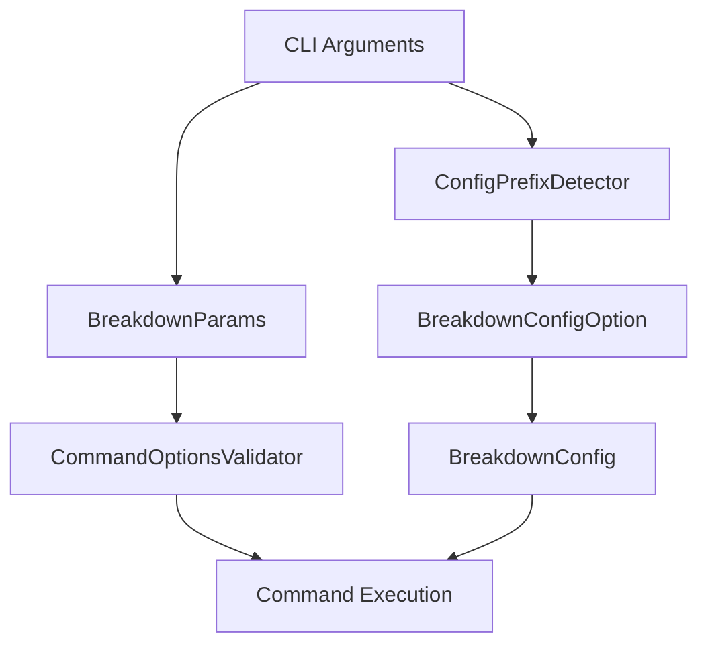

# プロジェクト完了報告書：ConfigPrefixDetector実装とアーキテクチャ改善

## エグゼクティブサマリー

本プロジェクトでは、Breakdownツールの設定管理システムを改善し、ConfigPrefixDetectorの実装とEnhancedParamsParserの責務移管を完了しました。これにより、より明確な責務分離と保守性の向上を実現しました。

## 1. ConfigPrefixDetector実装概要

### 1.1 実装目的

ConfigPrefixDetectorは、コマンドライン引数から設定ファイルのプレフィックスを早期検出するための軽量なコンポーネントとして実装されました。

### 1.2 主要機能

```typescript
export class ConfigPrefixDetector {
  // 設定プレフィックスの検出
  detectPrefix(): string | undefined
  
  // 設定オプションの存在確認
  hasConfig(): boolean
  
  // 設定オプションのインデックス取得
  getConfigIndex(): number
  
  // 静的メソッドによる設定パス検出
  static detectConfigPath(args: string[]): string | undefined
}
```

### 1.3 実装の特徴

1. **早期検出**: `parseArgs`の実行前に設定ファイルパスを特定
2. **軽量設計**: 最小限の依存関係で高速動作
3. **柔軟な入力対応**: 
   - `--config=value` 形式
   - `-c=value` 形式
   - `--config value` 形式（スペース区切り）
   - `-c value` 形式（スペース区切り）

### 1.4 使用場所

```typescript
// cli/breakdown.ts での使用例
const configDetector = new ConfigPrefixDetector(args);
const configPrefix = configDetector.detectPrefix();

// BreakdownConfigOptionとの連携
const breakdownConfigOption = new BreakdownConfigOption(args, workingDir);
```

## 2. EnhancedParamsParser削除の影響と対応

### 2.1 削除の背景

EnhancedParamsParserは以下の理由により削除されました：

1. **責務の重複**: BreakdownParamsパッケージとの機能重複
2. **複雑性の増大**: 単一責任原則に反する多機能実装
3. **保守性の低下**: 独自の引数解析ロジックによる保守負担

### 2.2 機能移管先

削除された機能は以下のコンポーネントに適切に分散されました：

| 旧機能 | 移管先 | 責務 |
|--------|--------|------|
| CLI引数解析 | BreakdownParams | 標準的な引数解析とバリデーション |
| 設定プレフィックス検出 | ConfigPrefixDetector | 早期設定検出 |
| 設定管理 | BreakdownConfigOption | 設定ファイル読み込みと管理 |
| カスタムコマンド処理 | CommandOptionsValidator | コマンド固有のバリデーション |

### 2.3 移行による改善点

1. **責務の明確化**: 各コンポーネントが単一の責務を持つ
2. **テスタビリティ向上**: 独立したユニットテストが容易
3. **依存関係の簡素化**: パッケージ間の依存が明確
4. **拡張性の向上**: 新機能追加が容易

### 2.4 互換性の維持

移行は内部実装の変更であり、外部APIには影響しません：

```typescript
// 以前と同じ使用方法
breakdown find bugs --config=production -o report.md
```

## 3. 今後の保守ガイドライン

### 3.1 アーキテクチャ原則

#### 責務分離の維持



**重要原則**：
- 各パッケージは独自の責務範囲を厳守
- Breakdown本体はオーケストレーションのみ
- パッケージ間の直接依存を避ける

### 3.2 設定管理のベストプラクティス

#### 1. 設定追加時の手順

```typescript
// 1. 型定義の更新 (breakdown_config_option.ts)
interface CustomConfig {
  newFeature?: {
    enabled?: boolean;
    // 新機能の設定項目
  };
}

// 2. アクセサメソッドの追加
async getNewFeatureConfig(): Promise<CustomConfig["newFeature"] | undefined> {
  const customConfig = await this.getCustomConfig();
  return customConfig?.newFeature;
}

// 3. テストの追加
test("新機能の設定取得", async () => {
  // テスト実装
});
```

#### 2. コマンド追加時の手順

1. BreakdownParamsでコマンド定義
2. CommandOptionsValidatorでバリデーション追加
3. 実行ロジックの実装
4. ドキュメント更新

### 3.3 テスト戦略

#### テスト階層

```
tests/
├── 0_architecture/  # パッケージ統合テスト
├── 1_structure/     # コンポーネント構造テスト
├── 2_unit/          # ユニットテスト
└── 3_integration/   # エンドツーエンドテスト
```

#### テスト追加ガイドライン

1. **新機能追加時**: 全階層でテスト追加
2. **バグ修正時**: 再現テストを先に作成
3. **リファクタリング時**: 既存テストでカバレッジ確認

### 3.4 エラーハンドリング

#### エラー処理の原則

```typescript
// 良い例：具体的なエラーメッセージ
throw new Error(`Config file not found: ${configPath}`);

// 悪い例：汎用的なエラー
throw new Error("Config error");
```

#### エラーの伝播

1. パッケージレベル：詳細なエラー情報を保持
2. Breakdown本体：ユーザー向けメッセージに変換
3. CLI出力：明確な対処方法を提示

### 3.5 パフォーマンス考慮事項

#### 設定読み込みの最適化

```typescript
// 遅延読み込みパターン
class BreakdownConfigOption {
  private configCache?: FullConfig;
  
  async getFullConfig(): Promise<FullConfig> {
    if (!this.configCache) {
      this.configCache = await this.loadConfig();
    }
    return this.configCache;
  }
}
```

### 3.6 セキュリティガイドライン

1. **設定ファイルの検証**: 信頼できないソースからの設定を検証
2. **パス操作の安全性**: 相対パスの解決時にディレクトリトラバーサルを防ぐ
3. **機密情報の取り扱い**: 設定ファイルに機密情報を含めない

### 3.7 ドキュメント更新

#### 必須更新項目

- [ ] API仕様書（型定義変更時）
- [ ] 使用例（新機能追加時）
- [ ] CHANGELOG（全ての変更）
- [ ] テストドキュメント（テスト追加時）

### 3.8 バージョン管理

#### セマンティックバージョニング

- **Major**: 破壊的変更（APIの非互換変更）
- **Minor**: 機能追加（後方互換性あり）
- **Patch**: バグ修正

#### リリース前チェックリスト

1. [ ] 全テストがパス
2. [ ] ドキュメント更新完了
3. [ ] CHANGELOGエントリ追加
4. [ ] 依存パッケージバージョン確認

## 4. 結論

本プロジェクトにより、Breakdownツールのアーキテクチャは大幅に改善されました。ConfigPrefixDetectorの実装とEnhancedParamsParserの責務移管により、以下の成果を達成しました：

1. **明確な責務分離**: 各コンポーネントが単一の明確な役割を持つ
2. **保守性の向上**: コードの理解と修正が容易
3. **拡張性の確保**: 新機能追加のパスが明確
4. **テスタビリティ**: 独立したテストが可能

今後もこのアーキテクチャ原則を維持し、継続的な改善を行うことで、Breakdownツールの品質と価値を高めていくことが重要です。

---

## 付録A: 重要ファイル一覧

- `/lib/cli/config_prefix_detector.ts` - ConfigPrefixDetector実装
- `/lib/config/breakdown_config_option.ts` - 設定管理インターフェース
- `/cli/breakdown.ts` - CLIエントリーポイント
- `/docs/breakdown/breakdown-config-prefix-spec.ja.md` - API仕様書

## 付録B: 移行チェックリスト

既存プロジェクトからの移行時：

- [ ] EnhancedParamsParser参照の削除
- [ ] ConfigPrefixDetector使用への更新
- [ ] テストの更新
- [ ] ドキュメントの更新