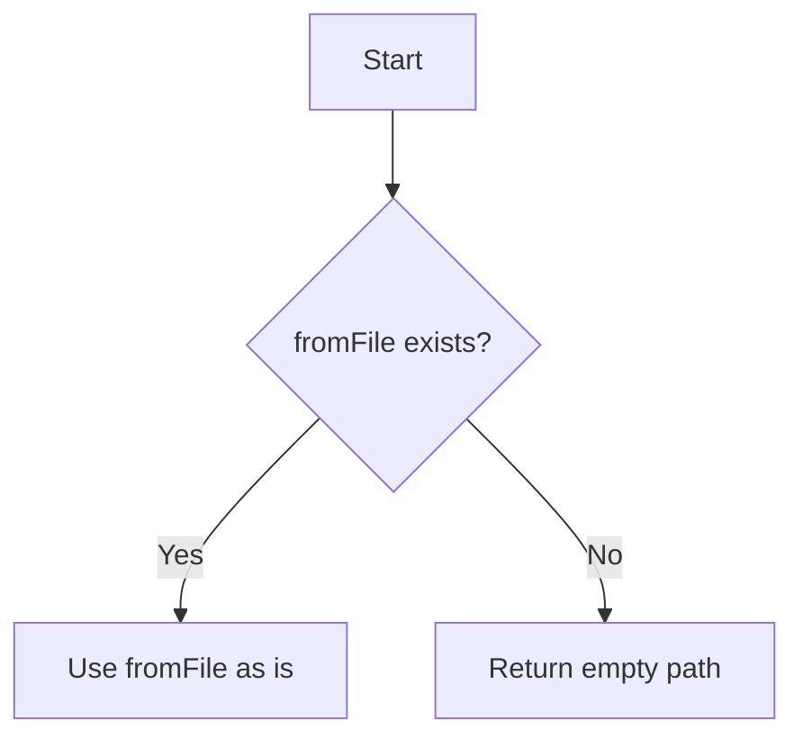

# PATH Processing Based on Options (Parameter Values)

## Terminology Organization (Added May 2024)

- **cwd**
  - Current Working Directory at runtime
  - Directory obtained by `Deno.cwd()`
  - Base path for command execution

- **working_dir**
  - Working directory specified in Breakdown configuration files (`breakdownConfig`/`app.yml`)
  - Management directories for Breakdown, such as `.agent/breakdown`
  - Used for resolving input/output files (-i, -o)

- **app_prompt.base_dir / app_schema.base_dir**
  - Base directories for prompt and schema templates
  - Resolved from **cwd** (`Deno.cwd()`) as the starting point
  - Example: If `app_prompt.base_dir: prompts`, it becomes `Deno.cwd()/prompts`

---

> **For implementation examples and recommended implementations of path resolution and parameter construction, please also refer to [app_factory.md](./app_factory.md).**

This is the specification for interpreting paths. PATH is determined when two prerequisites are met:

1. Configuration values exist
2. Two parameters are received (DoubleParamsResult from breakdownparams)

## Basic Structure

1. The top-level directory of PATH is the project root.

- Absolute paths are not used.
- URL API is recommended, but relative paths are used when passing.

2. Next, configuration values are used.

- Prompts: `app_prompt.base_dir` (**resolved from cwd**)
- Schema: `app_schema.base_dir` (**resolved from cwd**)
- Others: `working_dir` (used only for resolving input/output files)

3. Next, the PATH is constructed by combining two parameters.

- See "PATH Combinations"

# PATH Combinations

Combines when there are two parameters (DoubleParamsResult from breakdownparams).

```yaml
- DoubleParamsResult
  - demonstrativeType
  - layerType
  - options
  - fromFile (-f)
  - destinationFile (-o)
  - fromLayerType (-i)
```

## Prompts

- dir: {app_prompt.base_dir}/{demonstrativeType}/{layerType}
  - **app_prompt.base_dir must be resolved from cwd**
- filename: f_{fromLayerType}.md
  - When adaptation option (-a, --adaptation) is specified:
    - filename: f_{fromLayerType}_{adaptation}.md

Prompt file examples:
- Normal: `prompts/to/issue/f_issue.md` (`Deno.cwd()/prompts/to/issue/f_issue.md`)
- With adaptation: `prompts/to/issue/f_issue_strict.md`

### When fromLayerType is Empty

When fromLayerType is not specified, determine the equivalent value from fromFile. Ex.
When fromLayerType is empty and fromFile is `something/created/123_issue_file.md`, since fromFile contains
`issue`, identify `issue` from fromFile instead of fromLayerType. Since fromLayerType
can take values of project, issue, or task, this can be achieved by scanning fromFile
with these three words.

## Schema

- dir: {app_schema.base_dir}/{demonstrativeType}/{layerType}
  - **app_schema.base_dir must be resolved from cwd**
- filename: `base.schema.md`
  - Default value fixed as `base.schema.md`

Schema file example: `schemas/to/issue/base.schema.md` (`Deno.cwd()/schemas/to/issue/base.schema.md`)

## Input File

PATH processing varies depending on parameter values.

```yaml
- When fromFile has PATH hierarchy
- When fromFile has only filename
- When fromFile is empty (not specified)
```

### Parameter Priority

The fromFile parameter takes highest priority. When fromFile exists, other parameters are not used.



Each case is processed as follows:

### When fromFile has PATH hierarchy or only filename

- Use the path specified in fromFile as-is for absolute/relative paths
- No additional directory completion is performed

### When fromFile is empty (or not specified)

Return empty PATH and filename.

## Output File

> destinationFile (destinationPath) is a value to be embedded in templates, and there is no need to write the results received from prompts. File output is not mandatory and is determined by the user as needed.

PATH processing varies depending on parameter values.

```yaml
- When destinationFile is a file with PATH hierarchy
- When destinationFile has only filename
- When destinationFile is a "directory with PATH hierarchy"
- When destinationFile is empty (not specified)
```

Each case is processed as follows:

### When destinationFile is a file with PATH hierarchy

Use the specified destinationFile value as-is.

- File determination:
  Two conditions: no directory with the same name exists, and extension is present (filename contains at least one dot)
  - Check for existence of same-named directory before file determination.

### When destinationFile has only filename

- dir: {layerType}
- filename: {destinationFile}

### When destinationFile is a "directory with PATH hierarchy"

Use the specified destinationFile value as directory.

- File determination:
  Two conditions: no directory with the same name exists, and extension (filename contains at least one dot) is present
- Directory determination is everything else.
  - Check for directory existence before file determination.

- dir: destinationFile
- filename: {yyyymmdd}_{random_hash}.md (ex. 20250211_e81d0bd.md)

### When destinationFile is empty (not specified)

- dir: {layerType}
- filename: {yyyymmdd}_{random_hash}.md (ex. 20250211_e81d0bd.md)

# Determining "Directory with PATH Hierarchy"

- Relative paths like ./file.md or ../file.md have PATH hierarchy.
- test/file.md clearly has PATH hierarchy.
- Handling of \ path separator in Windows environment is PATH. Depends on OS path parsing.

# File Extensions

- When input files have no extension, do not automatically append .md.
- Output files do not always need to have .md extension.

# Creating Output Hierarchy

- Create hierarchy recursively. Since this is done at output timing, do not create during PATH determination.

# Hash Value Generation Specification

- 10-16 characters in length
- Regenerate on collision (duplicates not allowed)
- Generation algorithm should be suitable for filenames.

## Prompt Search Directory Priority

1. app_prompt.base_dir in configuration file (app.yml)
2. When not configured, lib/breakdown/prompts (system standard prompts)

## Schema Search Directory Priority

1. app_schema.base_dir in configuration file (app.yml)
2. When not configured, lib/breakdown/schema (system standard schemas)