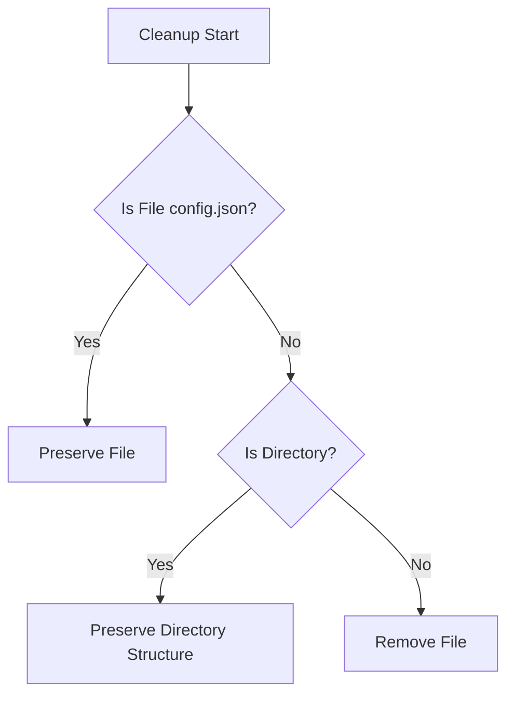

# Test Directory Persistence Specification

## Overview
Defines the management of test directories to prevent unintended deletion during test execution in the BreakDown CLI tool.

## Directory Structure

```
.agent_test/
└── breakdown/
    ├── config.json      # Persistent configuration
    ├── projects/        # Persistent directory
    ├── issues/          # Persistent directory
    └── tasks/           # Persistent directory
```

## Directory Management Requirements

### 1. Directory Persistence
- Base test directory (.agent_test/breakdown) must persist across test runs
- Subdirectories (projects/, issues/, tasks/) must persist across test runs
- config.json must persist across test runs

### 2. Cleanup Behavior


### 3. Implementation Rules

#### Directory Setup
```typescript
async function setup() {
  // Create if not exists
  // Never remove existing
  await ensureDir(TEST_DIR);
  await ensureDir(`${TEST_DIR}/projects`);
  await ensureDir(`${TEST_DIR}/issues`);
  await ensureDir(`${TEST_DIR}/tasks`);
}
```

#### Cleanup Operations
```typescript
async function cleanup() {
  // Remove only test artifacts
  // Preserve directory structure
  // Preserve config.json
}
```

### 4. Verification Points
- Directory structure remains intact after test execution
- Only test-generated files are removed
- config.json persists across test runs
- Base directories maintain their existence and permissions