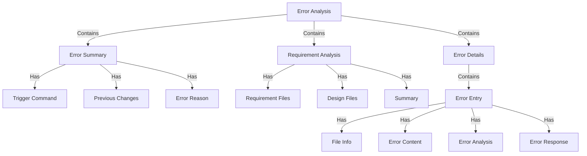
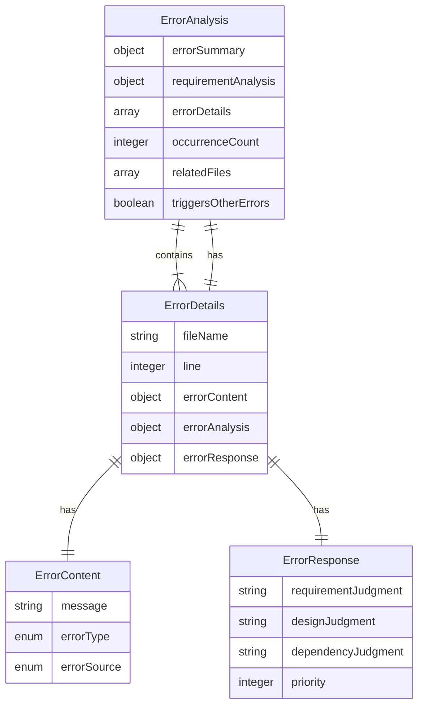
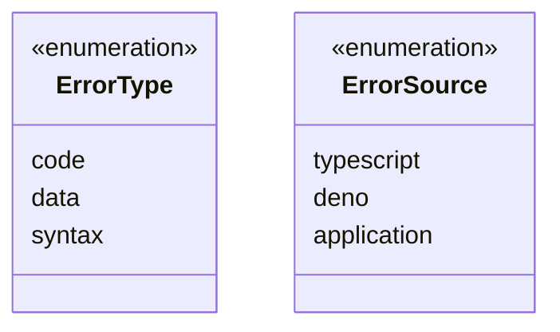
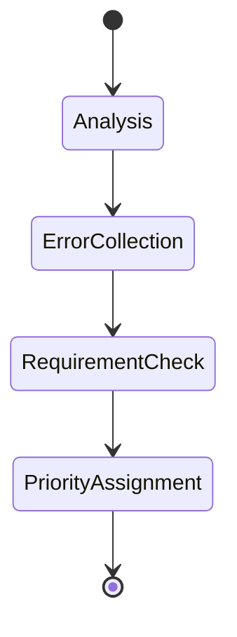
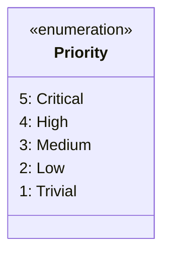

# Error Analysis Overview

# Structure

# Error Types

# Error Analysis States

# Attributes

## Error Content
- **message**: Actual error message text
- **errorType**: 
  - `code`: Logic or implementation errors
  - `data`: Data structure or format errors
  - `syntax`: Language syntax errors
- **errorSource**:
  - `typescript`: TypeScript compiler errors
  - `deno`: Deno runtime errors
  - `application`: Application-specific errors

## Error Analysis
- **occurrenceCount**: Total number of times this error occurred
- **relatedFiles**: List of files involved in the error chain
- **triggersOtherErrors**: Whether this error causes other cascading errors

## Error Response
- **requirementJudgment**: Decision on whether to modify code or update requirements
- **designJudgment**: Decision on whether to modify code or update design
- **dependencyJudgment**: Decision on whether to fix this error directly or address dependencies first
- **priority**: Integer priority ranking (1-5)
  - `5 (Critical)`: Blocks system operation or causes data corruption
  - `4 (High)`: Severely impacts core functionality
  - `3 (Medium)`: Affects non-critical features or has workarounds
  - `2 (Low)`: Minor issues with minimal impact
  - `1 (Trivial)`: Cosmetic issues or enhancement requests

