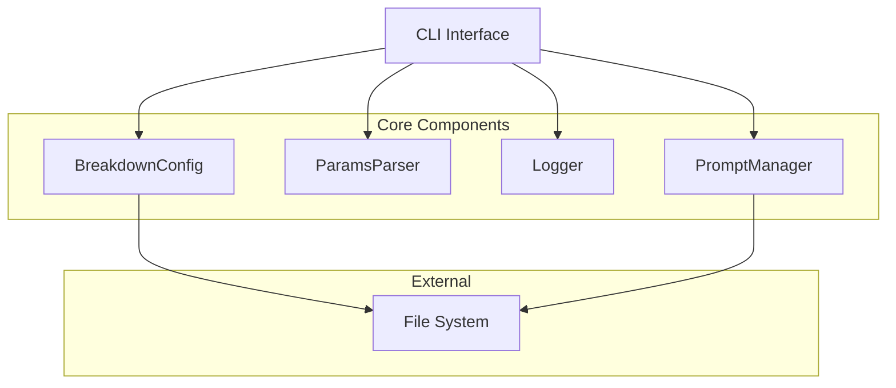
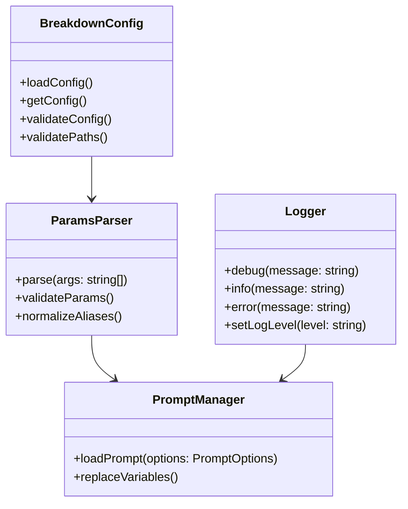
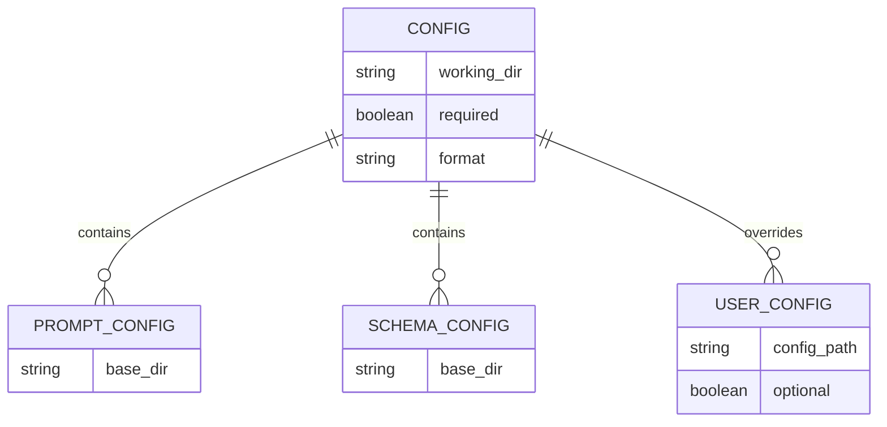
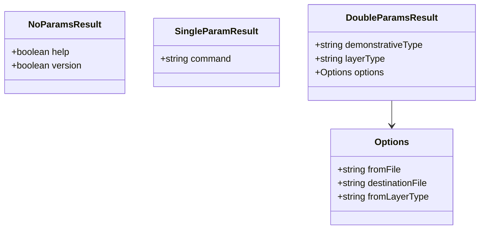
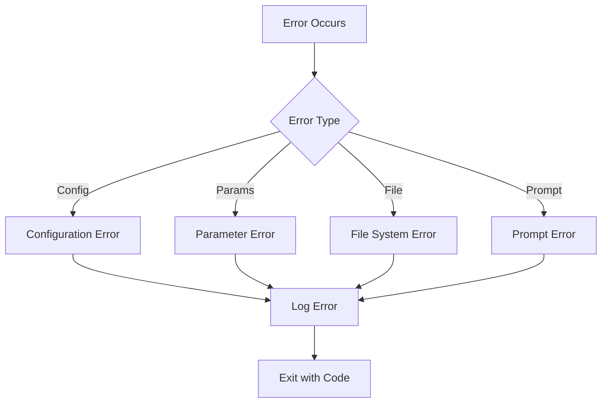

# Breakdown 開発設計書

## 1. システム概要

### 1.1 システムアーキテクチャ



### 1.2 コアコンポーネント関係



## 2. コンポーネント仕様

### 2.1 設定管理 (BreakdownConfig)

- アプリケーション設定
  - 必須で省略不可
  - YAML形式
  - パス・ディレクトリのバリデーション実施

- ユーザー設定
  - 配置場所: `$working_dir/config/user.yml`
  - 任意項目のみ記述可能
  - アプリケーション設定を上書き可能

### 2.2 パラメータ処理 (ParamsParser)

- コマンド種別
  - NoParams: ヘルプ/バージョン表示
  - SingleParam: 初期化コマンド
  - DoubleParams: 変換/要約/欠陥分析

- パラメータ型
  - DemonstrativeType: to, summary, defect
  - LayerType: project, issue, task

- オプション処理
  - --from/-f: 入力ファイル指定
  - --destination/-o: 出力先指定
  - --input/-i: 入力レイヤー指定
  - ロングフォーム優先
  - 大文字は無視
  - 未定義エイリアスは無視

### 2.3 ロギング (Logger)

- 環境変数 LOG_LEVEL でログレベル制御
- ログレベル: debug, info, error
- デバッグログ出力機能

### 2.4 プロンプト管理 (PromptManager)

- デフォルト配置: `lib/breakdown/prompts`
- 変数置換機能搭載
- レイヤー別プロンプト管理

## 3. データ構造

### 3.1 設定ファイル構造



### 3.2 パラメータ型定義



## 4. ディレクトリ構造

```mermaid
graph TD
    Root[/] --> Lib[lib/]
    Root --> Docs[docs/]
    Root --> Agent[.agent/]
    
    Lib --> Schema[schema/]
    Lib --> Prompts[prompts/]
    
    Schema --> ToSchema[to/]
    Schema --> SummarySchema[summary/]
    Schema --> DefectSchema[defect/]
    
    Prompts --> ToPrompt[to/]
    Prompts --> SummaryPrompt[summary/]
    Prompts --> DefectPrompt[defect/]
    
    Agent --> Breakdown[breakdown/]
    
    Docs --> Public[*.md]
    Docs --> BreakdownSpec[breakdown/]
    Docs --> DevSpec[development/]
    Docs --> SchemaSpec[schema/]
```

## 5. エラーハンドリング

