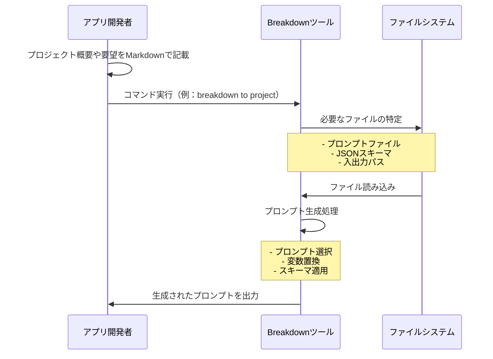
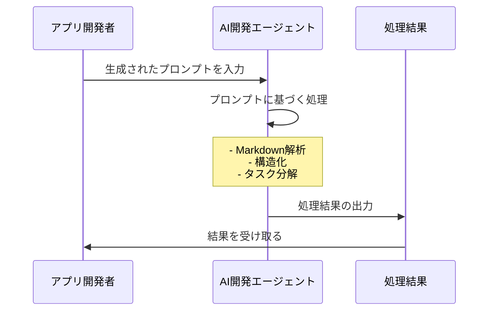

# BreakDown Documentation

BreakDownは、TypeScriptとJSONを使ったAI自動開発のための開発指示言語ツールです。

## 目次

- [概要](#概要)
- [使用方法](usage.ja.md)
- [開発者向け情報](breakdown/index.ja.md)

## 概要

BreakDownは、AI開発支援のためのプロンプト生成ツールです。入力されたMarkdownファイルと指定された条件に基づいて、AIが理解しやすい形式のプロンプトを生成します。生成されたプロンプトは、AIシステムが実際の変換や分析を行うための指示として機能します。

主な特徴：

- プロンプトの自動選択と生成
  - 入力と出力の条件に応じた適切なプロンプトの選択
  - プロンプト内での変数置換による動的な生成
  - プロンプト内でのJSON Schema参照情報の埋め込み
- DenoランタイムによるTypeScript実装
- AI開発エージェントとの連携
  - CursorやClineなどのAI開発エージェントに最適化
  - Claude-3.7-sonnetおよび他のAIモデルを利用想定

### 処理フロー

**プロンプト生成プロセス**

**AIによる処理プロセス**

## JSON Schema

- SchemaのJSONファイルは、このプロジェクト内に存在します
- Schema定義は、別のプロジェクトにドキュメントがあります： https://github.com/tettuan/breakdownschema
- このツールはSchemaの内容を解析しません
- Schemaファイルは、プロンプトに埋め込まれ、AIがプロンプトを解釈し入力値を出力値に変換する際の参照情報として使用されます
- AIは、プロンプトに従って入力値を変換する際に、JSON Schemaを解釈の一助として利用し、出力結果を安定化させます
