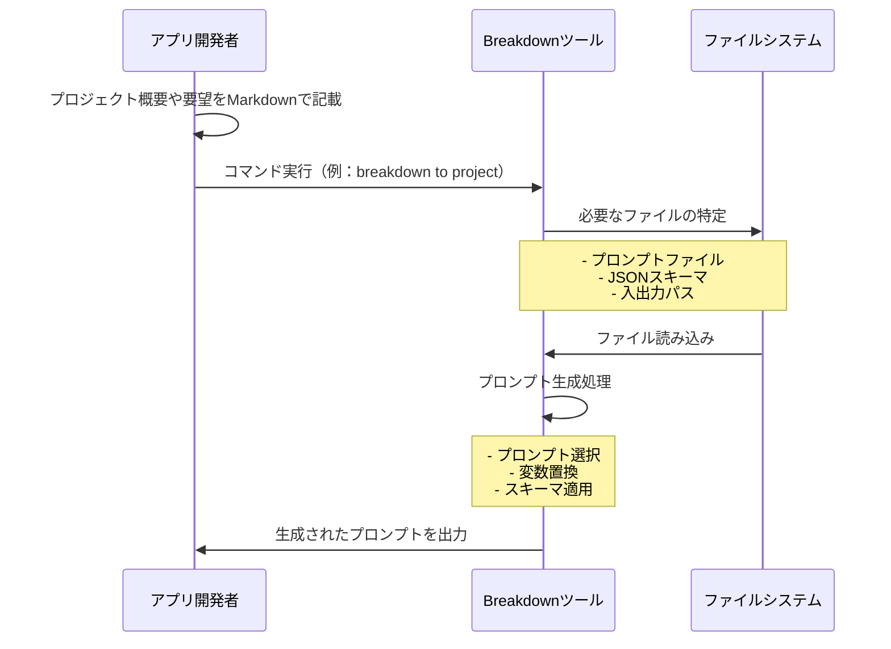
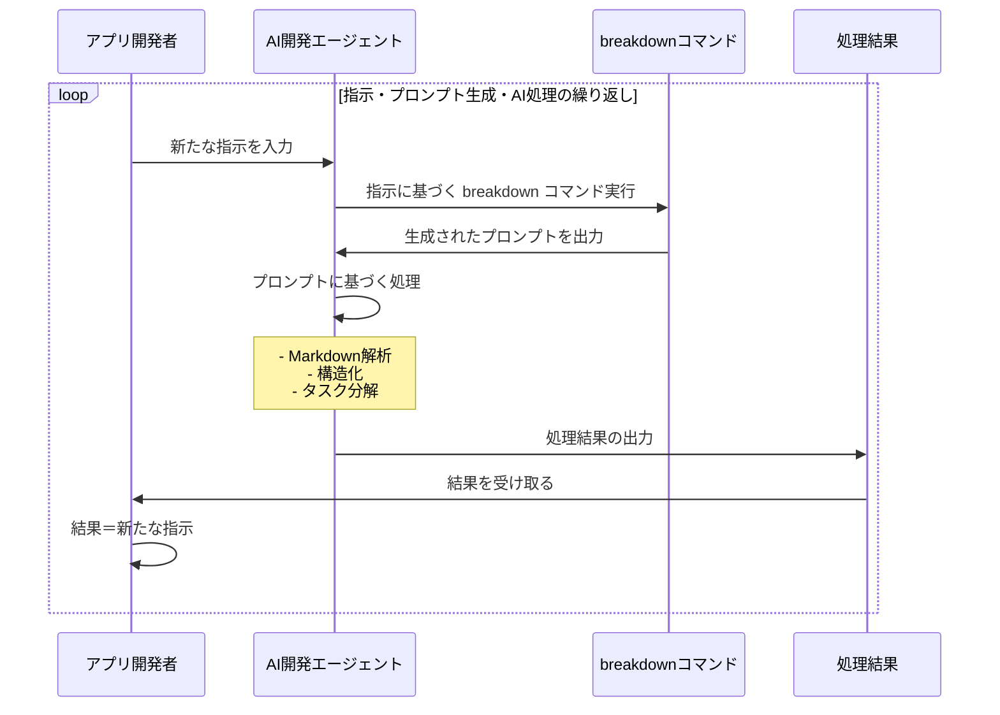

# Breakdown Documentation

Breakdownは、TypeScriptとJSON/YAML/Markdownを使ったAI自動開発のための開発指示言語ツールです。

## 目次

- [概要](#概要)
- [使用方法](usage.ja.md)
- [開発者向け情報](breakdown/index.ja.md)

## 概要

BreakDownは、AI開発支援のためのプロンプト生成ツールです。入力されたMarkdownファイルと指定された条件に基づいて、AIが理解しやすい形式のプロンプトを生成します。生成されたプロンプトは、AIシステムが実際の変換や分析を行うための指示として機能します。

主な特徴：

- プロンプトの自動選択と生成
  - 入力と出力の条件に応じた適切なプロンプトの選択
  - プロンプト内での変数置換による動的な生成
  - プロンプト内でのJSON Schema参照情報の埋め込み
- DenoランタイムによるTypeScript実装
- AI開発エージェントとの連携
  - CursorなどのAI開発エージェントに最適化
  - Claude-3.7-sonnetおよび他のAIモデルを利用想定

### 処理フロー

**プロンプト生成プロセス**

コマンドラインから実行する際は、単にプロンプトを受け取ります。

ターミナルコマンド→プロンプト部分を、AI開発エージェント上で動かすことができます。
この指示に基づいて、再帰的な指示を生み出すことが狙いです。

**AIによる処理プロセス**

基本構造はシンプルです。AI自動開発のためにプロンプトを生成するプロセスを設けることにより、自動的に指示が行われます。
指示が細分化された新たな指示を作り、それらを次の指示に用います。

**内部的処理**

事前用意したプロンプトを用います。
適切なプロンプトをコマンドから選択し、パラメータ値を変数として扱い、埋め込みます。

組み合わせ数：
- 事前用意可能なプロンプトパターン（無限）
- 入力変数（有限）
  - 入力値（無限）

となります。

この組み合わせ数にLLMの汎用性を掛け合わせることになるため、発散しやすくなります。

開発物を成果物とした場合、発散を制御し、目的へ収束する手法が必要です。
また、開発するために必要な仕様定義や分解手法は、積み重ねられた理論があるため、有限なパターンになります。
（例えばGoFの23のデザインパターンなど。）

そこで、多様な表現を特定のパターンに誘導するため、Schema定義を用います。
Breakdownツールでは、Project > Issues > Tasks という3階層を事前定義し、 `to` 指示が分解を行います。
この段階で、事前用意したプロンプトが project/issue/task のいずれかに分類されます。
入力→分解先（出力）の組み合わせの種類を掛け合わせると、 5つの組み合わせパターン(P->I,T, I->I,T,T->T)が事前用意されます。

また、分解方向とは異なるケースに対し、要約方向（project -> Project、 Issues -> Projectなど）を summary 指示が行います。
なかでも、エラー処理や不具合対応、未整備状態に対する要望へ応えるために、 defect 指示を設けています。詳細は[使い方](./usage.ja.md)をご覧ください。

### 動的プロンプト選択（案）

プロンプト選択部分をAI化すると、より動的になります。
この部分は、外部サービスを用いたほうが効率がよいため、このツールから分離することも可能です。

## JSON Schema

有限なパターンへ収斂させるために、JSON Schema参照を用います。
Schema定義に当てはめるのではなくチェックリストとして参照し、生成結果を制御することが狙いです。
最終的な出力は、JSONである必要はありません。より汎用性の高い YAML/Markdown/Textを想定してます。

- SchemaのJSONファイルは、このプロジェクト内に存在します
- Schema定義は、別のプロジェクトにドキュメントがあります： https://github.com/tettuan/breakdownschema
- このツールはSchemaの内容を解析しません
- Schemaファイルは、プロンプトにPATHで埋め込まれ、AIがプロンプトを解釈し入力値を出力値に変換する際の参照情報として使用されます
- AIは、プロンプトに従って入力値を変換する際に、JSON Schemaを解釈の一助として利用し、出力結果を安定化させます

近いバージョンで、URLベースでSchemaを参照可能とする予定です。
これによりSchema.orgなどを用いたデータ加工や、他のSchema定義を活用することができます。

開発要件定義の適切なSchema定義があれば参照しますが、まだ見当たらないため、当アプリケーションが必要とするものを作る予定です。

---

[English](index.md) | [日本語](index.ja.md)
