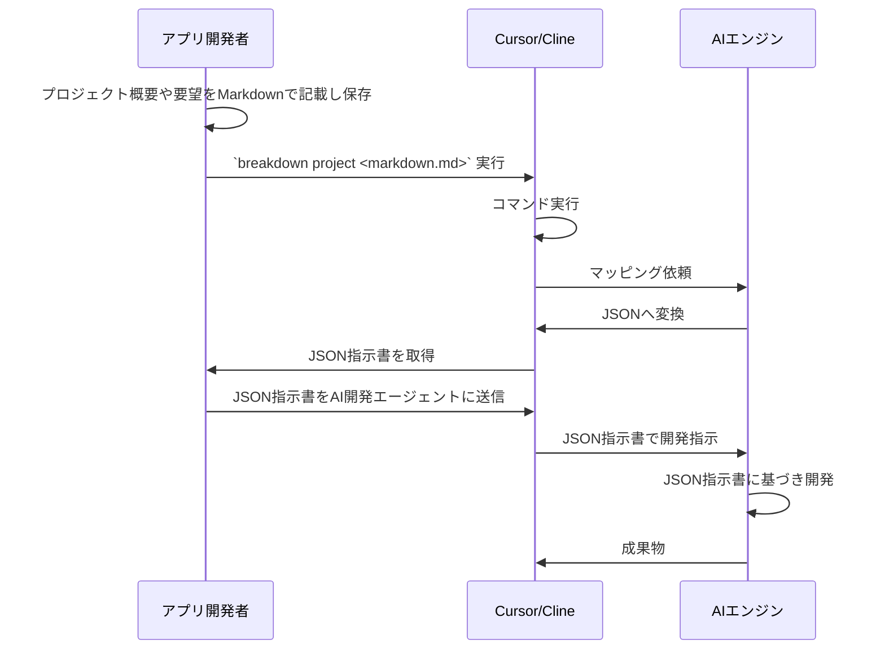

# BreakDown Documentation

BreakDownは、TypeScriptとJSONを使ったAI自動開発のための開発指示言語ツールです。

## 目次

- [概要](#概要)
- [使用方法](usage.ja.md)
- [開発者向け情報](breakdown/index.ja.md)

## 概要

BreakDownは、MarkdownドキュメントをJSON
Schema形式に変換し、AIシステムが解釈しやすい形式にする変換ツールです。 主な特徴：

- AI解釈用に最適化されたMarkdownからJSONへの変換
- DenoランタイムによるTypeScript実装
- AI自動開発のための構造化フォーマット
- AIシステムのための学習しやすい構文
- CursorとClineのAI開発エージェントに最適化
- Claude-3.7-sonnetおよび他のAIモデルとの互換性

### 処理フロー

# JSON Schema形式

- Schema定義は、別のドキュメントがあります。 https://github.com/tettuan/breakdownschema
- このライブラリでは、Schemaの中身を扱うことはありません。
- パラメータからSchemaのファイルPATHを特定するだけです。
