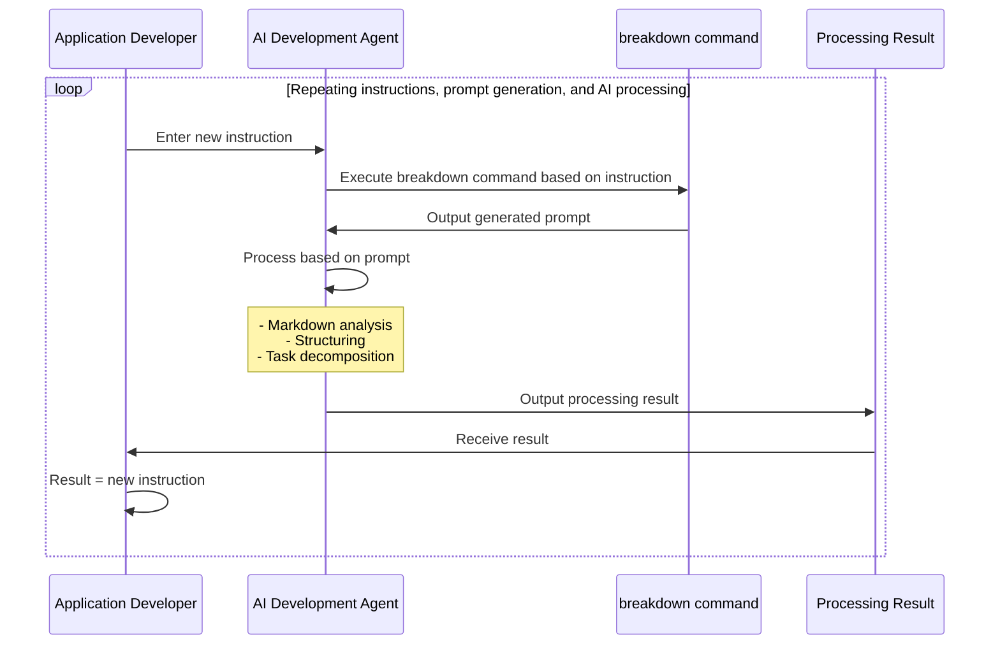

# Breakdown Documentation

Breakdown is a development instruction language tool for AI-automated development using TypeScript and JSON/YAML/Markdown.

## Table of Contents

- [Overview](#overview)
- [Usage](usage.ja.md)
- [Developer Information](breakdown/index.ja.md)

## Overview

BreakDown is a prompt generation tool to support AI development. It generates prompts in a format that is easy for AI to understand, based on the input Markdown file and specified conditions. The generated prompts function as instructions for actual conversion or analysis by AI systems.

Main Features:

- Automatic selection and generation of prompts
  - Selects appropriate prompts according to input and output conditions
  - Dynamic generation by variable substitution within prompts
  - Embeds JSON Schema reference information within prompts
- TypeScript implementation using the Deno runtime
- Integration with AI development agents
  - Optimized for AI development agents such as Cursor
  - Assumes use with Claude-3.7-sonnet and other AI models

### Process Flow

**Prompt Generation Process**

When executed from the command line, it simply receives a prompt.

The terminal command → prompt part can be run on an AI development agent. The aim is to generate recursive instructions based on this directive.

**AI Processing Process**

The basic structure is simple. By establishing a process to generate prompts for AI-automated development, instructions are automatically issued. New, subdivided instructions are created and used for the next directive.

**Internal Processing**

Predefined prompts are used. Appropriate prompts are selected from commands, parameter values are treated as variables, and embedded.

Combinatorial possibilities:
- Predefinable prompt patterns (infinite)
- Input variables (finite)
  - Input values (infinite)

This combination, multiplied by the versatility of LLMs, can easily diverge.

When the deliverable is the development product, a method to control divergence and converge on the objective is necessary. Also, the specification definitions and decomposition methods required for development are based on accumulated theory, resulting in finite patterns (such as the 23 GoF design patterns).

Therefore, Schema definitions are used to guide diverse expressions into specific patterns. The Breakdown tool predefines three layers: Project > Issues > Tasks, and the `to` directive performs decomposition. At this stage, predefined prompts are classified as either project, issue, or task. Combining input → decomposition destination (output) types results in five predefined combination patterns (P->I,T, I->I,T, T->T).

For cases different from decomposition direction, the summary directive performs summarization (e.g., project -> Project, Issues -> Project). For error handling, bug fixes, and requests for unorganized states, a defect directive is provided. For details, see [Usage](./usage.ja.md).

### Dynamic Prompt Selection (Proposal)

If the prompt selection part is AI-driven, it becomes more dynamic. It is also possible to separate this part from the tool and use an external service for greater efficiency.

## JSON Schema

To converge on finite patterns, JSON Schema references are used. Rather than fitting to a Schema definition, it is referenced as a checklist to control the generated result. The final output does not have to be JSON; more versatile formats such as YAML/Markdown/Text are assumed.

- Schema JSON files exist within this project
- Schema definitions are documented in a separate project: https://github.com/tettuan/breakdownschema
- This tool does not parse the contents of the Schema
- Schema files are embedded in prompts by PATH and used as reference information when the AI interprets the prompt and converts input values to output values
- The AI uses the JSON Schema as an aid when converting input values according to the prompt, helping to stabilize output results

In a near-future version, it is planned to allow Schema references by URL. This will enable data processing using Schema.org and other Schema definitions.

If there is an appropriate Schema definition for development requirements, it will be referenced, but since none have been found yet, this application plans to create what is needed. 