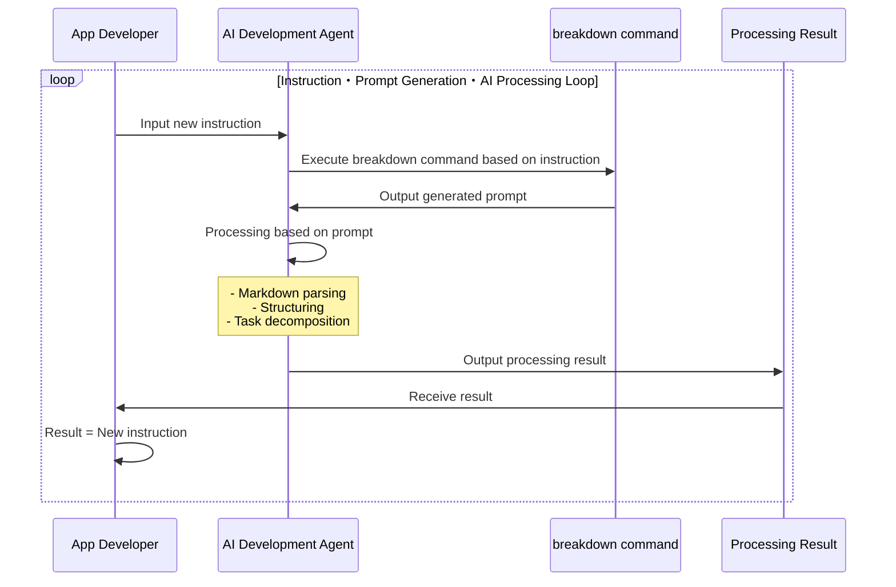

# Breakdown Documentation

Breakdown is a development instruction language tool for AI-automated development using TypeScript and JSON/YAML/Markdown.

## Table of Contents

- [Overview](#overview)
- [Usage](usage.md)
- [Developer Information](breakdown/index.md)

## Overview

BreakDown is a prompt generation tool for AI development support. It generates prompts in a format that AI can easily understand based on input Markdown files and specified conditions. The generated prompts function as instructions for AI systems to perform actual transformations and analyses.

Key features:

- Automatic prompt selection and generation
  - Selection of appropriate prompts based on input and output conditions
  - Dynamic generation through variable substitution within prompts
  - Embedding JSON Schema reference information within prompts
- TypeScript implementation with Deno runtime
- Integration with AI development agents
  - Optimized for AI development agents like Cursor
  - Designed to work with Claude-3.7-sonnet and other AI models

### Processing Flow

**Prompt Generation Process**

When executed from the command line, it simply receives prompts.

The terminal command → prompt part can be run on AI development agents.
The goal is to generate recursive instructions based on these instructions.

**AI Processing Process**

The basic structure is simple. By establishing a prompt generation process for AI automated development, instructions are automatically given.
Instructions create new subdivided instructions, which are used for subsequent instructions.

**Internal Processing**

Pre-prepared prompts are used.
The appropriate prompt is selected from the command, and parameter values are treated as variables and embedded.

Number of combinations:
- Pre-preparable prompt patterns (infinite)
- Input variables (finite)
  - Input values (infinite)

This results in the following.

When multiplied by the versatility of LLMs, this tends to diverge.

When development deliverables are the final product, methods are needed to control divergence and converge toward the goal.
Additionally, the specification definitions and decomposition methods necessary for development become finite patterns due to accumulated theories.
(For example, the 23 design patterns of GoF.)

Therefore, Schema definitions are used to guide diverse expressions into specific patterns.
The Breakdown tool pre-defines three layers: Project > Issues > Tasks, and the `to` instruction performs decomposition.
At this stage, pre-prepared prompts are classified into either project/issue/task.
When multiplying the combinations of input → decomposition destination (output), 5 combination patterns (P->I,T, I->I,T,T->T) are pre-prepared.

Also, for cases different from the decomposition direction, the summary instruction performs aggregation (project -> Project, Issues -> Project, etc.).
In particular, the defect instruction is provided to handle error processing, bug response, and requests for unmaintained states. Please see [Usage](./usage.md) for details.

### Dynamic Prompt Selection (Proposal)

Making the prompt selection part AI-driven would make it more dynamic.
This part can be separated from this tool as it would be more efficient to use external services.

## JSON Schema

JSON Schema references are used to converge to finite patterns.
The goal is not to fit into Schema definitions but to reference them as checklists to control generation results.
The final output does not need to be JSON. More versatile YAML/Markdown/Text formats are expected.

- Schema JSON files exist within this project
- Schema definitions have documentation in a separate project: https://github.com/tettuan/breakdownschema
- This tool does not parse Schema contents
- Schema files are embedded in prompts by PATH and used as reference information when AI interprets prompts and converts input values to output values
- AI uses JSON Schema as an aid to interpretation when converting input values according to prompts, stabilizing output results

In a future version, it is planned to make Schemas referenceable by URL.
This will enable data processing using Schema.org and utilization of other Schema definitions.

If appropriate Schema definitions for development requirements exist, they will be referenced, but as none have been found yet, we plan to create what this application requires.

---

[English](index.md) | [日本語](index.ja.md)