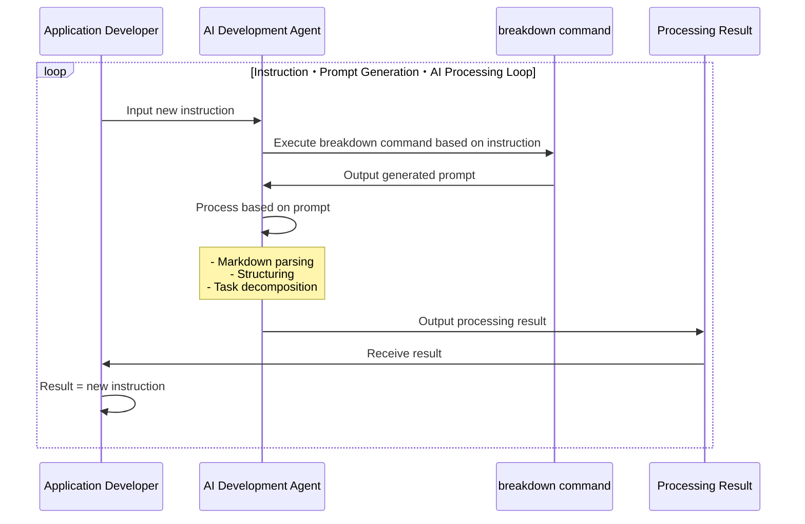

# Breakdown Documentation

Breakdown is a development instruction language tool for AI automated development using TypeScript and JSON/YAML/Markdown.

## Table of Contents

- [Overview](#overview)
- [Usage](usage.md)
- [Developer Information](breakdown/index.md)

## Overview

BreakDown is a prompt generation tool for AI development support. It generates prompts in a format that is easy for AI to understand, based on input Markdown files and specified conditions. The generated prompts serve as instructions for AI systems to perform actual conversions and analysis.

Key Features:

- Automatic Prompt Selection and Generation
  - Selection of appropriate prompts based on input and output conditions
  - Dynamic generation through variable substitution in prompts
  - Embedding of JSON Schema reference information in prompts
- TypeScript Implementation with Deno Runtime
- Integration with AI Development Agents
  - Optimized for AI development agents like Cursor
  - Designed for use with Claude-3.7-sonnet and other AI models

### Processing Flow

**Prompt Generation Process**

When executing from the command line, it simply receives the prompt.

The terminal command → prompt part can be run on an AI development agent.
The aim is to generate recursive instructions based on these instructions.

**AI Processing Process**

The basic structure is simple. By establishing a process for generating prompts for AI automated development, instructions are automatically provided.
It creates new instructions that break down the instructions, which are then used for the next instructions.

**Internal Processing**

Uses pre-prepared prompts.
Selects appropriate prompts from commands and treats parameter values as variables for embedding.

Number of combinations:
- Pre-preparable prompt patterns (infinite)
- Input variables (finite)
  - Input values (infinite)

When combined with LLM's versatility, this tends to diverge.

When considering development artifacts as deliverables, a method to control divergence and converge toward the goal is necessary.
Also, the specification definitions and decomposition methods needed for development have finite patterns due to accumulated theory.
(For example, GoF's 23 design patterns.)

Therefore, JSON Schema definitions are used to guide diverse expressions into specific patterns.
The Breakdown tool pre-defines three layers: Project > Issues > Tasks, and the `to` instruction performs decomposition.
At this stage, pre-prepared prompts are classified into project/issue/task.
When multiplying the types of input → decomposition destination (output) combinations, 5 combination patterns (P->I,T, I->I,T,T->T) are pre-prepared.

Additionally, the `summary` instruction handles cases different from the decomposition direction, such as summarization direction (project -> Project, Issues -> Project, etc.).
In particular, the `defect` instruction is provided to respond to error handling, defect resolution, and requests for unorganized states. For details, see [Usage](./usage.md).

### Dynamic Prompt Selection (Proposal)

Making the prompt selection part AI-driven makes it more dynamic.
This part can be separated from this tool as it would be more efficient to use external services.

## JSON Schema

JSON Schema references are used to converge to finite patterns.
The aim is not to fit into Schema definitions but to use them as a checklist to control generation results.
The final output does not need to be JSON. More versatile YAML/Markdown/Text formats are assumed.

- JSON Schema files exist within this project
- Schema definitions are documented in another project: https://github.com/tettuan/breakdownschema
- This tool does not parse Schema contents
- Schema files are embedded in prompts by PATH and used as reference information when AI interprets prompts and converts input values to output values
- AI uses JSON Schema as an aid in interpretation when converting input values according to prompts, stabilizing output results

In a near version, Schema references will be possible via URL.
This will enable data processing using Schema.org and utilization of other Schema definitions.

If there are appropriate Schema definitions for development requirements, they will be referenced, but since none are found yet, we plan to create what this application needs. 