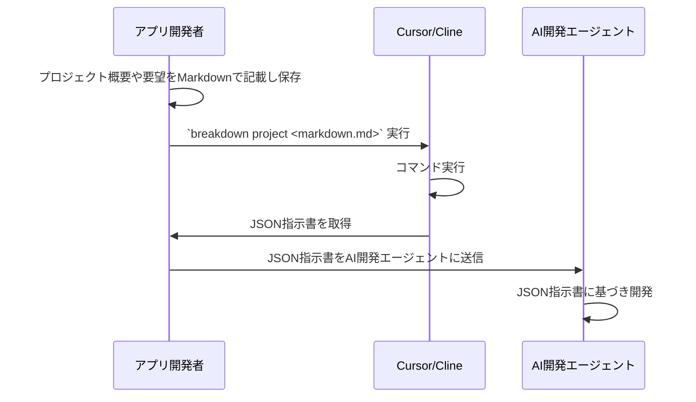
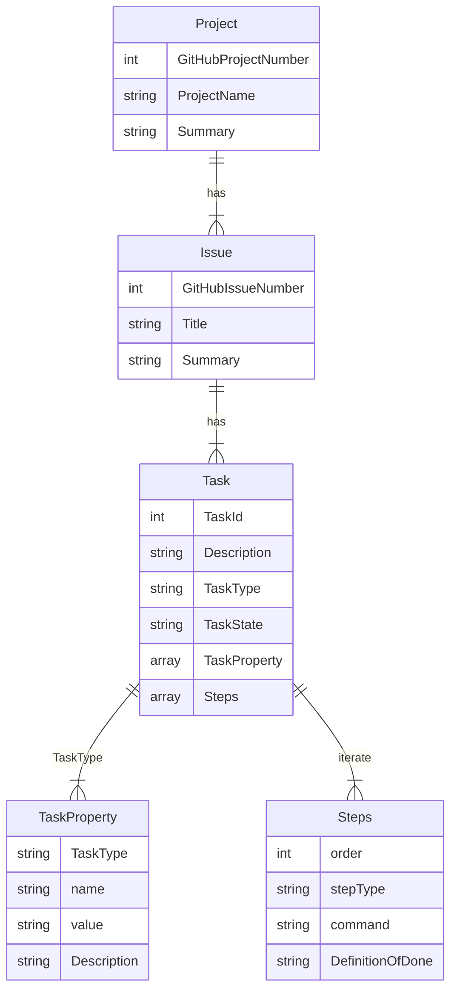
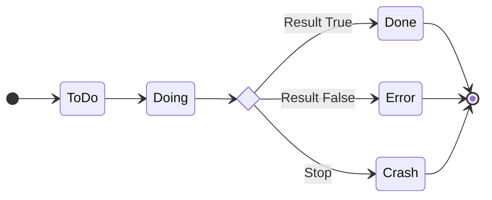

# BreakDown Documentation

BreakDownは、TypeScriptとJSONを使ったAI自動開発のための開発指示言語ツールです。

## 目次

- [概要](#概要)
- [スキーマ定義](#スキーマ定義)
- [タスクプロパティ](#タスクプロパティ)
- [ステップタイプ](#ステップタイプ)
- [リレーション](#リレーション)
- [ルール](#ルール)

## 概要

BreakDownは、MarkdownドキュメントをJSON形式に変換し、AIシステムが解釈しやすい形式にする変換ツールです。
主な特徴：

- AI解釈用に最適化されたMarkdownからJSONへの変換
- DenoランタイムによるTypeScript実装
- AI自動開発のための構造化フォーマット
- AIシステムのための学習しやすい構文
- CursorとClineのAI開発エージェントに最適化
- Claude-3.5-sonnetおよび他のAIモデルとの互換性

### 処理フロー

## スキーマ定義

プロジェクト、イシュー、タスクの関係は以下の通りです：

## タスクプロパティ

タスクには以下のプロパティを設定できます：

|プロパティ名| 定義| 例|
|---|---|---|
|Work Branch| タスクで使用するgitブランチ名。未指定の場合は現在のブランチを使用| cursor/edinet-api-20250123|
|Prohibited Files| 編集禁止のアプリケーションファイル| `routes.rb`, `migration/*`, `config/*` |

## ステップタイプ

各タスクのステップで使用可能なタイプ：

|タイプ名| 定義| 例|
|---|---|---|
|Execute Command| 指定されたコマンドを実行| `bundle exec rails test` |
|Check Logs| ログをチェックして問題がないか確認| `tail -200 log/development.log` |
|Write Application Code| アプリケーションの動作を変更するコードを記述| class Edinet ..., def initialize ...|
|Write Test Code| アプリケーションコードに対応するテストコードを記述||
|Write TDD Test Code| 仕様に基づいてTDDでテストを記述||
|Git Commit| 現在の変更をコミット| `git commit` |
|Git Commit All| ステージングされていない変更も含めて全てコミット| `git add . ; git commit` |
|Git Push| 変更をリモートにプッシュ| `git push` |

## タスクの状態遷移

## ルール

### バリデーションルール

1. 全てのノードは必須プロパティを持つ必要があります
2. ノードタイプは有効である必要があります
3. コンテンツは指定された形式に従う必要があります
4. 構造はネストルールに従う必要があります

### Markdownの構造ルール

- 見出し
  - レベル1-6をサポート
  - 内容は必須
  - 空の見出しは不可

- リスト
  - 最大3レベルまでのネストをサポート
  - 順序付き/順序なしリストをサポート
  - リストアイテムは内容が必須

- コードブロック
  - 言語指定が必須
  - 内容は空でも可
  - シンタックスハイライトのヒントをサポート 