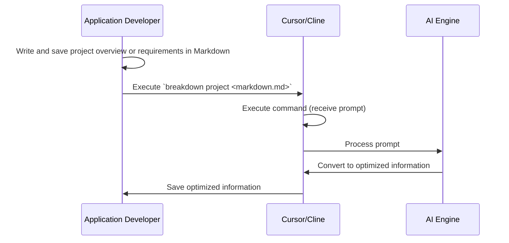
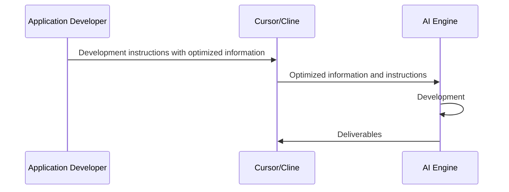

# BreakDown Documentation

> **PromptVariablesFactory (unified parameter/path resolver) is described in [breakdown/app_factory.ja.md](breakdown/app_factory.ja.md).**

BreakDown is a development instruction language tool for AI-automated development using TypeScript and JSON.

## Table of Contents

- [Overview](#overview)
- [Usage](usage.md)
- [Developer Information](breakdown/index.md)

## Overview

BreakDown is a tool that converts Markdown documents based on JSON Schema. Essentially, it's a tool that selects appropriate prompts, generates prompts with specified inputs and outputs. 
Since the execution result is a prompt, AI development tools perform the conversion process following the JSON Schema.

Key Features:

- Prompts that receive unorganized information and output it in an organized manner
- TypeScript implementation using Deno runtime
- Structured format for AI-automated development
- Easy-to-learn syntax for AI systems
- Optimized for AI development agents like Cursor
- Designed for use with Claude-3.7-sonnet and other AI models

### Process Flow

**Using Breakdown**

**Using Results Obtained from Breakdown**

# JSON Schema Format

- Schema JSON files exist within this project
- Schema definitions are documented in a separate project: https://github.com/tettuan/breakdownschema
- This project does not handle (parse) the contents of the Schema
- It only identifies the Schema file PATH from parameters 