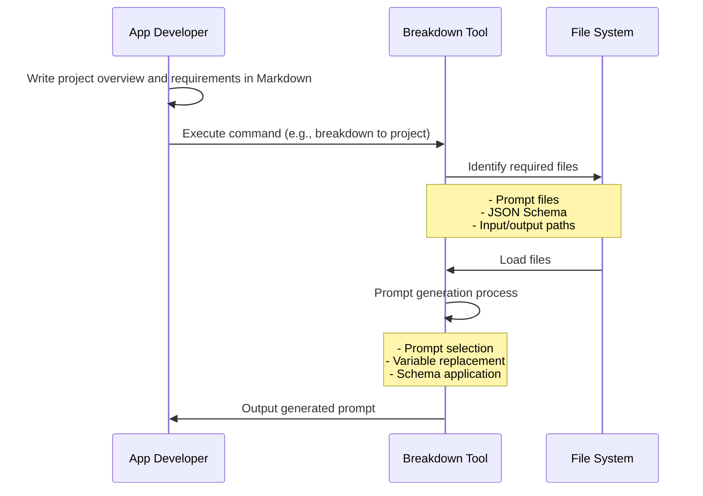
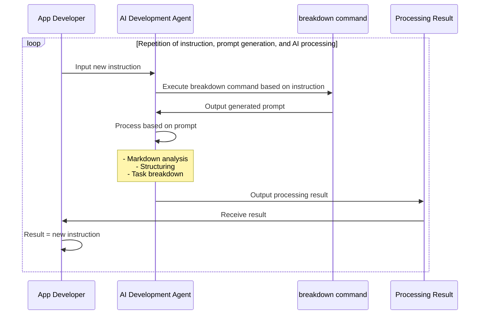

# Breakdown Documentation

Breakdown is a development instruction language tool for AI automated development using TypeScript and JSON/YAML/Markdown.

## Table of Contents

- [Overview](#overview)
- [Usage](usage.md)
- [Developer Information](breakdown/index.md)

## Overview

BreakDown is a prompt generation tool for AI development support. It generates prompts in a format that AI can easily understand, based on input Markdown files and specified conditions. The generated prompts function as instructions for AI systems to perform actual conversion and analysis.

Key Features:

- Automatic prompt selection and generation
  - Selection of appropriate prompts based on input and output conditions
  - Dynamic generation through variable replacement within prompts
  - Embedding of JSON Schema reference information within prompts
- TypeScript implementation with Deno runtime
- Integration with AI development agents
  - Optimized for AI development agents like Cursor
  - Designed for use with Claude-3.7-sonnet and other AI models

### Processing Flow

**Prompt Generation Process**

When executed from the command line, it simply receives prompts.

The terminal command → prompt part can be run on AI development agents.
The goal is to generate recursive instructions based on these instructions.

**AI Processing Process**

The basic structure is simple. By establishing a process to generate prompts for AI automated development, instructions are automatically given.
Instructions create new subdivided instructions, which are then used for the next instructions.

**Internal Processing**

Uses pre-prepared prompts.
Selects appropriate prompts from commands and treats parameter values as variables to embed them.

Number of combinations:
- Pre-preparable prompt patterns (infinite)
- Input variables (finite)
  - Input values (infinite)

This combination number is multiplied by the versatility of LLM, making it prone to divergence.

When considering development products as deliverables, methods to control divergence and converge toward objectives are necessary.
Also, since specification definition and breakdown methods required for development have accumulated theories, they become finite patterns.
(For example, the 23 design patterns in GoF.)

Therefore, Schema definitions are used to guide diverse expressions into specific patterns.
The Breakdown tool predefines three layers: Project > Issues > Tasks, and the `to` instruction performs breakdown.
At this stage, pre-prepared prompts are classified into either project/issue/task.
When multiplying the combinations of input → breakdown destination (output), 5 combination patterns (P->I,T, I->I,T, T->T) are pre-prepared.

For cases different from the breakdown direction, the `summary` instruction performs summary direction (project -> Project, Issues -> Project, etc.).
In particular, the `defect` instruction is provided to respond to error handling, bug response, and requests for undeveloped states. For details, see [Usage](./usage.md).

### Dynamic Prompt Selection (Plan)

Making the prompt selection part AI-powered would make it more dynamic.
Since this part would be more efficient using external services, it can also be separated from this tool.

## JSON Schema

JSON Schema references are used to converge to finite patterns.
The goal is to control generation results by referencing Schema definitions as checklists rather than fitting them into Schema definitions.
The final output does not need to be JSON. More versatile YAML/Markdown/Text is assumed.

- Schema JSON files exist within this project
- Schema definitions have documentation in a separate project: https://github.com/tettuan/breakdownschema
- This tool does not analyze Schema content
- Schema files are embedded in prompts by PATH and used as reference information when AI interprets prompts and converts input values to output values
- AI uses JSON Schema as an aid for interpretation when converting input values according to prompts, stabilizing output results

In upcoming versions, it is planned to enable Schema reference based on URLs.
This will enable data processing using Schema.org and utilization of other Schema definitions.

If there are appropriate Schema definitions for development requirement definitions, they will be referenced, but since none have been found yet, we plan to create what this application requires.

---

[English](index.md) | [日本語](index.ja.md)
