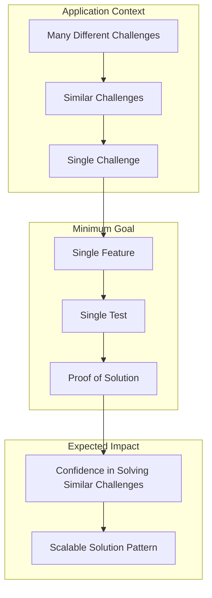
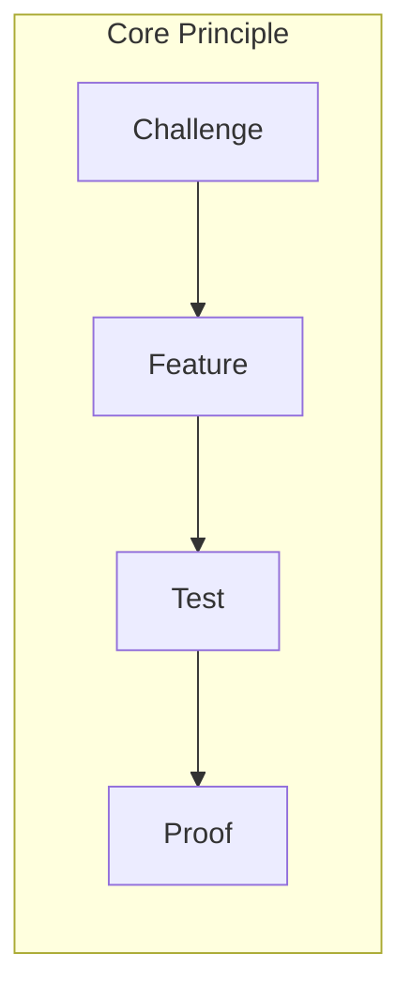

# Minimum Goal

## Definition
A Minimum Goal represents the smallest functional unit that demonstrates "if this test passes, similar challenges can be cleared." It serves as a proof of concept for solving a particular type of problem.

## Detailed Explanation
It's impossible to solve all problems simultaneously in software development. Therefore, we need to define a specific scope that proves a solution works for each challenge.

The Minimum Goal concept establishes a one-to-one relationship between:
- One challenge and one feature
- One feature and one test

When this test passes, we consider the Minimum Goal achieved.

## Example
For instance, when implementing standard library imports, if we can successfully implement and test the import functionality in one specific component, this serves as proof that we can handle similar import requirements throughout the application.

## Concept Visualization

## Benefits
1. **Focused Development**
   - Clear scope definition
   - Manageable implementation units
   - Verifiable success criteria

2. **Scalable Solutions**
   - Proven patterns for similar challenges
   - Reusable implementation approaches
   - Consistent problem-solving methodology

3. **Efficient Progress**
   - Incremental advancement
   - Measurable achievements
   - Clear validation points

## Implementation Strategy
1. Identify a specific challenge within the larger problem space
2. Define the minimal feature that addresses this challenge
3. Create a focused test that validates the feature
4. Use the successful implementation as a pattern for similar challenges

## Conclusion
The Minimum Goal approach provides a structured way to tackle complex problems by breaking them down into provable, manageable units. This methodology ensures steady progress while maintaining solution quality and scalability.
