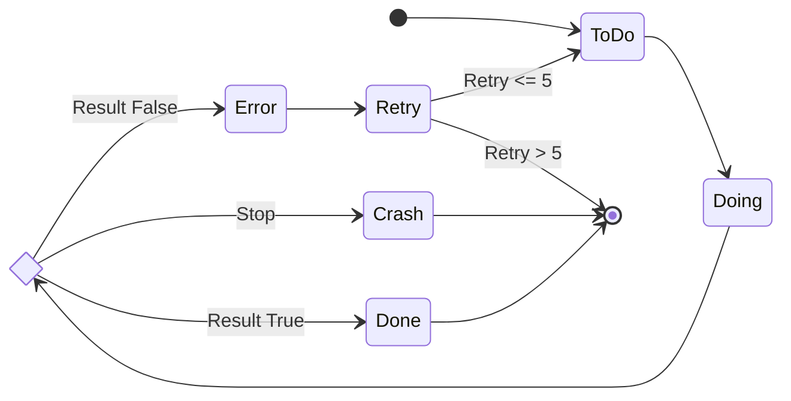

## Task and Step State

```mermaid
stateDiagram-v2
direction LR
  state Result <<choice>>

  [*] --> ToDo
  ToDo --> Doing
  Doing --> Result
  Result --> Error: Result False
  Result --> Crash: Stop
  Result --> Done: Result True
  Done --> [*]
  Crash --> [*]
  Error --> Retry
  Retry --> ToDo : Retry <= 5
  Retry --> [*] : Retry > 5
```
