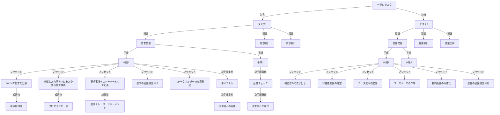

- 「一連のタスク」は、個々のタスクを順序で束ねたもの
- 各タスクは、種類と、種類に応じた作業内容のプリセットを持つ
- プリセットは定義済で、定義を指定する
- 成果物は別で定義されており、プリセットの手順の成果物に指定する
- 次手順への条件は、単体テストや品質チェックを指定する

# タスクのプロパティ

- 一連のタスク
  - タスク1
  - タスク2

- タスク
  - 種類:以下のいずれかを持つ "要求整理", "要件定義", "外部設計", "内部設計", "作業設計",
    "作業分解", "coding", "testing", "documentation"
  - 手順：種類に応じて組み合わせが決まる
    - 手順1:
      - プリセット名
      - 程度： [省略, 確認のみ, 必要なら簡易に , 必ず実施, 入念に実施]
      - 成果物
      - 次手順への条件（複数可）
    - 手順1:
      - プリセット名
      - 程度
      - 成果物
      - 次手順への条件（複数可）

# 手順プリセット

    "要求整理":
      - 5W2Hで要求を分解
      - 分解した内容をプロセスや関係性で構成
      - 要求事項をストーリーとして記述
      - 要求の優先順位付け
      - ステークホルダーの合意形成

    "要件定義":
      - 機能要件の洗い出し
      - 非機能要件の特定
      - データ要件の定義
      - ユースケースの作成
      - 制約条件の明確化
      - 要件の優先順位付け

    "外部設計":
      - システム境界の定義
      - 外部インターフェースの設計
      - 画面遷移の設計
      - APIの設計
      - エラー処理の設計
      - セキュリティ要件の具体化

    "内部設計":
      - アーキテクチャの設計
      - モジュール分割の設計
      - データベース設計
      - クラス設計
      - シーケンス設計
      - パフォーマンス設計

    "作業設計":
      - タスクの分解
      - 作業順序の決定
      - リソースの割り当て
      - スケジュール作成
      - リスクの特定と対策
      
    "作業分解":
      - 作業単位への分割
      - 依存関係の特定
      - 工数見積もり
      - チーム編成の検討
      - マイルストーンの設定

    "coding":
      - 開発環境のセットアップ
      - コーディング規約の確認
      - 実装
      - ユニットテストの作成
      - コードレビュー
      - リファクタリング

    "testing":
      - テスト計画の作成
      - テストケースの設計
      - 単体テストの実施
      - 結合テストの実施
      - システムテストの実施
      - 性能テストの実施
      - バグ修正と再テスト

    "documentation":
      - ドキュメント構成の設計
      - 技術文書の作成
      - APIドキュメントの作成
      - ユーザーマニュアルの作成
      - 運用手順書の作成
      - レビューと更新

# タスク階層構造

