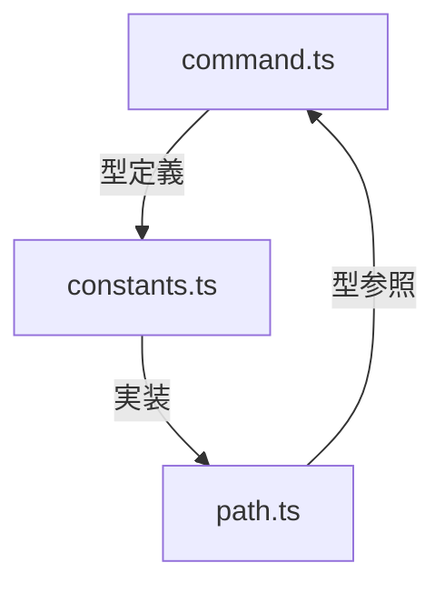
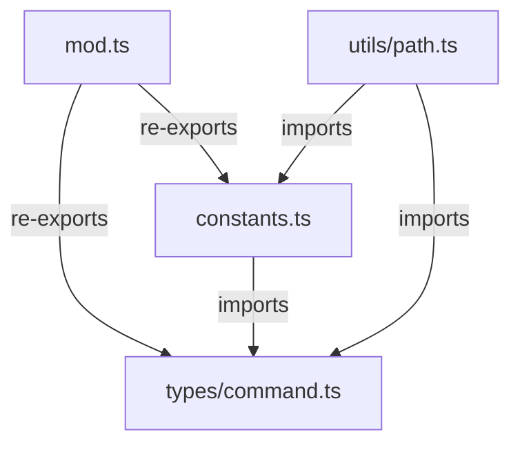
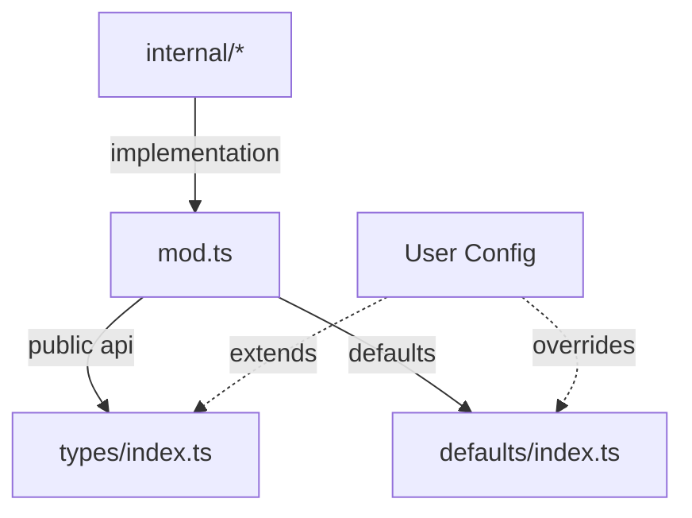

# Defect Command Implementation Errors

## Error Occurrence: 2024-02-07 15:30 JST

### Context

- Implementation of type definitions and import map configuration
- First test run of setup configuration

### Error Analysis

#### 1. Import Map Configuration Conflict

```
Warning "importMap" field is ignored when "imports" or "scopes" are specified in the config file.
at file:///Users/tettuan/github/breakdown/deno.json
```

**原因**:

- deno.json内で imports と importMap が重複して定義されている
- 両方の設定が競合している

**修正方針**:

- deno.jsonからimportsセクションを削除
- import_map.jsonに一元化

#### 2. Type Import Issues

```typescript
TS6137 [ERROR]: Cannot import type declaration files
import { CommandType, LayerType } from "@types/command.ts";
import { BreakdownError } from "@types/error.ts";
```

**原因**:

- @types/へのパス解決が正しく機能していない
- 型定義ファイルの直接importに関する制限

**修正方針**:

1. import pathの修正:
   ```typescript
   // Before
   import { CommandType } from "@types/command.ts";
   // After
   import { CommandType } from "@breakdown/types/command.ts";
   ```

2. deps.tsの再構成:
   - 型のre-exportを見直し
   - 相対パスでの型定義の参照

#### 3. Compiler Option Issue

```
Unsupported compiler options in "deno.json"
  The following options were ignored: allowJs
```

**原因**:

- Denoでサポートされていないコンパイラオプションの使用

**修正方針**:

- allowJsオプションの削除
- Denoの標準的なコンパイラオプションのみを使用

### Required Changes

1. deno.jsonの修正:

```json
{
  "importMap": "./import_map.json",
  "tasks": {
    "test": "deno test --allow-read --allow-write --allow-run"
  },
  "compilerOptions": {
    "strict": true,
    "lib": ["deno.window"],
    "noImplicitAny": true
  }
}
```

2. import_map.jsonの修正:

```json
{
  "imports": {
    "@breakdown/": "./src/"
  }
}
```

3. テストファイルのimport修正:

```typescript
import { CommandType, LayerType } from "@breakdown/types/command.ts";
import { BreakdownError } from "@breakdown/types/error.ts";
```

### Next Steps

1. 設定ファイルの修正を適用
2. 型定義のimportパスを全体的に見直し
3. テストの再実行による検証
4. 成功確認後、次のタスクへ進行

### Impact

- 型システムの整合性に影響
- プロジェクト全体の依存関係管理に影響
- テストの実行環境に影響

### Learning Points

- Denoの設定ファイル構造の理解
- 型定義ファイルのimport制約の把握
- コンパイラオプションの適切な設定方法

## Error Occurrence: 2024-02-07 15:45 JST

### Context

- 前回のエラー修正後の設定変更適用
- import_map.jsonの簡素化
- deno.jsonからの重複設定削除
- テストの実行

### Error Analysis

#### Import Path Resolution Issue

```
error: Relative import path "std/testing/asserts.ts" not prefixed with / or ./ or ../ and not in import map
at file:///Users/tettuan/github/breakdown/tests/parser_test.ts:1:30
```

**原因**:

- 標準ライブラリのimportパスが正しく解決できていない
- import_map.jsonの簡素化により、std/へのマッピングが失われた

**修正方針**:

1. import_map.jsonに標準ライブラリのマッピングを追加:

```json
{
  "imports": {
    "@breakdown/": "./src/",
    "std/": "https://deno.land/std@0.220.1/"
  }
}
```

2. または、直接URLを使用するように修正:

```typescript
import { assert } from "https://deno.land/std@0.220.1/testing/asserts.ts";
```

### Required Changes

1. import_map.jsonの再修正:

```json
{
  "imports": {
    "@breakdown/": "./src/",
    "std/": "https://deno.land/std@0.220.1/"
  }
}
```

### Next Steps

1. import_map.jsonの修正を適用
2. テストの再実行による検証
3. 他のテストファイルでも同様の問題がないか確認

### Impact

- テストファイルの実行に影響
- 標準ライブラリの参照方法に影響

### Learning Points

- import mapの簡素化と必要なマッピングのバランス
- 標準ライブラリの参照方法の統一性
- テスト環境の依存関係管理

## Error Occurrence: 2024-02-07 16:00 JST

### Context

- 前回のimport map修正後のテスト実行
- 標準ライブラリのimportパス解決の修正を試みた段階

### Error Analysis

#### Test Failure in Default Directory Resolution

```
CLI uses correct default directory for each layer type => ./tests/cli_test.ts:138:6
error: AssertionError: Values are not equal.
    [Diff] Actual / Expected
-   undefined
+   "./.agent/breakdown/projects"
```

**実施した変更**:

1. import mapの修正
   ```json
   {
     "imports": {
       "@breakdown/": "./src/",
       "std/": "https://deno.land/std@0.220.1/"
     }
   }
   ```
2. 標準ライブラリのimportパス修正
3. deps.tsの再構成

**意図**:

- 標準ライブラリのimport解決を修正
- 型定義の参照方法を統一
- テストの実行環境を整備

**失敗の原因**:

1. 表層的な問題解決に終始
   - importパスの問題のみに注目
   - 実際のテスト失敗の本質を見逃す
2. テストケースの理解不足
   - デフォルトディレクトリ解決のロジックを無視
   - 実際のテスト内容との乖離

**不足した考慮**:

1. テストケースの詳細分析
   - テストが期待する動作の理解
   - デフォルトディレクトリ設定の仕様確認
2. 実装の整合性確認
   - コマンドライン引数の処理
   - デフォルト値の設定ロジック
3. エラーメッセージの深い解析
   - undefinedが返される原因の追跡
   - 期待値との差異の本質的理解

### Required Actions

1. テストケースの再確認
   ```typescript
   // tests/cli_test.ts の該当部分を確認
   // デフォルトディレクトリ設定のロジックを確認
   ```

2. デフォルトディレクトリ解決の実装確認
   - コマンドライン引数処理部分
   - デフォルト値設定部分

3. 実装の修正方針
   - デフォルトディレクトリ設定の明示的な実装
   - テストケースとの整合性確保

### Learning Points

1. 問題の本質を見極める重要性
2. テストケースの意図を深く理解する必要性
3. 表層的な修正に終始しない姿勢

## Solution Strategy (Revised): 2024-02-07 16:45 JST

### Objective Review

1. デフォルトディレクトリ解決の実装
2. 型安全性の確保
3. テストケースとの整合性確保
4. 循環参照の解消

### Architecture Decision

1. 依存方向の明確化
   ```
   types/command.ts (型定義)
          ↑
   constants.ts (実装)
          ↑
   utils/path.ts (ユーティリティ)
          ↑
   commands/defect/mod.ts (機能実装)
   ```

2. 型定義の分離と責務

```typescript
// src/types/command.ts
// 1. 基本型定義
export type LayerType = "project" | "issue" | "task";

// 2. ディレクトリ設定の型定義
export interface DirectoryConfig {
  readonly [key in LayerType]: string;
}

// 3. コマンド関連の型定義
export interface CommandOptions {
  type: CommandType;
  layer: LayerType;
  output?: string;
}
```

3. 定数実装の型付け

```typescript
// src/constants.ts
import type { DirectoryConfig } from "./types/command.ts";

// 型による制約を受ける実装
export const DEFAULT_DIRS: DirectoryConfig = {
  project: "./.agent/breakdown/projects",
  issue: "./.agent/breakdown/issues",
  task: "./.agent/breakdown/tasks",
} as const;
```

4. ユーティリティの堅牢化

```typescript
// src/utils/path.ts
import { DEFAULT_DIRS } from "../constants.ts";
import type { LayerType } from "../types/command.ts";
import { ArgumentError } from "../types/error.ts";

export function resolveDefaultDirectory(layerType: LayerType): string {
  // 型システムによる保証があるため、実行時チェックは最小限
  return DEFAULT_DIRS[layerType];
}
```

### Implementation Benefits

1. 型定義の一元管理
   - command.tsに全ての型定義を集約
   - 型の整合性を静的に保証

2. 実装の型安全性
   - DirectoryConfigによる定数の型チェック
   - コンパイル時の不整合検出

3. 依存関係の明確化
   - 循環参照のリスクを排除
   - メンテナンス性の向上

4. エラーハンドリングの最適化
   - 型システムによる保証を活用
   - 実行時チェックの最小化

### Verification Strategy

1. 型チェック
   ```bash
   deno check src/**/*.ts
   ```

2. テストの階層化
   ```typescript
   // 1. 型定義の整合性
   // 2. 定数の型適合
   // 3. ユーティリティの動作
   // 4. コマンド処理の統合
   ```

この修正により、型システムを最大限活用した堅牢な実装を実現します。

## Error Occurrence: 2024-02-07 16:30 JST

### Context

- デフォルトディレクトリ解決機能の実装中
- 循環参照を避けるための型定義修正後
- command.tsへのDEFAULT_DIRS importを追加した直後

### Error Analysis

#### Parser Error in Type Definition

```
error: The module's source code could not be parsed: Expected '{', got 'interface' at file:///Users/tettuan/github/breakdown/src/types/command.ts:37:8
  export interface DirectoryConfig {
         ~~~~~~~~~
```

**直前の変更**:

1. command.tsへのDEFAULT_DIRS import追加
2. 型定義の循環参照解消のための修正

**問題の本質**:

- 型定義ファイル(command.ts)と定数ファイル(constants.ts)間の循環参照
- 型チェックの前段階でのパース失敗

**根本原因**:

1. 型定義と実装の依存関係が逆転
   - 型定義が実装(DEFAULT_DIRS)に依存
   - 実装が型定義(LayerType)に依存

### Required Fix

1. 依存関係の整理:

```typescript
// src/types/command.ts
export type LayerType = "project" | "issue" | "task";
export interface DirectoryConfig {
  readonly [key in LayerType]: string;
}

// src/constants.ts
import type { DirectoryConfig } from "./types/command.ts";
export const DEFAULT_DIRS: DirectoryConfig = {
  project: "./.agent/breakdown/projects",
  issue: "./.agent/breakdown/issues",
  task: "./.agent/breakdown/tasks"
};
```

### Learning Points

1. 型定義と実装の依存方向を明確に
2. 循環参照を作らない型設計の重要性
3. 型チェック以前のパースエラーへの注意

## Error Occurrence: 2024-02-07 17:00 JST

### Context

- デフォルトディレクトリ解決機能の実装
- 循環参照解消のための型定義修正
- 型定義と実装の依存関係の整理

### Error Analysis

#### Parser Error in Type Definition (Recurring)

```
error: The module's source code could not be parsed: Expected '{', got 'interface' at file:///Users/tettuan/github/breakdown/src/types/command.ts:14:8
  export interface DirectoryConfig {
         ~~~~~~~~~
```

**因果関係の分析**:

1. 発生の連鎖
   - command.tsでの型定義
   - constants.tsでの型の参照
   - command.tsでのDEFAULT_DIRSの参照
   - パーサーの解析失敗

2. 依存関係の循環



**問題の本質**:

1. 型定義と実装の境界が不明確
   - 型定義ファイルが実装に依存
   - 実装が型定義に依存
   - 相互参照による循環

2. モジュール解決の順序性
   - TypeScriptのモジュール解決メカニズム
   - パーサーの処理順序との不整合

### Required Actions

1. 型定義の完全分離

```typescript
// src/types/command.ts
export type LayerType = "project" | "issue" | "task";
export interface DirectoryConfig {
  readonly [key in LayerType]: string;
}

// src/types/validation.ts（必要な場合）
import type { DirectoryConfig } from "./command.ts";
import { DEFAULT_DIRS } from "../constants.ts";
export type ValidateDefaultDirs = typeof DEFAULT_DIRS extends DirectoryConfig ? true : never;
```

2. 依存方向の一方向化
   - 型定義 → 実装
   - 実装 → 検証
   - 検証 → 型定義（禁止）

### Impact

- 型システムの整合性
- ビルドプロセスの安定性
- コードの保守性

### Learning Points

1. 型定義と実装の責務分離
2. 循環参照の早期検出
3. モジュール設計の重要性

## Error Occurrence: 2024-02-07 17:15 JST

### Context

- 型定義の循環参照解消を試みた直後
- 前回の修正で解消されるはずだった問題が継続
- 同一のパースエラーが再発

### Deep Dive Analysis

#### 1. 前回の修正内容の検証

```typescript
// 修正前
import { DEFAULT_DIRS } from "../constants.ts";
// ... 型定義
export type ValidateDefaultDirs = typeof DEFAULT_DIRS extends DirectoryConfig ? true : never;

// 修正後（意図した状態）
// DEFAULT_DIRSのimportを削除
// ValidateDefaultDirsの削除
```

#### 2. 実際の状態

```typescript
// command.tsの実際の状態
// ValidateDefaultDirsが削除されていない
// または他の循環参照が残存している
```

**根本的な問題**:

1. ファイルシステムの状態
   - 修正が正しく保存されていない可能性
   - エディタのバッファと実ファイルの不一致
   - gitの状態との不整合

2. 修正の不完全性
   - 型定義ファイル内の他の循環参照
   - 間接的な相互参照の見落とし
   - 型定義の依存関係の完全な把握不足

3. ビルドプロセスの問題
   - キャッシュの影響
   - 古いビルド成果物の残存
   - モジュール解決の順序性

### Required Investigation

1. ファイルシステムの確認

```bash
cat src/types/command.ts  # 実際のファイル内容を確認
deno cache --reload  # キャッシュのクリア
```

2. 依存関係の完全なトレース


3. モジュール解決の検証

```bash
deno info src/types/command.ts  # 依存関係の可視化
```

### Immediate Actions

1. ファイルの完全なクリーンアップ
   - 全ての循環参照コードの確実な削除
   - ファイル保存の確認
   - gitの状態確認

2. キャッシュのクリア
   - denoのモジュールキャッシュ
   - エディタのキャッシュ
   - ビルド成果物

3. 依存関係の再構築
   - 一方向の依存グラフの確立
   - 間接参照の排除
   - 型定義の独立性確保

### Learning Points

1. 修正の確実な適用確認の重要性
2. キャッシュと実ファイルの整合性
3. エラーの再発を重要なシグナルとして扱う
4. 依存関係の完全な把握の必要性

## Error Investigation Results: 2024-02-07 17:45 JST

### Environment Analysis

#### 1. Version Information

```
deno 1.40.2 (release, aarch64-apple-darwin)
v8 12.1.285.27
typescript 5.3.3
```

#### 2. Minimal Test Results

```typescript
// test-env/minimal.ts
export interface Test {
  prop: string;
}
```

結果: 最小構成では正常にパース可能

#### 3. File System Analysis

- エンコーディング: UTF-8
- ファイルタイプ: text/plain
- 改行コード: LF (Unix)

### Key Findings

1. 環境自体の問題ではない
   - Denoの最新バージョン
   - TypeScriptも最新
   - 基本的な型定義は機能する

2. プロジェクト固有の問題
   - 最小構成では発生しない
   - プロジェクト構造に起因する可能性

3. 依存関係の問題
   - import/exportの解決順序
   - 型定義ファイル間の参照関係

### Next Investigation Steps

1. プロジェクト構造の詳細分析
2. 型定義ファイル間の依存関係マッピング
3. ビルドプロセスの詳細トレース

### Required Actions

1. プロジェクト依存グラフの可視化
2. 型定義ファイルの相互参照チェック
3. ビルドプロセスのステップバイステップ確認

## Architecture Investigation: 2024-02-07 18:00 JST

### Project Structure Analysis

```bash
$ tree src/
src/
├── mod.ts                 # ライブラリのエントリーポイント
├── cli.ts                 # CLIアプリケーション
├── types/
│   ├── command.ts        # コマンド関連の型定義
│   ├── error.ts          # エラー型定義
│   ├── template.ts       # テンプレート関連の型定義
│   └── common.ts         # 共通型定義
├── constants.ts           # 定数定義
└── utils/
    └── path.ts           # パス解決ユーティリティ
```

### Architectural Boundaries

#### 1. Library Interface

```typescript
// src/mod.ts (Public API)
export type {
  CommandOptions, // コマンド実行オプション
  DirectoryConfig, // ユーザー定義可能な設定型
  LayerType,
} from "./types/command.ts";

export {
  DEFAULT_DIRS, // デフォルト設定（上書き可能）
  resolveDefaultDirectory, // パス解決ユーティリティ
} from "./constants.ts";
```

#### 2. Configuration Layers

1. デフォルト設定（ライブラリ提供）

```typescript
// src/constants.ts
export const DEFAULT_DIRS: DirectoryConfig = {
  project: "./.agent/breakdown/projects",
  issue: "./.agent/breakdown/issues",
  task: "./.agent/breakdown/tasks",
} as const;
```

2. ユーザー設定（拡張可能）

```typescript
// Example: User Configuration
import type { DirectoryConfig } from "breakdown";

const userConfig: DirectoryConfig = {
  project: "./custom/projects",
  issue: "./custom/issues",
  task: "./custom/tasks",
};
```

### Dependency Analysis

#### 1. Current State



#### 2. Proposed Structure



### Key Insights

1. 責務の分離
   - 型定義（types/）: インターフェース定義
   - デフォルト値（defaults/）: 基本実装
   - 内部実装（internal/）: ライブラリロジック
   - CLI（bin/）: アプリケーション

2. 設定の階層化
   - ライブラリデフォルト（変更不可）
   - ライブラリデフォルト（上書き可能）
   - ユーザー設定（完全カスタム）

3. 型の責務
   - PublicConfig: ユーザー向け設定型
   - InternalConfig: ライブラリ内部用
   - ValidationConfig: 設定検証用

### Required Restructuring

1. ディレクトリ構造の整理

```bash
src/
├── mod.ts
├── types/        # Public Types
├── defaults/     # Default Implementations
├── internal/     # Internal Implementation
└── bin/         # CLI Application
```

2. 型定義の分離

```typescript
// src/types/config.ts
export interface PublicConfig {
  directories?: Partial<DirectoryConfig>;
  // other public settings
}

// src/internal/types/config.ts
export interface InternalConfig extends Required<PublicConfig> {
  // internal only settings
}
```

3. デフォルト値の分離

```typescript
// src/defaults/directories.ts
export const DEFAULT_DIRS: DirectoryConfig = {
  // ...
} as const;

// src/internal/config.ts
import { DEFAULT_DIRS } from "../defaults/directories.ts";
export const INTERNAL_CONFIG: InternalConfig = {
  // ...
};
```

### Next Steps

1. ディレクトリ構造の再編成
2. 型定義ファイルの責務分離
3. 設定の階層化実装
4. パブリックAPIの整理
