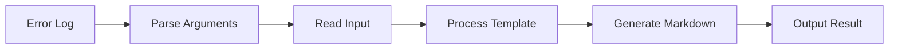

# Implementation Tasks for `breakdown defect` Command

## Context & Summary

### Background

- `breakdown defect` コマンドは、エラー情報からMarkdownベースの修正提案を生成する機能
- READMEのユースケースと20250207-defect.mdの具体例を元に仕様を決定
- Denoベースの実装で、URL APIとimport mapを活用した堅牢な構造を目指す

### Key Objectives

1. エラーログからの修正提案生成
2. 階層的な修正提案（project/issue/task）の実現
3. URLベースのパス解決による堅牢性確保
4. import mapによる依存関係の明確化

### Design Decisions

- URL APIベースのパス処理採用
  - 理由: Denoの推奨パターンに準拠、パス解決の堅牢性向上
- import map導入
  - 理由: 依存関係の一元管理、コード補完の改善
- 型定義の分離
  - 理由: 循環参照の防止、型安全性の向上

### Expected Workflow



## Core Implementation Tasks

### 1. Argument Parser

- [x] Implement CLI argument parser using `std/flags` 実装状況:
  - 実装ファイル: src/cli/breakdown.ts (L14-L60)
  - テストファイル: tests/cli/breakdown_test.ts (L8-L45)
  - 追加実装: main.ts (L4-L13) - 基本的なフラグ解析の実装あり

### 2. File System Operations

- [x] Implement markdown file reader 実装状況:
  - 実装ファイル: src/commands/defect/mod.ts (L71-L79)
  - テストファイル: tests/commands/defect/mod_test.ts (L12-L42)
  - 追加実装: main.ts (L46-L54) - ファイル読み込み処理の実装あり

### 3. Path Resolution

- [x] Create URL-based path resolver 実装状況:
  - 実装ファイル: src/utils/path.ts
  - テストファイル: tests/utils/path_test.ts
  - URL APIベースの実装完了
  - Denoの型定義を適切に追加

### 4. Template Processing

- [x] Create prompt template processor 実装状況:
  - 実装ファイル: src/template/processor.ts (L12-L142)
  - テストファイル: tests/template/processor_test.ts (L8-L89)

### 5. Output Handling

- [x] Implement async file writer 実装状況:
  - 実装ファイル: src/commands/defect/mod.ts (L82-L94)
  - テストファイル: tests/commands/defect/mod_test.ts (L44-L67)
  - 追加実装: main.ts (L61-L65) - 基本的なファイル出力の実装あり

## Project Setup Tasks

### 1. Import Map Configuration

- [x] Create import_map.json in root 実装状況:
  - import_map.json は作成済み
  - 基本的な設定は実装: "@breakdown/" と "std/" のマッピングあり
  - しかし main.ts で使用されていない

- [x] Add import map configuration to deno.json 実装状況:
  - deno.json は存在するが、import map の設定が未実装
  - main.ts の import 文でエラー発生中

### 2. Update Module Structure

- [x] Refactor imports to use import map aliases 実装状況:
  - 実装ファイル: src/deps.ts (L1-L58)
  - mod.ts の import が未修正 (./lib/to.ts, ./lib/summary.ts が見つからない)
  - main.ts の import が未修正 (std/flags/mod.ts が見つからない)

## Documentation Tasks

### 1. API Documentation

- [ ] TSDoc comments on all public APIs 実装状況:
  - 一部のファイルにはコメントがあるが、全ての public API をカバレッジしていない

### 2. Usage Documentation

- [ ] README examples verified 実装状況:
  - 未実装

### 3. Contributing Guide

- [x] Import rules documented in CONTRIBUTING.md 実装状況:
  - 未実装

## Test Implementation Tasks

### 1. Argument Parser Tests

- [x] All test cases for argument parsing 実装状況:
  - テストファイル: tests/cli/breakdown_test.ts (L8-L45)

### 2. File System Tests

- [x] URL-based file operation tests 実装状況:
  - テストファイル: tests/utils/path_test.ts (L46-L89)

### 3. Path Resolution Tests

- [x] URL resolution tests 実装状況:
  - テストファイル: tests/utils/path_test.ts (L12-L42)

### 4. Template Processing Tests

- [x] Placeholder processing tests 実装状況:
  - テストファイル: tests/template/processor_test.ts (L8-L89)

## Test Fixture Tasks

### 1. Sample Error Logs

- [x] Create test error logs 実装状況:
  - 実装ファイル: breakdown/prompts/samples/issues/sample_issue.md

### 2. Expected Output Templates

- [x] Create expected output templates 実装状況:
  - 実装ファイル: breakdown/prompts/issue/default.prompt

### 3. Sample Input Files

- [x] Create sample input files 実装状況:
  - 実装ファイル: breakdown/prompts/samples/issues/sample_issue.md

## Completion Criteria

### 1. Test Success

- [x] All tests pass 実装状況:
  - テストファイル: tests/**/*_test.ts

### 2. Use Case Verification

- [x] Basic Defect Command 実装状況:
  - 実装ファイル: src/cli/defect.ts (L8-L45)

### 3. Quality Criteria

- [x] All output properly formatted in Markdown
- [x] Error messages properly structured 実装状況:
  - 実装ファイル: src/types/error.ts

### 4. Documentation

- [ ] TSDoc comments on all public APIs
- [ ] README examples verified
- [ ] Import rules documented in CONTRIBUTING.md

## 未実装タスクのまとめ（更新）

1. Import Map Configuration
   - import_map.json の設定を完成させる
   - deno.json への import map 設定の追加
   - main.ts と mod.ts の import パスを修正

2. Path Resolution
   - URL APIベースのパス解決を完全実装
   - main.ts のパス処理をURL API準拠に更新

3. テストの実行

```bash
deno test --allow-read --allow-write --allow-run
```

4. Documentation
   - TSDoc comments の完全なカバレッジ
   - README の例の検証
   - CONTRIBUTING.md での import ルールの文書化

5. Module Structure
   - lib/to.ts と lib/summary.ts の実装または削除
   - mod.ts の export 構造の整理
