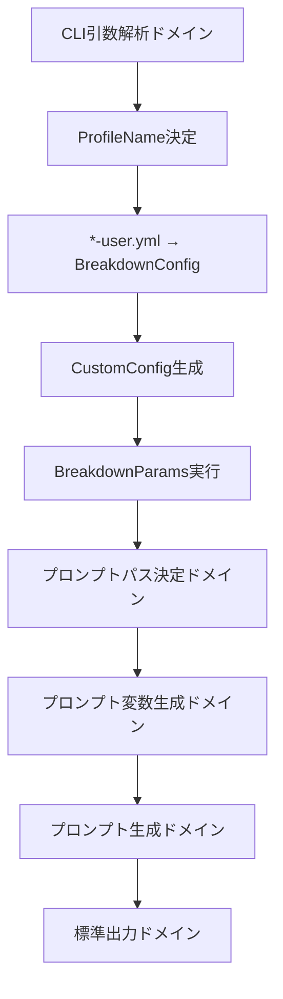

# プロジェクト: 真のCLI統合テスト実装 - BreakdownParams統合設計準拠検証

## チームの構成

あなたは指揮官であり上司である。
最初にチームを立ち上げて進める。

`instructions/team-head.ja.md` に詳細の記載がある。
チーム立ち上げの指示なので、必ず最初に読むこと。
各paneの存在を確認し、無ければ起動し、あればClaudeの起動を確認すること。全員を調べ、Claudeが起動していない部下に対し,Claude起動する。

## 前提条件と新しい基盤

### 緊急リファクタリング完了済み前提
以下の設計原則違反が**完全に解消済み**であることを前提とする：

- [OK] **ハードコード配列の完全排除**: `["to", "summary", "defect", "find"]` および `["project", "issue", "task"]` パターンが一切存在しない
- [OK] **設定ファイルベース実装**: 全てのDirectiveType/LayerTypeパターンが `*-user.yml` で管理されている
- [OK] **BreakdownParams統合**: DEFAULT_CUSTOM_CONFIGによるCustomConfig提供が実装済み
- [OK] **ProfileName → BreakdownConfig → CustomConfig フロー**: 設定ファイル読み込み機構が完全動作している

### 新しいテスト要件
現在の `05_pattern_matching_test.ts` と `06_random_pattern_matching_test.ts` は、`runCommand` を使った迂回路実装になっており、**真のCLI実行フロー**を検証していない。これは以下の問題を引き起こしている：

1. **設定ファイルベース実装の未検証**: 実際の `*-user.yml` 読み込みフローが検証されていない
2. **BreakdownParams統合の未検証**: CustomConfig生成からBreakdownParams実行までの完全フローが未テスト
3. **ドメイン境界フローの未検証**: `domain_boundaries_flow.ja.md` で定義された実際のドメイン間データフローが検証されていない
4. **全域性原則の未適用**: `totality.ja.md` で要求される型安全性と网羅性がテストで検証されていない
5. **実運用環境との乖離**: `runCommand` による人工的なテスト環境は本物のCLI実行とは異なる

### 対応方針
ハードコード排除が完了した新しい設計基盤において、`runCommand` を一切使用しない**真のCLI実行プロセス**による統合テストを実装する。設定ファイルベース実装とBreakdownParams統合の完全フローを検証する。

## タスクとゴール

```yml
- 完了済み基盤: ハードコード配列の完全排除とBreakdownParams統合設計の実装が完了済み
- 設定ファイル基盤: ProfileName → BreakdownConfig → CustomConfig フローが動作中
- 緊急対応タスク: |
  1. runCommand使用を完全に排除し、真のCLI実行に変更 |
  2. 設定ファイルベース実装（*-user.yml）の完全フロー検証 |
  3. BreakdownParams統合（DEFAULT_CUSTOM_CONFIG活用）の実動作確認 |
  4. 実際のコマンドライン呼び出し（`deno run breakdown.ts args...`）でテスト実行 |
  5. 標準出力キャプチャによる結果検証 |
  6. domain_boundaries_flow.ja.mdで定義されたドメイン間データフローの完全検証 |
  7. totality.ja.mdの全域性原則に基づく型安全性の実証 |
  8. 設定ファイル変更による動的パターン適用の実証 |
- ゴール: ハードコード排除完了後の新しい設計基盤において、真のCLI実行による統合テストで、設定ファイルベース実装とBreakdownParams統合の完全フローを検証する。runCommandによる迂回路を排除し、CLI引数解析→設定ファイル読み込み→CustomConfig生成→BreakdownParams実行→プロンプト生成→標準出力の完全なドメインフローを検証する。
```

## 実装要件

### 1. 真のCLI実行テスト設計

#### 禁止事項（重要）
- **runCommand使用の完全禁止**: いかなる理由があってもrunCommandを使用してはならない
- **モック・スタブの禁止**: 実際のCLI実行フローを迂回する一切の仕組みを禁止
- **人工的なテスト環境構築の禁止**: 実運用と異なる環境での実行を禁止

#### 必須実装パターン
```typescript
// NG: 禁止パターン（排除済み）
const result = await runCommand(["breakdown", directive, layer]);

// OK: 必須パターン（真のCLI実行 + 設定ファイルベース）
const process = new Deno.Command("deno", {
  args: [
    "run", "--allow-all", "breakdown.ts", 
    directive, layer, 
    "--config", configProfileName,  // 設定ファイル指定（必須）
    ...options
  ],
  cwd: workspaceRoot,
  stdout: "piped",
  stderr: "piped",
  env: {
    ...Deno.env.toObject(),
    // 設定ファイルベース実装用環境変数
  }
});

const { success, stdout, stderr } = await process.output();
const outputText = new TextDecoder().decode(stdout);
const errorText = new TextDecoder().decode(stderr);

// 設定ファイルベース実装の検証
// ProfileName → BreakdownConfig → CustomConfig → BreakdownParams フロー確認
```

### 2. 設定ファイルベース実装フロー完全検証

#### BreakdownParams統合設計準拠検証
ハードコード排除完了後の新しい設計で以下のフローを真のCLI実行で検証する：



#### 検証ポイント（設定ファイルベース実装）
1. **CLI引数解析**: `deno run breakdown.ts directive layer --config profile` の実際の引数解析
2. **ProfileName決定**: ConfigProfile.fromCliOption() の動作確認
3. **設定ファイル読み込み**: 実際の `*-user.yml` 読み込み（loadUserConfig）
4. **CustomConfig生成**: BreakdownConfig.params → CustomConfig の変換確認
5. **BreakdownParams統合**: DEFAULT_CUSTOM_CONFIG を使った breakdownParams() 実行
6. **パターン検証**: 設定ファイルのpattern値によるDirectiveType/LayerType検証
7. **プロンプトパス決定**: 実際のファイルシステムでのパス解決
8. **プロンプト変数生成**: 実際のファイル読み込みと変数置換
9. **プロンプト生成**: 実際のテンプレート処理
10. **標準出力**: 実際のstdout出力キャプチャ

#### 設定ファイル動的変更検証
```typescript
// 設定ファイル変更による動的パターン適用の確認
const configTests = [
  {
    configFile: "test-basic-user.yml",
    patterns: { directive: "to|summary|defect", layer: "project|issue|task" },
    validInputs: [["to", "project"], ["summary", "issue"]],
    invalidInputs: [["analyze", "project"], ["to", "component"]]
  },
  {
    configFile: "test-extended-user.yml", 
    patterns: { directive: "to|summary|defect|analyze|debug", layer: "project|issue|task|component|service" },
    validInputs: [["analyze", "component"], ["debug", "service"]],
    invalidInputs: [["unknown", "project"], ["to", "unknown"]]
  }
];
```

### 3. 全域性原則検証（totality.ja.md準拠）

#### Smart Constructor検証（設定ファイルパターン準拠）
```typescript
// DirectiveType/LayerTypeの設定ファイルベース検証
const validationTests = [
  // 基本設定（to|summary|defect + project|issue|task）
  { 
    configFile: "test-basic-user.yml",
    directive: "to", layer: "project", shouldSucceed: true 
  },
  { 
    configFile: "test-basic-user.yml",
    directive: "summary", layer: "issue", shouldSucceed: true 
  },
  // 拡張設定（analyze|debug追加パターン）
  { 
    configFile: "test-extended-user.yml",
    directive: "analyze", layer: "component", shouldSucceed: true 
  },
  // 設定外パターン（エラー期待）
  { 
    configFile: "test-basic-user.yml",
    directive: "analyze", layer: "project", shouldSucceed: false 
  },
  // 不正文字パターン（全設定で共通エラー）
  { 
    configFile: "test-basic-user.yml",
    directive: "abc@123", layer: "def456", shouldSucceed: false 
  },
];
```

#### Result型によるエラー値化検証
- 成功時: `{ ok: true, data: output }` の標準出力キャプチャ
- 失敗時: `{ ok: false, error: { kind: "...", message: "..." } }` のエラー出力解析

#### Discriminated Union検証（設定ファイルベース）
- パラメータ数による分岐: `{ type: "zero" | "two", data: ... }`
- 設定ファイルエラー型の分類: `{ domain: "config-loading" | "custom-config-generation" | "breakdownparams-execution" | ..., error: ... }`
- BreakdownParams統合エラー: `{ kind: "params-validation-error", source: "custom-config", message: "..." }`

### 4. テスト用設定ファイル動的管理

#### 設定ファイル（*-user.yml）動的作成
真のCLI実行で必要な実際の設定ファイル作成・削除：

```typescript
interface TestConfigManager {
  createConfigFile(profileName: string, patterns: ConfigPatterns): Promise<string>;
  createPromptTemplate(directive: string, layer: string, fromLayer?: string): Promise<string>;
  cleanup(): Promise<void>;
}

interface ConfigPatterns {
  directiveType: { pattern: string; errorMessage: string };
  layerType: { pattern: string; errorMessage: string };
}

// 実際の設定ファイル作成（テスト実行前）
const configContent = `
# BreakdownParams CustomConfig完全階層構造
params:
  two:
    directiveType:
      pattern: "${patterns.directiveType.pattern}"
      errorMessage: "${patterns.directiveType.errorMessage}"
    layerType:
      pattern: "${patterns.layerType.pattern}"
      errorMessage: "${patterns.layerType.errorMessage}"
`;

const configPath = `config/${profileName}-user.yml`;
await ensureDir(dirname(configPath));
await Deno.writeTextFile(configPath, configContent);

// プロンプトテンプレートファイル作成
const templatePath = `prompts/${directive}/${layer}/f_${fromLayer || layer}.md`;
await ensureDir(dirname(templatePath));
await Deno.writeTextFile(templatePath, templateContent);

// テスト完了後のクリーンアップ
await Deno.remove(configPath);
await Deno.remove(templatePath);
await Deno.remove(dirname(templatePath), { recursive: true });
```

#### 設定ファイルパターンバリエーション
```typescript
const configVariations = [
  {
    name: "basic",
    patterns: {
      directiveType: { pattern: "to|summary|defect", errorMessage: "Invalid directive type" },
      layerType: { pattern: "project|issue|task", errorMessage: "Invalid layer type" }
    }
  },
  {
    name: "extended", 
    patterns: {
      directiveType: { pattern: "to|summary|defect|analyze|debug|optimize", errorMessage: "Invalid directive type" },
      layerType: { pattern: "project|issue|task|component|service|domain", errorMessage: "Invalid layer type" }
    }
  },
  {
    name: "strict",
    patterns: {
      directiveType: { pattern: "to|summary", errorMessage: "Only to/summary allowed" },
      layerType: { pattern: "project|issue", errorMessage: "Only project/issue allowed" }
    }
  }
];
```

### 5. 統合テスト再設計仕様

#### ファイル構成
```
tests/integration/cli_execution/
├── real_cli_config_based_test.ts              # 設定ファイルベース真のCLI実行テスト
├── real_cli_random_config_test.ts             # ランダム設定パターンCLI実行テスト
├── real_cli_breakdownparams_integration_test.ts # BreakdownParams統合フロー検証
├── fixtures/
│   ├── config/                                # 動的作成・削除対象
│   │   ├── test-basic-user.yml                # 基本パターン設定
│   │   ├── test-extended-user.yml             # 拡張パターン設定
│   │   └── test-strict-user.yml               # 厳格パターン設定
│   └── prompts/                               # 動的作成・削除対象
└── helpers/
    ├── real_cli_executor.ts                   # 真のCLI実行ヘルパー
    ├── config_manager.ts                      # 設定ファイル動的管理
    ├── file_manager.ts                        # プロンプトファイル管理
    └── output_parser.ts                       # 標準出力解析
```

#### テストケース設計（設定ファイルベース）
```typescript
interface RealCLIConfigTestCase {
  name: string;
  directive: string;
  layer: string;
  fromLayer?: string;
  configProfile: string;                       // ProfileName指定
  configPatterns: ConfigPatterns;              // 設定ファイル内容
  expectedSuccess: boolean;
  expectedOutputPattern?: RegExp;
  expectedErrorPattern?: RegExp;
  breakdownParamsIntegration?: boolean;         // BreakdownParams統合確認
}

const testCases: RealCLIConfigTestCase[] = [
  {
    name: "basic config - valid directive/layer",
    directive: "to",
    layer: "project", 
    fromLayer: "issue",
    configProfile: "test-basic",
    configPatterns: {
      directiveType: { pattern: "to|summary|defect", errorMessage: "Invalid directive" },
      layerType: { pattern: "project|issue|task", errorMessage: "Invalid layer" }
    },
    expectedSuccess: true,
    expectedOutputPattern: /# Test Prompt Template/,
    breakdownParamsIntegration: true
  },
  {
    name: "extended config - analyze directive",
    directive: "analyze",
    layer: "component",
    configProfile: "test-extended",
    configPatterns: {
      directiveType: { pattern: "to|summary|defect|analyze|debug", errorMessage: "Invalid directive" },
      layerType: { pattern: "project|issue|task|component|service", errorMessage: "Invalid layer" }
    },
    expectedSuccess: true,
    expectedOutputPattern: /DirectiveType: analyze/,
    breakdownParamsIntegration: true
  },
  {
    name: "basic config - invalid analyze directive",
    directive: "analyze",
    layer: "project",
    configProfile: "test-basic",
    configPatterns: {
      directiveType: { pattern: "to|summary|defect", errorMessage: "Invalid directive" },
      layerType: { pattern: "project|issue|task", errorMessage: "Invalid layer" }
    },
    expectedSuccess: false,
    expectedErrorPattern: /Invalid directive/,
    breakdownParamsIntegration: true
  }
];
```

### 6. 実行フロー検証（設定ファイルベース + BreakdownParams統合）

#### CLI実行コマンド例
```bash
# 実際のCLI実行（テストで呼び出される）
deno run --allow-all breakdown.ts to project -i=issue --config=test-basic

# 期待される処理フロー（ハードコード排除完了後）:
# 1. CLI引数解析: to, project, issue, test-basic の解析
# 2. ProfileName決定: ConfigProfile.fromCliOption("test-basic")
# 3. 設定ファイル読み込み: loadUserConfig() → test-basic-user.yml読み込み
# 4. BreakdownConfig取得: params階層を含む設定オブジェクト取得
# 5. CustomConfig生成: BreakdownConfig.params → CustomConfig変換
# 6. BreakdownParams実行: breakdownParams(args, customConfig) 呼び出し
# 7. パラメータ検証: 設定ファイルのpattern値でDirectiveType/LayerType検証
# 8. プロンプトパス決定: prompts/to/project/f_issue.md の解決
# 9. プロンプト変数生成: ファイル読み込みと変数置換
# 10. プロンプト生成: 最終プロンプト作成
# 11. 標準出力: stdout にプロンプト出力
```

#### 標準出力検証（設定ファイルベース実装）
```typescript
// 実際の標準出力キャプチャと設定ファイルベース検証
const { success, stdout, stderr } = await process.output();
const outputText = new TextDecoder().decode(stdout);

// 設定ファイルベース実装フロー成功の検証
assertEquals(success, true, "CLI execution should succeed with config-based implementation");
assertStringIncludes(outputText, "# Test Prompt Template", "Should contain prompt template");
assertStringIncludes(outputText, "DirectiveType: to", "Should contain directive from config validation");
assertStringIncludes(outputText, "LayerType: project", "Should contain layer from config validation");

// BreakdownParams統合確認
assertStringIncludes(outputText, "BreakdownParams:", "Should show BreakdownParams integration");

// 設定ファイルパターン適用確認
if (configPatterns.directiveType.pattern.includes(directive)) {
  assertEquals(success, true, "Should succeed when directive matches config pattern");
} else {
  assertEquals(success, false, "Should fail when directive doesn't match config pattern");
  assertStringIncludes(errorText, configPatterns.directiveType.errorMessage, "Should show config error message");
}
```

#### 設定ファイル変更による動的検証
```typescript
// 設定ファイル変更テスト
const dynamicConfigTest = async (directive: string, layer: string) => {
  // 1. 厳格設定でテスト（to|summary のみ）
  await createTestConfig("test-strict", {
    directiveType: { pattern: "to|summary", errorMessage: "Only to/summary allowed" },
    layerType: { pattern: "project|issue", errorMessage: "Only project/issue allowed" }
  });
  
  const strictResult = await executeCLI(directive, layer, "test-strict");
  
  // 2. 拡張設定でテスト（analyze|debug 追加）
  await createTestConfig("test-extended", {
    directiveType: { pattern: "to|summary|analyze|debug", errorMessage: "Extended patterns allowed" },
    layerType: { pattern: "project|issue|component|service", errorMessage: "Extended layers allowed" }
  });
  
  const extendedResult = await executeCLI(directive, layer, "test-extended");
  
  // 設定変更による結果の違いを検証
  if (directive === "analyze") {
    assertEquals(strictResult.success, false, "Should fail with strict config");
    assertEquals(extendedResult.success, true, "Should succeed with extended config");
  }
};
```

## 作業手順

### Phase 1: 現状調査と設定ファイルベース実装確認
1. ハードコード排除完了状況の確認
2. 設定ファイルベース実装（*-user.yml）の動作確認
3. BreakdownParams統合フローの動作確認
4. `05_pattern_matching_test.ts` の`runCommand`使用箇所を特定
5. `06_random_pattern_matching_test.ts` の問題点を分析
6. 真のCLI実行への変更影響範囲を調査
7. 調査結果を `tmp/main/config-based-investigation.md` に記録

### Phase 2: 設定ファイルベース真のCLI実行基盤構築
1. `real_cli_executor.ts` の実装（`runCommand`の完全置き換え + 設定ファイル指定）
2. `config_manager.ts` の実装（動的設定ファイル管理）
3. `file_manager.ts` の実装（プロンプトファイル管理）
4. `output_parser.ts` の実装（標準出力解析 + BreakdownParams統合確認）
5. 設定ファイルベース基盤テストで動作確認

### Phase 3: 設定ファイルベーステストケース実装
1. 既存テストの`runCommand`呼び出しを設定ファイルベース真のCLI実行に変更
2. 設定ファイル動的変更による動的パターン検証の追加
3. BreakdownParams統合フロー検証の追加
4. 全域性原則検証の追加（設定ファイルパターン準拠）
5. ランダム設定パターンテストの拡充

### Phase 4: 設定ファイルベース統合テスト実行と検証
1. 個別設定ファイルパターンテストケースの実行確認
2. 設定変更による動的パターン適用の確認
3. BreakdownParams統合の完全フロー実行確認
4. 完全なテストスイート実行
5. 実際のCLI動作との一致確認
6. パフォーマンステスト

### Phase 5: ドキュメント更新
1. 設定ファイルベーステスト仕様書の更新
2. 真のCLI実行パターンの文書化
3. BreakdownParams統合テストパターンの文書化
4. 設定ファイル動的変更テストガイドの作成
5. トラブルシューティングガイド作成

## 完了条件

以下の全ての点を満たすこと：

### 必須条件
- [ ] `runCommand` の使用が完全に排除されている
- [ ] 真のCLI実行（`deno run breakdown.ts ... --config=profile`）でテストが動作する
- [ ] 設定ファイルベース実装（*-user.yml）の完全フロー検証が実装されている
- [ ] BreakdownParams統合（DEFAULT_CUSTOM_CONFIG活用）の実動作確認が含まれている
- [ ] ProfileName → BreakdownConfig → CustomConfig → BreakdownParams フロー検証が機能している
- [ ] 設定ファイル動的変更による動的パターン適用が確認されている
- [ ] 全域性原則に基づく型安全性検証が含まれている（設定ファイルパターン準拠）
- [ ] 標準出力キャプチャによる結果検証が機能している
- [ ] テスト用設定ファイルの動的作成・削除が正常動作している
- [ ] ランダム設定パターンテストが動作している
- [ ] `deno task test` が全てpassする

### 品質条件
- [ ] 実際のユーザー使用体験と完全に一致するテストになっている（設定ファイル指定込み）
- [ ] 設定ファイル変更による動的パターン適用が正確に動作している
- [ ] BreakdownParams統合が実際のCLI実行で正常動作している
- [ ] テスト実行時間が合理的範囲内（3分以内）
- [ ] エラーメッセージが明確で診断しやすい（設定ファイルエラー含む）
- [ ] テスト失敗時の原因特定が容易（設定ファイル/BreakdownParams統合レベル含む）
- [ ] 並列実行可能な設計になっている

### 文書化条件
- [ ] 設定ファイルベース真のCLI実行テストパターンが文書化されている
- [ ] BreakdownParams統合テストガイドが整備されている
- [ ] 設定ファイル動的変更テストパターンが文書化されている
- [ ] トラブルシューティングガイドが整備されている
- [ ] パフォーマンス基準が明記されている

## 禁止事項（重要）

### 絶対禁止
- **runCommand の使用**: いかなる理由があっても使用禁止
- **モック・スタブによる迂回**: 実際のCLI実行を迂回する仕組みの使用禁止
- **人工的テスト環境**: 実運用と異なる環境での実行禁止
- **lib/ 配下の変更**: コア実装への不要な変更禁止
- **examples/ の変更**: 既存サンプルの破壊禁止

### 制限事項
- tests/ 配下のファイルのみ変更可能
- config/ 配下の動的テスト用設定ファイル作成・削除は許可
- tmp/ 配下での作業ファイル管理
- 既存テストの破壊は最小限に抑制
- ハードコード排除完了済みのlib/ 配下への変更は不要

## タスクの進め方

- **Git**: 現在のブランチ（main）で作業する
- **サイクル**: 問題把握 → 基盤構築 → テスト再設計 → 実行検証 → 文書化 → 品質確認
- **作業分担**: ワーカープールマネージャーへタスク分散、並列処理最大化
- **進捗管理**: `tmp/main/config-based-tasks.md` でタスク進捗管理

## 進捗更新

- 進捗タスクは `tmp/main/config-based-tasks.md` に記録し、完了マークで管理
- 最終完了時は `tmp/main/config-based-completed.md` に完了レポート作成
- 問題発生時は `tmp/main/config-based-issues.md` に課題と対策を記録

## 作業開始指示

### 初期タスク分散
1. **チーム立ち上げ**: 全paneの稼働確認、Claude起動確認
2. **ハードコード排除確認**: 緊急リファクタリング完了状況の確認
3. **設定ファイルベース実装確認**: *-user.yml読み込み、BreakdownParams統合の動作確認
4. **既存テスト調査**: `runCommand`使用状況の完全把握
5. **設計タスク**: 設定ファイルベース真のCLI実行基盤の技術検討
6. **実装準備**: ファイル構成設計、設定ベーステストケース設計

### ワーカープール最大活用
- **マネージャー1**: 設定ファイルベース実装確認・分析タスクの統括管理
- **マネージャー2**: 真のCLI実行実装・テストタスクの統括管理  
- **ワーカー**: 設定ファイル動的管理、BreakdownParams統合確認の並列実行
- **書記官**: 進捗集約、課題整理、報告

### 成功の鍵
**ハードコード排除完了済み基盤での設定ファイルベース真のCLI実行**が最優先目標。設定ファイル（*-user.yml）とBreakdownParams統合の完全フローを、`runCommand`による迂回路を完全に排除した真のCLI実行で検証することが、このプロジェクトの成功条件である。

**開始指示**: チーム立ち上げ後、ハードコード排除完了確認を最初に実行し、設定ファイルベース実装基盤での`runCommand`排除への具体的ロードマップを作成せよ。
