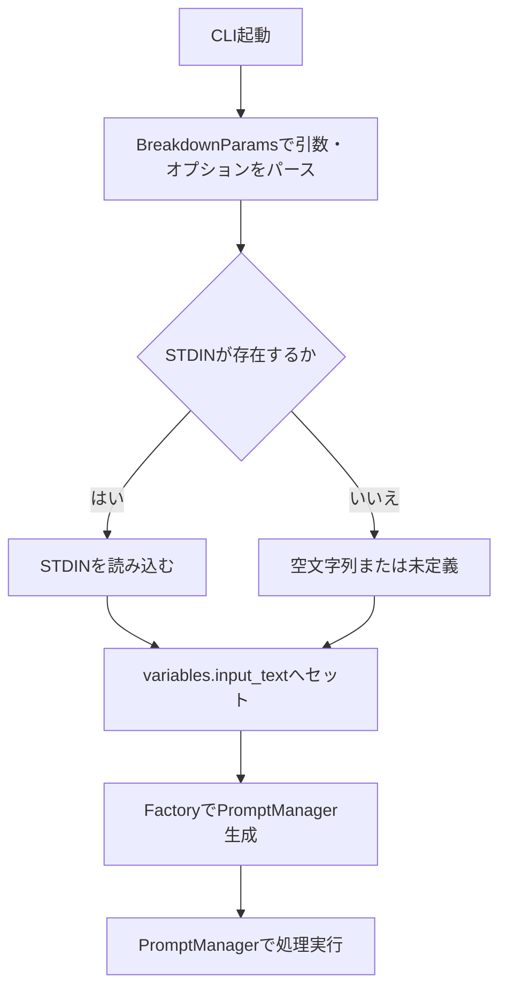

# STDIN入力によるinput_textセット機能 仕様書

## 要件
- コマンドライン引数のパース時に、STDINからの入力を受け付ける。
- 引数やオプションの管理にはBreakdownParamsを使用する。
- STDINの読み込みはアプリケーションの起点となるクラスで行う。
- STDINからの入力は必須ではなく、オプション値とする。
- 最終的に、PromptManagerへ渡すための`variables.input_text`へ値をセットする。
- Factoryパターンで組み立てる。

## 目的
- CLIツールとして、パイプやリダイレクトによる柔軟な入力方法を提供する。
- ユーザーがファイルや引数だけでなく、標準入力からもテキストデータを渡せるようにする。
- 既存の引数・オプション設計と整合性を保ちつつ、拡張性を持たせる。

## 一連の流れ
1. CLI起動時、コマンドライン引数・オプションをBreakdownParamsでパースする。
2. 標準入力(STDIN)が存在する場合、内容を読み込む。
3. 読み込んだ内容を`variables.input_text`へセットする。
4. FactoryでPromptManagerインスタンスを生成する際、`variables.input_text`を渡す。
5. PromptManagerは`variables.input_text`を利用して処理を進める。

## 思考プロセス
- 標準入力は必須ではなく、ファイルや引数が優先される場合はそちらを利用する。
- 標準入力が空の場合は、`variables.input_text`は未定義または空文字列とする。(既存仕様通り)
- BreakdownParamsは、引数・オプションの値を一元的に管理する役割を担うが標準入力は対象外。
- Factoryパターンを用いることで、テスト容易性や拡張性を確保する。

## 処理フロー

## ゴール
- CLIツールでパイプやリダイレクトによる入力を受け付け、`variables.input_text`へ正しく値をセットできること。
- 既存の引数・オプション設計と矛盾せず、BreakdownParamsと共存できること。
- Factoryパターンを活用し、テストや拡張が容易な設計となっていること。 