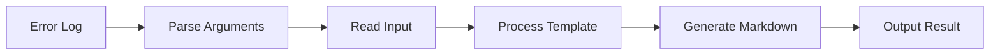

# Implementation Tasks for `breakdown defect` Command

## Context & Summary

### Background
- `breakdown defect` コマンドは、エラー情報からMarkdownベースの修正提案を生成する機能
- READMEのユースケースと20250207-defect.mdの具体例を元に仕様を決定
- Denoベースの実装で、URL APIとimport mapを活用した堅牢な構造を目指す

### Key Objectives
1. エラーログからの修正提案生成
2. 階層的な修正提案（project/issue/task）の実現
3. URLベースのパス解決による堅牢性確保
4. import mapによる依存関係の明確化

### Design Decisions
- URL APIベースのパス処理採用
  - 理由: Denoの推奨パターンに準拠、パス解決の堅牢性向上
- import map導入
  - 理由: 依存関係の一元管理、コード補完の改善
- 型定義の分離
  - 理由: 循環参照の防止、型安全性の向上

### Expected Workflow


## Core Implementation Tasks

### 1. Argument Parser
- [ ] Implement CLI argument parser using `std/flags`
  - [ ] Command type validation (defect)
  - [ ] Layer type validation (project/issue/task)
  - [ ] Input file path handling (--from-xxx option)
  - [ ] Output directory handling (-o option)
- [ ] Add help text and usage information
- [ ] Implement default output directory logic using URL API

### 2. File System Operations
- [ ] Implement markdown file reader using Deno.readTextFile
- [ ] Create directory handler using URL and path APIs
  - [ ] Implement safe directory creation
  - [ ] Add path normalization
- [ ] Add file existence checks with proper error messages
- [ ] Implement schema file loader with URL-based path resolution

### 3. Path Resolution
- [ ] Create URL-based path resolver for:
  ```typescript
  new URL("rules/schema/<demonstrative>/<layer_type>.schema.json", import.meta.url)
  new URL("breakdown/prompts/<demonstrative>/<layer_type>/default.prompt", import.meta.url)
  ```
- [ ] Add path validation with proper error types
- [ ] Implement path utilities using std/path module

### 4. Template Processing
- [ ] Create prompt template processor
- [ ] Implement placeholder replacement with validation:
  - [ ] {input_markdown}
  - [ ] {output_schema}
  - [ ] {output_directory}
- [ ] Add error handling for missing/invalid placeholders

### 5. Output Handling
- [ ] Implement async file writer with proper error handling
- [ ] Create structured stdout formatter
- [ ] Add error output handler with proper error types

## Test Implementation Tasks

### 1. Argument Parser Tests
```typescript
Deno.test("defect command argument parsing", async (t) => {
  await t.step("validates command type", async () => {
    const args = ["defect", "issue", "--from-issue", "test.md"];
    // Test command validation
  });

  await t.step("handles URL-based paths", async () => {
    const args = ["defect", "issue", "--from-issue", "file:///test.md"];
    // Test URL handling
  });

  await t.step("sets default output directory", async () => {
    // Test URL-based path generation
  });
});
```

### 2. File System Tests
```typescript
Deno.test("file system operations", async (t) => {
  await t.step("handles file URLs correctly", async () => {
    const fileUrl = new URL("./test.md", import.meta.url);
    // Test URL-based file operations
  });

  await t.step("validates file existence", async () => {
    // Test with proper error types
  });
});
```

### 3. Path Resolution Tests
```typescript
Deno.test("path resolution", async (t) => {
  await t.step("resolves URLs correctly", async () => {
    // Test URL resolution
  });

  await t.step("normalizes paths properly", async () => {
    // Test path normalization
  });
});
```

### 4. Template Processing Tests
```typescript
Deno.test("template processing", async (t) => {
  await t.step("processes all placeholders", async () => {
    // Test with proper types
  });

  await t.step("validates placeholder data", async () => {
    // Test type validation
  });
});
```

### 5. Integration Tests
```typescript
Deno.test("defect command integration", async (t) => {
  await t.step("processes markdown to JSON", async () => {
    // Test full workflow
  });

  await t.step("handles errors gracefully", async () => {
    // Test error scenarios
  });
});
```

## Test Fixture Tasks

### 1. Sample Error Logs
- [ ] Create test error logs in `tests/fixtures/logs/`:
  ```
  tests/fixtures/logs/
  ├── sample_error.log        # 基本的なエラーログ
  ├── complex_error.log      # 複数のエラーが混在するログ
  └── multiline_error.log    # 複数行にまたがるエラーログ
  ```

### 2. Expected Output Templates
- [ ] Create expected output templates in `tests/fixtures/expected/`:
  ```
  tests/fixtures/expected/
  ├── project/
  │   └── project_defect.md   # プロジェクトレベルの修正提案
  ├── issue/
  │   ├── issue_defect.md     # 単一イシューの修正提案
  │   └── issue_defect/       # 複数イシューに分解された修正提案
  │       ├── issue_1.md
  │       └── issue_2.md
  └── task/
      ├── task_defect.md      # 単一タスクの修正提案
      └── task_defect/        # 複数タスクに分解された修正提案
          ├── task_1.md
          └── task_2.md
  ```

### 3. Sample Input Files
- [ ] Create sample input files in `tests/fixtures/input/`:
  ```
  tests/fixtures/input/
  ├── project_defect.md      # プロジェクト修正提案の入力例
  ├── issue_defect.md        # イシュー修正提案の入力例
  └── task_defect.md         # タスク修正提案の入力例
  ```

### 4. Test Helper Functions
- [ ] Create test utilities in `tests/helpers/`:
  ```typescript
  // tests/helpers/fixtures.ts
  export function loadFixture(type: "log" | "expected" | "input", name: string): Promise<string>;
  export function compareOutput(actual: string, expected: string): void;
  ```

## Project Setup Tasks

### 1. Import Map Configuration
- [ ] Create import_map.json in root:
  ```json
  {
    "imports": {
      "@breakdown/": "./src/",
      "@commands/": "./src/commands/",
      "@fs/": "./src/fs/",
      "@utils/": "./src/utils/",
      "@types/": "./src/types/",
      "@test/": "./tests/"
    }
  }
  ```
- [ ] Add import map configuration to deno.json:
  ```json
  {
    "importMap": "./import_map.json",
    "tasks": {
      "test": "deno test --allow-read --allow-write --import-map=import_map.json"
    }
  }
  ```

### 2. Update Module Structure
- [ ] Refactor imports to use import map aliases:
  ```typescript
  // Before
  import { parseArgs } from "../../../deps.ts";
  
  // After
  import { parseArgs } from "@breakdown/deps.ts";
  ```

## Directory Structure (Updated)
```
├── import_map.json
├── deno.json
├── src/
│   ├── deps.ts              # Central dependencies
│   │   └── defect/
│   │       ├── mod.ts       # import { Command } from "@breakdown/types/command.ts";
│   │       ├── parser.ts    # import { parseArgs } from "@breakdown/deps.ts";
│   │       ├── template.ts  # import { Template } from "@breakdown/types/template.ts";
│   │       ├── paths.ts     # import { resolve } from "@utils/url.ts";
│   │       ├── types.ts     # import type { ... } from "@types/common.ts";
│   │       └── errors.ts    # import { BaseError } from "@types/error.ts";
│   ├── fs/
│   │   ├── reader.ts        # import { ... } from "@utils/url.ts";
│   │   └── writer.ts
│   ├── utils/
│   │   └── url.ts
│   └── types/
│       ├── common.ts
│       ├── command.ts
│       ├── template.ts
│       └── error.ts
└── tests/
    └── commands/
        └── defect/
            ├── mod_test.ts   # import { ... } from "@commands/defect/mod.ts";
            ├── parser_test.ts
            ├── template_test.ts
            └── fixtures/
```

## Implementation Order (Updated)
1. [ ] Create type definitions and error types
2. [ ] Set up import map and project configuration
3. [ ] **Create test fixtures and helpers**
4. [ ] Implement URL utilities
5. [ ] Create argument parser
6. [ ] Implement file system operations
7. [ ] Add path resolution
8. [ ] Create template processor
9. [ ] Add output handling
10. [ ] Write integration tests

## Import Rules
- [ ] Create central deps.ts file for third-party dependencies
- [ ] Use absolute imports with import map aliases
- [ ] Avoid relative imports except for closely related files
- [ ] Keep circular dependencies in check with proper type imports
- [ ] Use type-only imports where possible
- [ ] Document import patterns in CONTRIBUTING.md

主な追加点:
- import_map.jsonによる依存関係の整理
- 一貫した import パターンの定義
- モジュール構造の明確化
- 依存関係の集中管理
- テスト実行時の import map 設定 

## Completion Criteria

### 1. Test Success
- [ ] All tests pass with:
  ```bash
  deno test --allow-read --allow-write --allow-run
  ```

### 2. Use Case Verification
以下の全てのコマンドが正常に動作すること:

#### Basic Defect Command
- [ ] エラーログからの Issue 生成
  ```bash
  tail -100 "<error_log_file>" | breakdown defect issue -o <issue_defect.md>
  ```

#### Project Level Analysis
- [ ] プロジェクトレベルの不具合分析
  ```bash
  tail -100 "<error_log_file>" | breakdown defect project -o <project_defect.md>
  ```

#### Issue Breakdown
- [ ] プロジェクト修正からIssueへの分解
  ```bash
  breakdown defect issue --from-project <project_defect.md> -o <issue_defect_dir>
  ```

#### Task Level Details
- [ ] Issueからタスクレベルの修正提案
  ```bash
  breakdown defect task --from-issue <issue_defect.md> -o <task_defect_dir>
  ```

### 3. Quality Criteria
- [ ] 全ての出力がMarkdown形式で整形されている
- [ ] エラーメッセージが適切に構造化されている
- [ ] URLベースのパス解決が正しく機能している
- [ ] import mapによる依存関係が正しく解決されている
- [ ] 非同期処理が適切にハンドリングされている
- [ ] エラー状態が適切にハンドリングされている

### 4. Documentation
- [ ] 全ての公開APIにTSDocコメントが付与されている
- [ ] READMEの例が全て動作することを確認
- [ ] CONTRIBUTING.mdにimportルールが記載されている 