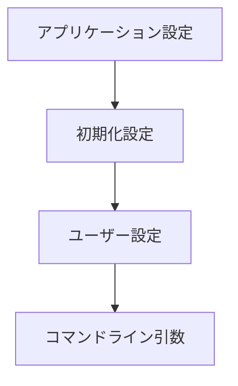

# breakdown コマンドの設計 (Updated)

## 1. 設定の階層構造

### 1.1 設定の種類と優先順位
1. アプリケーション設定（最優先）
   - コンパイル時に固定
   - サポートするレイヤー型やコマンド型を定義
   - `src/types/config.ts` で型定義
   ```typescript
   interface BaseConfig {
     readonly version: string;
   }

   interface ApplicationConfig extends BaseConfig {
     readonly supportedLayers: LayerType[];
     readonly supportedDemonstratives: DemonstrativeType[];
     readonly requiredDependencies: string[];
   }
   ```

2. 初期化設定（次点）
   - インストール時に必要な設定
   - プロンプトやスキーマのディレクトリパス
   - `$HOME/.breakdown/config.json` で管理
   ```typescript
   interface InitializeConfig {
     readonly promptDirectory: URL;
     readonly schemaDirectory: URL;
     readonly cliInstallPath: URL;
   }
   ```

3. ユーザー設定（最後）
   - オプショナルな実行時設定
   - カスタムディレクトリやデフォルト値
   - `./breakdown.json` で管理（カレントディレクトリ）
   ```typescript
   interface UserConfig {
     directories?: Record<LayerType, string>;
     customPrompts?: Record<LayerType, string>;
   }
   ```

### 1.2 設定の読み込み順序


## 2. ディレクトリ構造

### 2.1 ユーザー作業ディレクトリ
```
.agent/
  └── breakdown/
      ├── projects/      # プロジェクト関連の出力
      ├── issues/        # 課題関連の出力
      └── tasks/         # タスク関連の出力
```

### 2.2 システムリソースディレクトリ
```
$HOME/.breakdown/
  ├── config.json       # 初期化設定
  ├── rules/
  │   └── schema/       # 出力スキーマ
  └── prompts/          # プロンプトテンプレート
```

### 2.3 プロジェクトディレクトリ
```
./                      # プロジェクトルート
  └── breakdown.json    # プロジェクト固有の設定
```

## 3. コマンド処理フロー

### 3.1 defect コマンドの処理
1. 入力ファイルの読み込み
2. レイヤータイプの自動検出
3. プロンプトとスキーマの解決
4. テンプレート変数の置換
5. 出力の生成

### 3.2 パス解決の優先順位
1. コマンドライン引数 (`--output`)
2. ユーザー設定 (`.breakdown.json`)
3. デフォルトディレクトリ (`.agent/breakdown/...`)

## 4. 型システムの設計

### 4.1 型定義の分離と依存関係
```typescript
// src/types/config.ts - 基本型定義（他の型定義の基盤）
export type LayerType = "project" | "issue" | "task";
export type DemonstrativeType = "to" | "summary" | "defect";
export interface BaseConfig { ... }
export interface ApplicationConfig extends BaseConfig { ... }
export interface InitializeConfig { ... }
export interface UserConfig { ... }

// src/types/command.ts - コマンド関連の型（config.tsに依存）
import type { LayerType, DemonstrativeType } from "./config.ts";
export interface CommandOptions { ... }
export interface CommandResult { ... }

// src/constants.ts - 定数定義（型定義に依存）
import type { ApplicationConfig } from "./types/config.ts";
export const DEFAULT_CONFIG: ApplicationConfig = { ... }
```

### 4.2 エラー型階層
```typescript
// src/types/error.ts
export class BreakdownError extends Error {
  constructor(message: string) {
    super(message);
    this.name = this.constructor.name;
  }
}

export class ConfigurationError extends BreakdownError {
  constructor(
    message: string,
    public readonly configType: "application" | "initialize" | "user"
  ) {
    super(`${configType} config error: ${message}`);
  }
}

export class ArgumentError extends BreakdownError {}
export class FileSystemError extends BreakdownError {}
export class ValidationError extends BreakdownError {}
export class TemplateError extends BreakdownError {}
```

## 5. バリデーション

### 5.1 設定の検証
```typescript
// src/config/validator.ts
export class ConfigValidator {
  validateConfigHierarchy(
    app: ApplicationConfig,
    init: InitializeConfig,
    user?: UserConfig
  ): void {
    this.validateNoOverlap(init, user);
    this.validateRequiredPaths(init);
    this.validateCustomPaths(user);
  }

  private validateNoOverlap(init: InitializeConfig, user?: UserConfig): void;
  private validateRequiredPaths(init: InitializeConfig): void;
  private validateCustomPaths(user?: UserConfig): void;
}
```

### 5.2 パス解決
```typescript
// src/utils/path.ts
export class PathResolver {
  resolveSchemaPath(demonstrative: string, layerType: string): URL;
  resolvePromptPath(demonstrative: string, layerType: string): URL;
  resolveOutputPath(options: OutputPathOptions): URL;
  resolveUserConfig(): URL;
  resolveInitConfig(): URL;
}
```

### 5.3 レイヤー検出
```typescript
// src/layer/detector.ts
export class LayerDetector {
  detectLayerType(content: string, filename?: string): LayerType;
  validateLayerType(detected: LayerType, expected?: LayerType): void;
}
```

## 6. 実装の注意点

### 6.1 依存関係の方向
```
types/config.ts ← types/command.ts
                ← constants.ts
                ← utils/path.ts
                ← layer/detector.ts
```

### 6.2 設定の読み込み順序
1. アプリケーション設定（`DEFAULT_CONFIG`）
2. 初期化設定（`$HOME/.breakdown/config.json`）
3. ユーザー設定（`./breakdown.json`）
4. コマンドライン引数

### 6.3 エラー処理の階層
1. 設定エラー（`ConfigurationError`）
2. 引数エラー（`ArgumentError`）
3. ファイルシステムエラー（`FileSystemError`）
4. バリデーションエラー（`ValidationError`）
5. テンプレートエラー（`TemplateError`）

## 7. テスト戦略

### 7.1 単体テスト
1. 型定義の整合性
2. 設定のバリデーション
3. パス解決
4. レイヤー検出

### 7.2 統合テスト
1. コマンドライン処理
2. 設定の階層的読み込み
3. ファイル入出力
4. エラー処理 