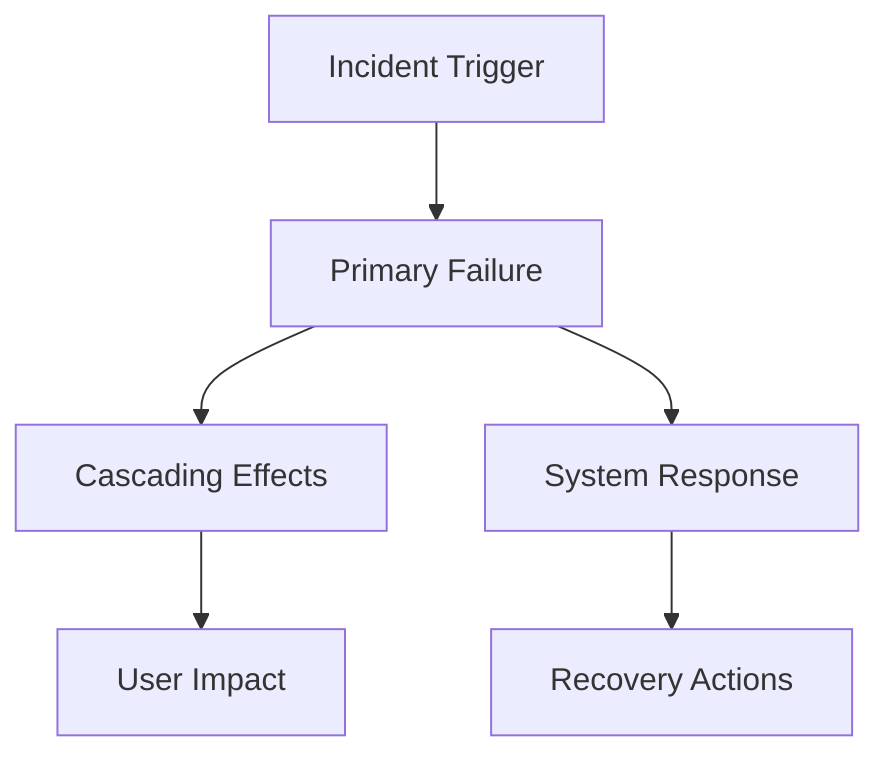

# Production Issue Defect Analysis Template

## Input
- {incident_report}
- {production_logs}
- {monitoring_alerts}
- {user_reports}
- {system_metrics}

## Output
- {incident_analysis}
- {business_impact}
- {remediation_plan}
- {postmortem_report}

---

## Production Incident Analysis

### Incident Overview
- Incident ID: {incident_id}
- Severity level: {severity}
- Start time: {incident_start}
- Detection method: {detection_method}
- Current status: {current_status}

### Impact Assessment
1. **User Impact**
   - Affected users: {user_count}
   - Geographic regions: {affected_regions}
   - Features impacted: {impacted_features}
   - Revenue impact: {revenue_loss}

2. **System Impact**
   - Services affected: {affected_services}
   - Data integrity: {data_status}
   - Performance degradation: {performance_metrics}
   - SLA compliance: {sla_status}

3. **Business Impact**
   - Customer complaints: {complaint_count}
   - Brand reputation risk: {reputation_impact}
   - Regulatory compliance: {compliance_status}
   - Financial exposure: {financial_impact}

### Root Cause Analysis


### Timeline of Events
| Time | Event | Action Taken | Result |
|------|-------|--------------|--------|
| {time_1} | {event_1} | {action_1} | {result_1} |
| {time_2} | {event_2} | {action_2} | {result_2} |
| {time_3} | {event_3} | {action_3} | {result_3} |

### Production Monitoring Data
```yaml
alerts_triggered:
  - alert: {alert_name}
    threshold: {threshold_value}
    actual: {actual_value}
    duration: {alert_duration}

metrics_anomalies:
  cpu_usage: {cpu_anomaly}
  memory_usage: {memory_anomaly}
  error_rate: {error_rate_anomaly}
  response_time: {latency_anomaly}
```

### Immediate Actions
1. **Stabilization**
   - Rollback procedure: {rollback_steps}
   - Traffic rerouting: {traffic_management}
   - Resource scaling: {scaling_actions}
   - Emergency patches: {hotfix_details}

2. **Communication**
   - Status page update: {status_update}
   - Customer notification: {customer_comms}
   - Internal escalation: {escalation_path}
   - Stakeholder briefing: {stakeholder_update}

### Long-term Remediation
- Code fixes required: {code_changes}
- Infrastructure improvements: {infra_changes}
- Monitoring enhancements: {monitoring_updates}
- Process improvements: {process_changes}

### Lessons Learned
1. **What went well**
   - {positive_1}
   - {positive_2}

2. **What could be improved**
   - {improvement_1}
   - {improvement_2}

3. **Action items**
   - {action_item_1}
   - {action_item_2}

### Prevention Measures
- Automated safeguards: {automation_plans}
- Additional monitoring: {monitoring_plans}
- Capacity planning: {capacity_plans}
- Disaster recovery updates: {dr_updates}

## Instructions
1. Gather all incident data within first 15 minutes
2. Assess user and business impact immediately
3. Implement stabilization measures
4. Document all actions with timestamps
5. Conduct thorough root cause analysis
6. Prepare comprehensive postmortem
7. Define concrete prevention measures

## Output Format
- Executive incident summary (1 page)
- Technical root cause analysis
- Business impact assessment
- Detailed timeline with actions
- Postmortem report with action items
- Prevention and improvement plan